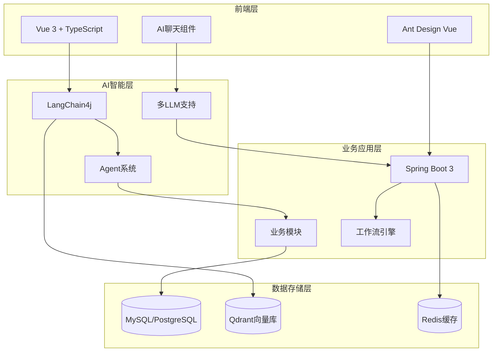

# 🤖 RuoYi-Vue-Plus AI智能化企业管理平台

<div align="center">

[](LICENSE)
[](https://www.oracle.com/java/)
[](https://spring.io/projects/spring-boot)
[](https://vuejs.org/)
[](https://www.typescriptlang.org/)
[](https://github.com/langchain4j/langchain4j)

**基于AI大模型的下一代智能企业管理平台**

[🚀 快速开始](#-快速开始) •
[📖 AI功能文档](client/docs/src/ai-transformation/README.md) •
[🗺 开发路线图](client/docs/src/ai-transformation/ROADMAP.md) •
[🏗 技术架构](client/docs/src/ai-transformation/ARCHITECTURE.md)

</div>

---

## 🌟 项目简介

RuoYi-Vue-Plus AI智能化企业管理平台是基于开源框架 [RuoYi-Vue-Plus](https://gitee.com/dromara/RuoYi-Vue-Plus) 深度改造的**新一代AI增强型企业管理系统**。通过集成**LangChain4j**、**Qdrant向量数据库**和**Agent智能体技术**，将传统的企业管理平台升级为具备智能决策、自动化处理和知识管理能力的现代化工作平台。

### 🎯 核心价值

- **🧠 智能化办公**：AI助手实现自然语言交互，提升工作效率80%
- **📚 知识管理**：企业知识库智能检索，信息获取从分钟级到秒级
- **🤖 流程自动化**：Agent智能体自动执行复杂业务流程
- **🏢 多租户SaaS**：支持企业级多租户服务，安全可靠
- **⚡ 现代技术栈**：Vue 3 + Spring Boot 3 + AI技术的完美融合

---

## ✨ 核心特性

### 🔥 AI智能能力

| 功能 | 描述 | 状态 |
|------|------|------|
| **智能问答** | 基于企业知识库的自然语言问答 | ✅ 已完成 |
| **文档理解** | 支持PDF、Word、Excel等多格式文档解析 | 🚧 开发中 |
| **Agent智能体** | 可编程AI助手，支持复杂任务自动化 | 📋 规划中 |
| **代码生成** | AI辅助生成业务代码和SQL语句 | 📋 规划中 |
| **数据分析** | 自然语言数据查询和智能报表 | 📋 规划中 |

### 🏢 企业级功能

- **多租户架构**：完善的SaaS多租户隔离和管理
- **权限管理**：细粒度的RBAC权限控制体系
- **工作流引擎**：支持复杂业务流程审批
- **代码生成器**：一键生成CRUD代码和页面
- **系统监控**：实时监控系统状态和性能指标
- **多数据源**：支持MySQL、Oracle、PostgreSQL等

### 🛠 技术亮点

- **现代化架构**：前后端分离，微服务就绪
- **AI原生设计**：深度集成AI能力，非简单功能叠加
- **高性能**：Qdrant向量数据库，毫秒级语义检索
- **可扩展**：模块化设计，支持插件化扩展
- **安全可靠**：多层安全防护，企业级数据保护

---

## 🏗 技术架构



### 🔧 技术栈详情

#### 后端技术栈
- **核心框架**：Spring Boot 3.4.7、Spring Security
- **AI集成**：LangChain4j、OpenAI API、本地大模型支持
- **数据存储**：MySQL 8.0+、Qdrant向量数据库、Redis
- **ORM框架**：MyBatis-Plus、动态多数据源
- **权限认证**：Sa-Token、JWT
- **工作流**：Warm-Flow工作流引擎
- **构建工具**：Maven、Docker

#### 前端技术栈
- **框架**：Vue 3、TypeScript、Vite
- **UI组件**：Ant Design Vue、自定义AI组件
- **状态管理**：Pinia
- **路由**：Vue Router 4
- **工具库**：VueUse、Lodash-ES
- **包管理**：Pnpm Monorepo

#### AI技术栈
- **大语言模型**：OpenAI GPT、Claude、本地模型(Qwen/GLM)
- **向量数据库**：Qdrant、支持分布式部署
- **Embedding**：OpenAI Embeddings、BGE等多种模型
- **Agent框架**：自研Agent系统、MCP协议支持
- **工具链**：数据库工具、HTTP工具、文件处理工具

---

## 📁 项目结构

```
├── 📁 client/                    # 前端项目
│   ├── 📁 apps/
│   │   ├── 📁 web-antd/          # Ant Design Vue主应用
│   │   └── 📁 backend-mock/      # 后端API Mock服务
│   ├── 📁 docs/                  # 项目文档
│   │   └── 📁 src/ai-transformation/  # AI改造文档
│   ├── 📁 packages/              # 前端公共包
│   └── 📁 internal/              # 内部工具包
│
├── 📁 server/                    # 后端项目
│   ├── 📁 ruoyi-admin/          # 应用启动模块
│   ├── 📁 ruoyi-common/         # 公共模块
│   ├── 📁 ruoyi-modules/        # 业务模块
│   │   ├── 📁 ruoyi-system/     # 系统管理
│   │   ├── 📁 ruoyi-ai/         # AI智能模块 (新增)
│   │   ├── 📁 ruoyi-workflow/   # 工作流模块
│   │   └── 📁 ruoyi-generator/  # 代码生成
│   └── 📁 script/               # 数据库脚本
│
├── 📁 docs/                     # 项目文档
├── 📄 README.md                # 项目说明
├── 📄 .gitignore              # Git忽略文件
└── 📄 LICENSE                 # 开源许可证
```

---

## 🚀 快速开始

### 📋 环境要求

| 组件 | 版本要求 | 说明 |
|------|----------|------|
| **Java** | 17+ | 推荐使用 OpenJDK 17 或 Oracle JDK 17+ |
| **Node.js** | 18+ | 推荐使用 Node.js 18+ LTS版本 |
| **MySQL** | 8.0+ | 生产环境推荐MySQL 8.0+ |
| **Redis** | 5.0+ | 用于缓存和会话存储 |
| **Qdrant** | 1.7+ | 向量数据库，支持Docker部署 |

### ⚙️ 安装部署

#### 1. 克隆项目
```bash
git clone https://github.com/your-username/ruoyi-vue-plus-ai.git
cd ruoyi-vue-plus-ai
```

#### 2. 数据库初始化
```bash
# 创建数据库
mysql -u root -p
CREATE DATABASE ruoyi_vue_plus_ai CHARACTER SET utf8mb4 COLLATE utf8mb4_unicode_ci;

# 导入数据
mysql -u root -p ruoyi_vue_plus_ai < server/script/sql/ry_vue_5.X.sql
```

#### 3. 启动向量数据库
```bash
# 使用Docker启动Qdrant
docker run -p 6333:6333 -p 6334:6334 \
    -v $(pwd)/qdrant_storage:/qdrant/storage:z \
    qdrant/qdrant:v1.7.0
```

#### 4. 后端服务启动
```bash
cd server

# 配置数据库连接和AI服务
cp ruoyi-admin/src/main/resources/application-dev.yml.example \
   ruoyi-admin/src/main/resources/application-dev.yml

# 编辑配置文件，添加以下配置：
# spring.datasource.url=jdbc:mysql://localhost:3306/ruoyi_vue_plus_ai
# ai.llm.api-key=your_openai_api_key
# qdrant.host=localhost

# 启动后端服务
mvn clean install
mvn spring-boot:run -pl ruoyi-admin
```

#### 5. 前端应用启动
```bash
cd client

# 安装依赖
pnpm install

# 启动开发服务器
pnpm dev
```

#### 6. 访问应用
- **前端地址**：http://localhost:5173
- **后端接口**：http://localhost:8080
- **接口文档**：http://localhost:8080/doc.html
- **默认账号**：admin / admin123

---

## 🤖 AI功能使用

### 💬 智能问答
1. 登录系统后，点击右上角的"AI助手"图标
2. 输入问题，如："帮我查询本月的用户注册统计"
3. AI将基于企业知识库和数据库信息提供准确回答

### 📚 知识库管理
1. 进入"AI管理" -> "知识库管理"
2. 上传企业文档(PDF、Word、Excel等)
3. 系统自动进行文档解析和向量化处理
4. 可通过自然语言检索文档内容

### 🔧 Agent配置
1. 进入"AI管理" -> "Agent管理"
2. 创建自定义Agent，配置工具和提示词
3. 设置触发条件和执行流程
4. Agent将自动执行指定的业务任务

更多AI功能详细说明请参考：[AI功能文档](client/docs/src/ai-transformation/README.md)

---

## 🎯 AI改造规划

我们正在进行系统的AI智能化改造，分为4个阶段进行：

### 📍 当前进度

```
✅ Phase 0: 项目规划 (已完成)
🚧 Phase 1: LangChain4j集成 (进行中)
📋 Phase 2: Qdrant RAG (计划中)
📋 Phase 3: Agent系统 (计划中)
📋 Phase 4: 系统集成优化 (计划中)
```

### 🗓 详细路线图

- **Phase 1** (3周): LangChain4j集成，实现基础AI聊天功能
- **Phase 2** (4周): Qdrant向量数据库集成，构建RAG检索增强系统
- **Phase 3** (5周): Agent智能体系统开发，支持复杂任务自动化
- **Phase 4** (4周): 系统集成优化，性能调优和生产部署

详细开发计划请查看：[开发路线图](client/docs/src/ai-transformation/ROADMAP.md)

---

## 📊 性能指标

### 🎯 目标指标

| 指标类型 | 目标值 | 当前值 | 说明 |
|----------|--------|--------|------|
| **响应时间** | < 2秒 | 待测试 | AI问答平均响应时间 |
| **检索准确率** | > 85% | 待测试 | 向量检索相关性准确率 |
| **并发支持** | 1000+ | 待测试 | 同时在线用户数 |
| **系统可用性** | > 99.9% | 待测试 | 系统稳定性指标 |

### 📈 预期收益

- **工作效率提升**: 80% (信息检索和处理速度)
- **人工成本降低**: 50% (重复性工作自动化)
- **决策准确性提升**: 70% (AI辅助数据分析)
- **用户满意度提升**: 60% (智能化交互体验)

---

## 🤝 参与贡献

我们欢迎社区贡献，一起构建更好的AI企业管理平台！

### 🔧 贡献方式

1. **🐛 问题反馈**：通过 [Issues](https://github.com/your-username/ruoyi-vue-plus-ai/issues) 报告Bug
2. **💡 功能建议**：提出新的AI功能需求和改进建议
3. **🛠 代码贡献**：提交 Pull Request 改进代码
4. **📖 文档完善**：帮助完善使用文档和开发指南

### 📝 开发规范

- 遵循 [Alibaba Java编码规范](https://github.com/alibaba/p3c)
- 前端遵循 [Vue 3官方风格指南](https://vuejs.org/style-guide/)
- 提交代码前请运行测试确保功能正常
- Pull Request请详细描述修改内容和测试情况

### 🌟 贡献者

感谢所有为项目做出贡献的开发者！

<a href="https://github.com/your-username/ruoyi-vue-plus-ai/graphs/contributors">
  
</a>

---

## 📄 许可证

本项目基于 [MIT License](LICENSE) 开源协议，可自由使用、修改和分发。

```
MIT License

Copyright (c) 2025 RuoYi-Vue-Plus AI Team

Permission is hereby granted, free of charge, to any person obtaining a copy
of this software and associated documentation files (the "Software"), to deal
in the Software without restriction, including without limitation the rights
to use, copy, modify, merge, publish, distribute, sublicense, and/or sell
copies of the Software, and to permit persons to whom the Software is
furnished to do so, subject to the following conditions:

The above copyright notice and this permission notice shall be included in all
copies or substantial portions of the Software.

THE SOFTWARE IS PROVIDED "AS IS", WITHOUT WARRANTY OF ANY KIND, EXPRESS OR
IMPLIED, INCLUDING BUT NOT LIMITED TO THE WARRANTIES OF MERCHANTABILITY,
FITNESS FOR A PARTICULAR PURPOSE AND NONINFRINGEMENT. IN NO EVENT SHALL THE
AUTHORS OR COPYRIGHT HOLDERS BE LIABLE FOR ANY CLAIM, DAMAGES OR OTHER
LIABILITY, WHETHER IN AN ACTION OF CONTRACT, TORT OR OTHERWISE, ARISING FROM,
OUT OF OR IN CONNECTION WITH THE SOFTWARE OR THE USE OR OTHER DEALINGS IN THE
SOFTWARE.
```

---

## 🔗 相关链接

- **📖 官方文档**：[AI改造文档](client/docs/src/ai-transformation/)
- **🗺 开发路线图**：[ROADMAP.md](client/docs/src/ai-transformation/ROADMAP.md)
- **🏗 技术架构**：[ARCHITECTURE.md](client/docs/src/ai-transformation/ARCHITECTURE.md)
- **📊 进度跟踪**：[PROGRESS.md](client/docs/src/ai-transformation/PROGRESS.md)
- **🌐 RuoYi-Vue-Plus官方**：[plus-doc.dromara.org](https://plus-doc.dromara.org)
- **🤖 LangChain4j**：[github.com/langchain4j/langchain4j](https://github.com/langchain4j/langchain4j)
- **🔍 Qdrant**：[qdrant.tech](https://qdrant.tech)

---

## 💝 支持项目

如果这个项目对你有帮助，请给我们一个 ⭐️ Star！

你也可以通过以下方式支持项目：
- 🔄 Fork项目并贡献代码
- 📢 分享给更多的开发者
- 💬 参与社区讨论和反馈
- 📝 完善文档和教程

---

<div align="center">

**让AI赋能企业数字化转型，让智能创造更大价值！** 🌟

Made with ❤️ by RuoYi-Vue-Plus AI Team

</div>