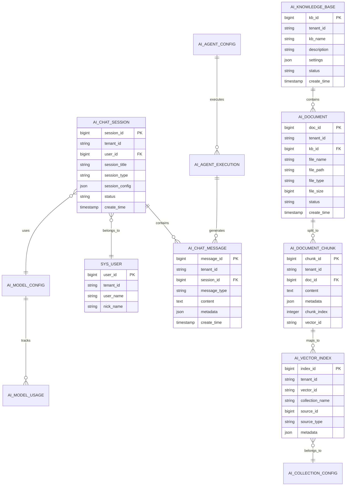

# AI功能数据模型设计

> 详细的数据库设计方案，包括关系型数据和向量数据的存储设计

## 🎯 设计原则

### 核心设计理念
- **多租户优先**: 所有AI数据表都支持租户级别隔离
- **性能导向**: 针对AI场景的查询模式优化索引设计
- **安全可控**: 敏感数据加密存储，访问权限严格控制
- **扩展友好**: 支持未来功能扩展的灵活表结构设计
- **一致性保证**: 与现有系统数据模型保持一致的设计风格

### 技术约束
- **主数据库**: PostgreSQL 15+ (支持JSON字段和高级特性)
- **向量数据库**: Qdrant (独立部署，通过API交互)
- **ORM框架**: MyBatis Plus (与现有系统保持一致)
- **多租户**: 基于tenant_id字段的行级数据隔离
- **审计要求**: 所有表包含创建、更新时间和操作者信息

## 🏗️ 整体架构设计

### 数据分层架构
```
┌─────────────────────────────────────────┐
│             应用层 (Application)          │
├─────────────────────────────────────────┤
│             服务层 (Service)             │
├─────────────────────────────────────────┤
│           数据访问层 (DAO/Mapper)          │
├─────────────────┬───────────────────────┤
│   关系型数据存储    │      向量数据存储        │
│   (PostgreSQL)  │      (Qdrant)        │
│                │                      │
│ • 会话管理       │  • 文档向量            │
│ • 消息记录       │  • 查询向量            │
│ • 知识库管理     │  • 相似度索引          │
│ • 用户配置       │  • 元数据映射          │
│ • 审计日志       │                      │
└─────────────────┴───────────────────────┘
```

### 数据同步策略
- **实时同步**: 核心业务数据的双写保证
- **异步同步**: 非关键数据的异步更新机制
- **最终一致性**: 允许短暂的数据不一致，保证最终一致
- **补偿机制**: 失败重试和数据修复策略

## 📊 核心实体关系设计

### 实体关系图 (ERD)


## 📋 详细表结构设计

### 1. AI会话管理表

#### ai_chat_session (AI对话会话表)
```sql
CREATE TABLE ai_chat_session (
    session_id          BIGSERIAL PRIMARY KEY,
    tenant_id           VARCHAR(20) DEFAULT '000000' NOT NULL,
    user_id             BIGINT NOT NULL,
    session_title       VARCHAR(200) NOT NULL,
    session_type        VARCHAR(20) DEFAULT 'chat',     -- chat/agent/knowledge
    model_type          VARCHAR(50),                    -- openai/ollama/qwen
    model_name          VARCHAR(100),                   -- gpt-4/llama2/qwen-max
    session_config      JSONB,                         -- 会话配置(提示词、参数等)
    message_count       INTEGER DEFAULT 0,              -- 消息数量
    token_used          INTEGER DEFAULT 0,              -- 使用的token数
    status              CHAR(1) DEFAULT '1',           -- 1=活跃 0=归档 2=删除
    last_message_time   TIMESTAMP,                     -- 最后消息时间
    tenant_id           VARCHAR(20) DEFAULT '000000',
    create_dept         BIGINT,
    create_by           BIGINT,
    create_time         TIMESTAMP DEFAULT CURRENT_TIMESTAMP,
    update_by           BIGINT,
    update_time         TIMESTAMP DEFAULT CURRENT_TIMESTAMP,
    remark              VARCHAR(500)
);

-- 索引设计
CREATE INDEX idx_ai_chat_session_tenant ON ai_chat_session(tenant_id);
CREATE INDEX idx_ai_chat_session_user ON ai_chat_session(user_id);
CREATE INDEX idx_ai_chat_session_type ON ai_chat_session(session_type);
CREATE INDEX idx_ai_chat_session_status ON ai_chat_session(status);
CREATE INDEX idx_ai_chat_session_time ON ai_chat_session(create_time DESC);
```

#### ai_chat_message (AI对话消息表)
```sql
CREATE TABLE ai_chat_message (
    message_id          BIGSERIAL PRIMARY KEY,
    tenant_id           VARCHAR(20) DEFAULT '000000' NOT NULL,
    session_id          BIGINT NOT NULL,
    parent_message_id   BIGINT,                        -- 回复消息ID
    message_type        VARCHAR(20) NOT NULL,          -- user/assistant/system/tool
    role                VARCHAR(20) NOT NULL,          -- user/assistant/system
    content             TEXT NOT NULL,                 -- 消息内容
    content_type        VARCHAR(20) DEFAULT 'text',    -- text/image/file/code
    model_info          JSONB,                         -- 模型信息(名称、版本等)
    usage_info          JSONB,                         -- token使用信息
    metadata            JSONB,                         -- 扩展元数据
    attachment_urls     TEXT[],                        -- 附件URL数组
    tool_calls          JSONB,                         -- 工具调用信息
    error_info          JSONB,                         -- 错误信息
    status              CHAR(1) DEFAULT '1',           -- 1=正常 0=删除
    create_time         TIMESTAMP DEFAULT CURRENT_TIMESTAMP,
    
    CONSTRAINT fk_message_session FOREIGN KEY (session_id) REFERENCES ai_chat_session(session_id)
);

-- 索引设计
CREATE INDEX idx_ai_chat_message_tenant ON ai_chat_message(tenant_id);
CREATE INDEX idx_ai_chat_message_session ON ai_chat_message(session_id);
CREATE INDEX idx_ai_chat_message_type ON ai_chat_message(message_type);
CREATE INDEX idx_ai_chat_message_time ON ai_chat_message(create_time DESC);
CREATE INDEX idx_ai_chat_message_parent ON ai_chat_message(parent_message_id);
```

### 2. 知识库管理表

#### ai_knowledge_base (AI知识库表)
```sql
CREATE TABLE ai_knowledge_base (
    kb_id               BIGSERIAL PRIMARY KEY,
    tenant_id           VARCHAR(20) DEFAULT '000000' NOT NULL,
    kb_name             VARCHAR(100) NOT NULL,
    kb_code             VARCHAR(50) NOT NULL,          -- 知识库编码
    description         TEXT,                          -- 知识库描述
    kb_type             VARCHAR(20) DEFAULT 'general', -- general/faq/manual/code
    vector_dimension    INTEGER DEFAULT 1536,          -- 向量维度
    collection_name     VARCHAR(100),                  -- Qdrant集合名称
    chunk_size          INTEGER DEFAULT 512,           -- 文档分块大小
    chunk_overlap       INTEGER DEFAULT 50,            -- 分块重叠大小
    embedding_model     VARCHAR(100),                  -- 嵌入模型名称
    settings            JSONB,                         -- 知识库配置
    document_count      INTEGER DEFAULT 0,             -- 文档数量
    chunk_count         INTEGER DEFAULT 0,             -- 分块数量
    index_status        VARCHAR(20) DEFAULT 'ready',   -- ready/indexing/error
    last_index_time     TIMESTAMP,                     -- 最后索引时间
    status              CHAR(1) DEFAULT '1',           -- 1=启用 0=禁用
    tenant_id           VARCHAR(20) DEFAULT '000000',
    create_dept         BIGINT,
    create_by           BIGINT,
    create_time         TIMESTAMP DEFAULT CURRENT_TIMESTAMP,
    update_by           BIGINT,
    update_time         TIMESTAMP DEFAULT CURRENT_TIMESTAMP,
    remark              VARCHAR(500),
    
    CONSTRAINT uk_kb_code_tenant UNIQUE (kb_code, tenant_id)
);

-- 索引设计
CREATE INDEX idx_ai_knowledge_base_tenant ON ai_knowledge_base(tenant_id);
CREATE INDEX idx_ai_knowledge_base_type ON ai_knowledge_base(kb_type);
CREATE INDEX idx_ai_knowledge_base_status ON ai_knowledge_base(status);
```

#### ai_document (AI文档表)
```sql
CREATE TABLE ai_document (
    doc_id              BIGSERIAL PRIMARY KEY,
    tenant_id           VARCHAR(20) DEFAULT '000000' NOT NULL,
    kb_id               BIGINT NOT NULL,
    file_name           VARCHAR(255) NOT NULL,
    original_name       VARCHAR(255) NOT NULL,         -- 原始文件名
    file_path           VARCHAR(500) NOT NULL,         -- 文件存储路径
    file_url            VARCHAR(500),                  -- 文件访问URL
    file_type           VARCHAR(50) NOT NULL,          -- pdf/docx/txt/md
    file_size           BIGINT NOT NULL,               -- 文件大小(字节)
    file_hash           VARCHAR(64),                   -- 文件MD5哈希
    encoding            VARCHAR(20) DEFAULT 'UTF-8',   -- 文件编码
    language            VARCHAR(10) DEFAULT 'zh',      -- 文档语言
    doc_status          VARCHAR(20) DEFAULT 'pending', -- pending/processing/completed/error
    chunk_count         INTEGER DEFAULT 0,             -- 分块数量
    vector_count        INTEGER DEFAULT 0,             -- 向量数量
    process_log         TEXT,                          -- 处理日志
    extracted_text      TEXT,                          -- 提取的文本内容
    metadata            JSONB,                         -- 文档元数据
    tags                VARCHAR(200)[],                -- 文档标签
    last_process_time   TIMESTAMP,                     -- 最后处理时间
    tenant_id           VARCHAR(20) DEFAULT '000000',
    create_dept         BIGINT,
    create_by           BIGINT,
    create_time         TIMESTAMP DEFAULT CURRENT_TIMESTAMP,
    update_by           BIGINT,
    update_time         TIMESTAMP DEFAULT CURRENT_TIMESTAMP,
    
    CONSTRAINT fk_document_kb FOREIGN KEY (kb_id) REFERENCES ai_knowledge_base(kb_id)
);

-- 索引设计
CREATE INDEX idx_ai_document_tenant ON ai_document(tenant_id);
CREATE INDEX idx_ai_document_kb ON ai_document(kb_id);
CREATE INDEX idx_ai_document_status ON ai_document(doc_status);
CREATE INDEX idx_ai_document_type ON ai_document(file_type);
CREATE INDEX idx_ai_document_hash ON ai_document(file_hash);
```

#### ai_document_chunk (AI文档分块表)
```sql
CREATE TABLE ai_document_chunk (
    chunk_id            BIGSERIAL PRIMARY KEY,
    tenant_id           VARCHAR(20) DEFAULT '000000' NOT NULL,
    doc_id              BIGINT NOT NULL,
    kb_id               BIGINT NOT NULL,
    chunk_text          TEXT NOT NULL,                 -- 分块文本内容
    chunk_title         VARCHAR(200),                  -- 分块标题
    chunk_index         INTEGER NOT NULL,              -- 分块序号
    chunk_hash          VARCHAR(64),                   -- 分块内容哈希
    token_count         INTEGER,                       -- token数量
    char_count          INTEGER,                       -- 字符数量
    start_position      INTEGER,                       -- 在原文档中的开始位置
    end_position        INTEGER,                       -- 在原文档中的结束位置
    vector_id           VARCHAR(100),                  -- Qdrant中的向量ID
    embedding_model     VARCHAR(100),                  -- 使用的嵌入模型
    metadata            JSONB,                         -- 分块元数据
    keywords            VARCHAR(100)[],                -- 关键词数组
    similarity_hash     VARCHAR(64),                   -- 用于去重的相似性哈希
    status              CHAR(1) DEFAULT '1',           -- 1=正常 0=删除
    create_time         TIMESTAMP DEFAULT CURRENT_TIMESTAMP,
    
    CONSTRAINT fk_chunk_document FOREIGN KEY (doc_id) REFERENCES ai_document(doc_id),
    CONSTRAINT fk_chunk_kb FOREIGN KEY (kb_id) REFERENCES ai_knowledge_base(kb_id)
);

-- 索引设计
CREATE INDEX idx_ai_document_chunk_tenant ON ai_document_chunk(tenant_id);
CREATE INDEX idx_ai_document_chunk_doc ON ai_document_chunk(doc_id);
CREATE INDEX idx_ai_document_chunk_kb ON ai_document_chunk(kb_id);
CREATE INDEX idx_ai_document_chunk_vector ON ai_document_chunk(vector_id);
CREATE INDEX idx_ai_document_chunk_hash ON ai_document_chunk(chunk_hash);
CREATE INDEX idx_ai_document_chunk_similarity ON ai_document_chunk(similarity_hash);
```

### 3. Agent配置管理表

#### ai_agent_config (AI智能体配置表)
```sql
CREATE TABLE ai_agent_config (
    agent_id            BIGSERIAL PRIMARY KEY,
    tenant_id           VARCHAR(20) DEFAULT '000000' NOT NULL,
    agent_name          VARCHAR(100) NOT NULL,
    agent_code          VARCHAR(50) NOT NULL,          -- Agent编码
    agent_type          VARCHAR(30) NOT NULL,          -- sql/document/code/data_analysis
    description         TEXT,                          -- Agent描述
    avatar_url          VARCHAR(200),                  -- Agent头像
    system_prompt       TEXT,                          -- 系统提示词
    model_config        JSONB,                         -- 模型配置
    tool_configs        JSONB,                         -- 工具配置
    knowledge_bases     BIGINT[],                      -- 关联的知识库ID数组
    permissions         JSONB,                         -- 权限配置
    rate_limit          JSONB,                         -- 访问频率限制
    version             VARCHAR(20) DEFAULT '1.0.0',   -- Agent版本
    is_public           BOOLEAN DEFAULT FALSE,         -- 是否公开
    usage_count         INTEGER DEFAULT 0,             -- 使用次数
    status              CHAR(1) DEFAULT '1',           -- 1=启用 0=禁用
    tenant_id           VARCHAR(20) DEFAULT '000000',
    create_dept         BIGINT,
    create_by           BIGINT,
    create_time         TIMESTAMP DEFAULT CURRENT_TIMESTAMP,
    update_by           BIGINT,
    update_time         TIMESTAMP DEFAULT CURRENT_TIMESTAMP,
    remark              VARCHAR(500),
    
    CONSTRAINT uk_agent_code_tenant UNIQUE (agent_code, tenant_id)
);

-- 索引设计
CREATE INDEX idx_ai_agent_config_tenant ON ai_agent_config(tenant_id);
CREATE INDEX idx_ai_agent_config_type ON ai_agent_config(agent_type);
CREATE INDEX idx_ai_agent_config_status ON ai_agent_config(status);
CREATE INDEX idx_ai_agent_config_public ON ai_agent_config(is_public);
```

#### ai_agent_execution (AI智能体执行记录表)
```sql
CREATE TABLE ai_agent_execution (
    execution_id        BIGSERIAL PRIMARY KEY,
    tenant_id           VARCHAR(20) DEFAULT '000000' NOT NULL,
    agent_id            BIGINT NOT NULL,
    session_id          BIGINT,                        -- 关联的会话ID
    user_id             BIGINT NOT NULL,
    execution_type      VARCHAR(20) NOT NULL,          -- sync/async
    input_data          JSONB NOT NULL,                -- 输入数据
    output_data         JSONB,                         -- 输出数据
    tool_calls          JSONB,                         -- 工具调用记录
    execution_steps     JSONB,                         -- 执行步骤
    start_time          TIMESTAMP DEFAULT CURRENT_TIMESTAMP,
    end_time            TIMESTAMP,
    duration_ms         INTEGER,                       -- 执行耗时(毫秒)
    token_usage         JSONB,                         -- token使用情况
    execution_status    VARCHAR(20) DEFAULT 'running', -- running/completed/error/timeout
    error_message       TEXT,                          -- 错误信息
    metadata            JSONB,                         -- 扩展元数据
    
    CONSTRAINT fk_execution_agent FOREIGN KEY (agent_id) REFERENCES ai_agent_config(agent_id),
    CONSTRAINT fk_execution_session FOREIGN KEY (session_id) REFERENCES ai_chat_session(session_id)
);

-- 索引设计
CREATE INDEX idx_ai_agent_execution_tenant ON ai_agent_execution(tenant_id);
CREATE INDEX idx_ai_agent_execution_agent ON ai_agent_execution(agent_id);
CREATE INDEX idx_ai_agent_execution_user ON ai_agent_execution(user_id);
CREATE INDEX idx_ai_agent_execution_status ON ai_agent_execution(execution_status);
CREATE INDEX idx_ai_agent_execution_time ON ai_agent_execution(start_time DESC);
```

### 4. 模型配置管理表

#### ai_model_config (AI模型配置表)
```sql
CREATE TABLE ai_model_config (
    model_id            BIGSERIAL PRIMARY KEY,
    tenant_id           VARCHAR(20) DEFAULT '000000' NOT NULL,
    model_name          VARCHAR(100) NOT NULL,
    model_type          VARCHAR(50) NOT NULL,          -- openai/ollama/qwen/custom
    provider            VARCHAR(50) NOT NULL,          -- openai/alibaba/local
    model_version       VARCHAR(50),                   -- 模型版本
    api_endpoint        VARCHAR(200),                  -- API端点
    api_key_encrypted   VARCHAR(500),                  -- 加密的API密钥
    model_params        JSONB,                         -- 模型参数配置
    rate_limit          JSONB,                         -- 频率限制配置
    cost_config         JSONB,                         -- 成本配置
    max_tokens          INTEGER DEFAULT 4096,          -- 最大token数
    temperature         DECIMAL(3,2) DEFAULT 0.7,      -- 温度参数
    is_default          BOOLEAN DEFAULT FALSE,         -- 是否默认模型
    is_active           BOOLEAN DEFAULT TRUE,          -- 是否激活
    priority            INTEGER DEFAULT 5,             -- 优先级(1-10)
    health_status       VARCHAR(20) DEFAULT 'unknown', -- unknown/healthy/unhealthy
    last_check_time     TIMESTAMP,                     -- 最后健康检查时间
    tenant_id           VARCHAR(20) DEFAULT '000000',
    create_dept         BIGINT,
    create_by           BIGINT,
    create_time         TIMESTAMP DEFAULT CURRENT_TIMESTAMP,
    update_by           BIGINT,
    update_time         TIMESTAMP DEFAULT CURRENT_TIMESTAMP,
    remark              VARCHAR(500)
);

-- 索引设计
CREATE INDEX idx_ai_model_config_tenant ON ai_model_config(tenant_id);
CREATE INDEX idx_ai_model_config_type ON ai_model_config(model_type);
CREATE INDEX idx_ai_model_config_provider ON ai_model_config(provider);
CREATE INDEX idx_ai_model_config_active ON ai_model_config(is_active);
CREATE INDEX idx_ai_model_config_priority ON ai_model_config(priority DESC);
```

#### ai_model_usage (AI模型使用统计表)
```sql
CREATE TABLE ai_model_usage (
    usage_id            BIGSERIAL PRIMARY KEY,
    tenant_id           VARCHAR(20) DEFAULT '000000' NOT NULL,
    model_id            BIGINT NOT NULL,
    user_id             BIGINT,
    session_id          BIGINT,
    usage_date          DATE NOT NULL,                 -- 使用日期
    request_count       INTEGER DEFAULT 0,             -- 请求次数
    input_tokens        INTEGER DEFAULT 0,             -- 输入token数
    output_tokens       INTEGER DEFAULT 0,             -- 输出token数
    total_tokens        INTEGER DEFAULT 0,             -- 总token数
    cost_amount         DECIMAL(10,4) DEFAULT 0,       -- 成本金额
    success_count       INTEGER DEFAULT 0,             -- 成功次数
    error_count         INTEGER DEFAULT 0,             -- 错误次数
    avg_response_time   INTEGER DEFAULT 0,             -- 平均响应时间(毫秒)
    create_time         TIMESTAMP DEFAULT CURRENT_TIMESTAMP,
    update_time         TIMESTAMP DEFAULT CURRENT_TIMESTAMP,
    
    CONSTRAINT fk_usage_model FOREIGN KEY (model_id) REFERENCES ai_model_config(model_id),
    CONSTRAINT uk_usage_model_date UNIQUE (tenant_id, model_id, user_id, usage_date)
);

-- 索引设计
CREATE INDEX idx_ai_model_usage_tenant ON ai_model_usage(tenant_id);
CREATE INDEX idx_ai_model_usage_model ON ai_model_usage(model_id);
CREATE INDEX idx_ai_model_usage_user ON ai_model_usage(user_id);
CREATE INDEX idx_ai_model_usage_date ON ai_model_usage(usage_date DESC);
```

### 5. 向量索引映射表

#### ai_vector_index (AI向量索引表)
```sql
CREATE TABLE ai_vector_index (
    index_id            BIGSERIAL PRIMARY KEY,
    tenant_id           VARCHAR(20) DEFAULT '000000' NOT NULL,
    vector_id           VARCHAR(100) NOT NULL,         -- Qdrant中的向量ID
    collection_name     VARCHAR(100) NOT NULL,         -- Qdrant集合名称
    source_type         VARCHAR(30) NOT NULL,          -- document_chunk/query/message
    source_id           BIGINT NOT NULL,               -- 来源数据的ID
    kb_id               BIGINT,                        -- 关联的知识库ID
    embedding_model     VARCHAR(100),                  -- 嵌入模型名称
    vector_dimension    INTEGER NOT NULL,              -- 向量维度
    metadata            JSONB,                         -- 向量元数据
    index_status        VARCHAR(20) DEFAULT 'active',  -- active/deleted
    create_time         TIMESTAMP DEFAULT CURRENT_TIMESTAMP,
    
    CONSTRAINT uk_vector_id_collection UNIQUE (vector_id, collection_name)
);

-- 索引设计
CREATE INDEX idx_ai_vector_index_tenant ON ai_vector_index(tenant_id);
CREATE INDEX idx_ai_vector_index_collection ON ai_vector_index(collection_name);
CREATE INDEX idx_ai_vector_index_source ON ai_vector_index(source_type, source_id);
CREATE INDEX idx_ai_vector_index_kb ON ai_vector_index(kb_id);
CREATE INDEX idx_ai_vector_index_status ON ai_vector_index(index_status);
```

#### ai_collection_config (AI向量集合配置表)
```sql
CREATE TABLE ai_collection_config (
    collection_id       BIGSERIAL PRIMARY KEY,
    tenant_id           VARCHAR(20) DEFAULT '000000' NOT NULL,
    collection_name     VARCHAR(100) NOT NULL,
    kb_id               BIGINT,                        -- 关联的知识库ID
    vector_dimension    INTEGER NOT NULL,              -- 向量维度
    distance_metric     VARCHAR(20) DEFAULT 'cosine',  -- cosine/euclidean/dot
    index_config        JSONB,                         -- 索引配置
    shard_count         INTEGER DEFAULT 1,             -- 分片数量
    replication_factor  INTEGER DEFAULT 1,             -- 副本因子
    vector_count        INTEGER DEFAULT 0,             -- 向量数量
    collection_status   VARCHAR(20) DEFAULT 'active',  -- active/creating/error
    qdrant_url          VARCHAR(200),                  -- Qdrant服务地址
    create_time         TIMESTAMP DEFAULT CURRENT_TIMESTAMP,
    update_time         TIMESTAMP DEFAULT CURRENT_TIMESTAMP,
    
    CONSTRAINT uk_collection_name_tenant UNIQUE (collection_name, tenant_id),
    CONSTRAINT fk_collection_kb FOREIGN KEY (kb_id) REFERENCES ai_knowledge_base(kb_id)
);

-- 索引设计
CREATE INDEX idx_ai_collection_config_tenant ON ai_collection_config(tenant_id);
CREATE INDEX idx_ai_collection_config_kb ON ai_collection_config(kb_id);
CREATE INDEX idx_ai_collection_config_status ON ai_collection_config(collection_status);
```

### 6. 系统配置和审计表

#### ai_system_config (AI系统配置表)
```sql
CREATE TABLE ai_system_config (
    config_id           BIGSERIAL PRIMARY KEY,
    tenant_id           VARCHAR(20) DEFAULT '000000' NOT NULL,
    config_key          VARCHAR(100) NOT NULL,         -- 配置键
    config_value        TEXT,                          -- 配置值
    config_type         VARCHAR(20) DEFAULT 'string',  -- string/number/boolean/json
    config_group        VARCHAR(50),                   -- 配置分组
    description         VARCHAR(200),                  -- 配置描述
    is_encrypted        BOOLEAN DEFAULT FALSE,         -- 是否加密
    is_public           BOOLEAN DEFAULT FALSE,         -- 是否公开
    sort_order          INTEGER DEFAULT 0,             -- 排序
    status              CHAR(1) DEFAULT '1',           -- 1=启用 0=禁用
    tenant_id           VARCHAR(20) DEFAULT '000000',
    create_by           BIGINT,
    create_time         TIMESTAMP DEFAULT CURRENT_TIMESTAMP,
    update_by           BIGINT,
    update_time         TIMESTAMP DEFAULT CURRENT_TIMESTAMP,
    remark              VARCHAR(500),
    
    CONSTRAINT uk_config_key_tenant UNIQUE (config_key, tenant_id)
);

-- 索引设计
CREATE INDEX idx_ai_system_config_tenant ON ai_system_config(tenant_id);
CREATE INDEX idx_ai_system_config_group ON ai_system_config(config_group);
CREATE INDEX idx_ai_system_config_status ON ai_system_config(status);
```

#### ai_operation_log (AI操作审计日志表)
```sql
CREATE TABLE ai_operation_log (
    log_id              BIGSERIAL PRIMARY KEY,
    tenant_id           VARCHAR(20) DEFAULT '000000' NOT NULL,
    user_id             BIGINT,
    operation_type      VARCHAR(50) NOT NULL,          -- chat/knowledge/agent/config
    operation_action    VARCHAR(50) NOT NULL,          -- create/update/delete/query
    resource_type       VARCHAR(50),                   -- session/document/agent/model
    resource_id         BIGINT,                        -- 资源ID
    operation_desc      VARCHAR(200),                  -- 操作描述
    request_params      JSONB,                         -- 请求参数
    response_data       JSONB,                         -- 响应数据
    operation_result    VARCHAR(20) DEFAULT 'success', -- success/error
    error_message       TEXT,                          -- 错误信息
    ip_address          VARCHAR(50),                   -- IP地址
    user_agent          VARCHAR(500),                  -- 用户代理
    execution_time      INTEGER,                       -- 执行耗时(毫秒)
    operation_time      TIMESTAMP DEFAULT CURRENT_TIMESTAMP,
    
    -- 分区表按月分区
    PARTITION BY RANGE (operation_time)
);

-- 创建分区表示例
CREATE TABLE ai_operation_log_2024_01 PARTITION OF ai_operation_log 
    FOR VALUES FROM ('2024-01-01') TO ('2024-02-01');

-- 索引设计
CREATE INDEX idx_ai_operation_log_tenant ON ai_operation_log(tenant_id);
CREATE INDEX idx_ai_operation_log_user ON ai_operation_log(user_id);
CREATE INDEX idx_ai_operation_log_type ON ai_operation_log(operation_type);
CREATE INDEX idx_ai_operation_log_time ON ai_operation_log(operation_time DESC);
CREATE INDEX idx_ai_operation_log_result ON ai_operation_log(operation_result);
```

## 🔐 多租户数据隔离策略

### 隔离原则
1. **完全隔离**: 不同租户的数据完全分离，不允许跨租户访问
2. **透明隔离**: 应用层无需感知租户隔离逻辑，由框架自动处理
3. **性能优化**: 租户隔离不能显著影响查询性能
4. **安全保证**: 通过多层防护确保数据安全

### 实现策略

#### 数据库层隔离
- **tenant_id字段**: 所有业务表强制包含tenant_id字段
- **行级安全**: 利用PostgreSQL RLS(Row Level Security)功能
- **索引优化**: tenant_id作为复合索引的第一个字段
- **分区表**: 大表按tenant_id进行分区存储

#### 应用层隔离
- **MyBatis拦截器**: 自动为所有SQL添加tenant_id条件
- **上下文管理**: 通过ThreadLocal维护当前租户上下文
- **API网关**: 在API层面验证租户权限
- **缓存隔离**: Redis缓存key包含tenant_id前缀

#### 向量数据隔离
- **Collection隔离**: 每个租户使用独立的Qdrant Collection
- **元数据标记**: 向量元数据包含tenant_id标识
- **查询过滤**: 向量检索时自动添加租户过滤条件
- **访问控制**: API调用时验证Collection访问权限

## 🚀 向量数据存储方案

### Qdrant集成架构
```
┌─────────────────────────────────────────┐
│                应用层                    │
├─────────────────────────────────────────┤
│            Qdrant Client                │
├─────────────────────────────────────────┤
│               Qdrant集群                 │
│  ┌─────────┐  ┌─────────┐  ┌─────────┐   │
│  │  Node1  │  │  Node2  │  │  Node3  │   │
│  └─────────┘  └─────────┘  └─────────┘   │
└─────────────────────────────────────────┘
```

### Collection设计策略

#### 按租户分Collection
```
tenant_000001_knowledge     # 租户1的知识库向量
tenant_000001_queries       # 租户1的查询向量
tenant_000002_knowledge     # 租户2的知识库向量
tenant_000002_queries       # 租户2的查询向量
```

#### Collection配置参数
```json
{
  "vectors": {
    "size": 1536,
    "distance": "Cosine"
  },
  "optimizers_config": {
    "deleted_threshold": 0.2,
    "vacuum_min_vector_number": 1000,
    "default_segment_number": 0,
    "max_segment_size": 20000,
    "memmap_threshold": 50000,
    "indexing_threshold": 20000,
    "flush_interval_sec": 5,
    "max_optimization_threads": 1
  },
  "replication_factor": 2,
  "write_consistency_factor": 1
}
```

### 向量数据同步机制

#### 实时同步流程
1. **文档上传** → 异步解析和分块
2. **文本嵌入** → 调用嵌入模型生成向量
3. **双写入库** → PostgreSQL存储元数据，Qdrant存储向量
4. **一致性检查** → 定期检查数据一致性
5. **失败重试** → 自动重试机制保证最终一致性

#### 数据同步配置
```yaml
vector_sync:
  batch_size: 100           # 批处理大小
  retry_times: 3            # 重试次数
  retry_interval: 5000      # 重试间隔(毫秒)
  consistency_check: true   # 是否开启一致性检查
  check_interval: 3600      # 检查间隔(秒)
```

## 📈 性能优化设计

### 数据库性能优化

#### 索引策略
- **复合索引**: tenant_id + 业务字段的复合索引
- **覆盖索引**: 包含查询所需全部字段的索引
- **部分索引**: 针对特定条件的部分索引
- **表达式索引**: 针对函数查询的表达式索引

#### 分区策略
- **时间分区**: 日志表按月分区
- **租户分区**: 大表按tenant_id范围分区
- **混合分区**: 时间+租户的二级分区

#### 查询优化
- **连接查询**: 减少N+1查询问题
- **批量操作**: 使用批量插入和更新
- **缓存策略**: 热点数据Redis缓存
- **读写分离**: 查询和写入分离

### 向量数据性能优化

#### 检索优化
- **预过滤**: 使用元数据预过滤减少向量计算
- **分层检索**: 先粗糙检索再精确检索
- **缓存策略**: 热门查询结果缓存
- **并行检索**: 多Collection并行查询

#### 存储优化
- **压缩算法**: 向量数据压缩存储
- **分片策略**: 大Collection自动分片
- **内存管理**: 合理配置内存映射
- **SSD优化**: 利用SSD随机读取优势

## 🔒 数据安全保护

### 敏感数据加密

#### 字段级加密
- **API密钥**: 使用AES-256加密存储
- **用户输入**: 敏感用户输入加密存储
- **模型配置**: 关键配置参数加密
- **日志数据**: 包含敏感信息的日志加密

#### 加密策略
```sql
-- 示例：API密钥加密存储
UPDATE ai_model_config 
SET api_key_encrypted = encrypt(api_key, 'encryption_key', 'aes')
WHERE model_id = ?;

-- 查询时解密
SELECT model_name, decrypt(api_key_encrypted, 'encryption_key', 'aes') as api_key
FROM ai_model_config 
WHERE model_id = ?;
```

### 数据脱敏处理

#### 查询脱敏
- **日志查询**: 敏感信息用***代替
- **调试信息**: 开发环境下的数据脱敏
- **导出数据**: 数据导出时自动脱敏
- **第三方对接**: 向第三方系统传输时脱敏

#### 脱敏规则
```json
{
  "phone": "keep_first_3_last_4",
  "email": "keep_domain_hide_user",
  "api_key": "keep_first_8_hide_rest",
  "content": "remove_personal_info"
}
```

## 📊 数据迁移和版本管理

### 版本控制策略

#### 数据库版本管理
- **版本标识**: 每个表包含版本字段
- **向前兼容**: 新版本向前兼容旧数据
- **渐进升级**: 分步骤逐步升级数据结构
- **回滚支持**: 支持版本回滚操作

#### 迁移脚本管理
```sql
-- 版本升级脚本示例
-- Version: 1.0.0 -> 1.1.0
-- Description: 添加Agent工具配置字段

BEGIN;

-- 添加新字段
ALTER TABLE ai_agent_config 
ADD COLUMN tool_configs JSONB DEFAULT '{}';

-- 迁移现有数据
UPDATE ai_agent_config 
SET tool_configs = '{"database": {"enabled": true}}'
WHERE agent_type = 'sql';

-- 更新版本信息
INSERT INTO ai_system_config (tenant_id, config_key, config_value, config_type)
VALUES ('000000', 'db_version', '1.1.0', 'string');

COMMIT;
```

### 数据备份策略

#### 备份方案
- **全量备份**: 每日全量数据备份
- **增量备份**: 每小时增量备份
- **向量备份**: Qdrant数据定期快照
- **跨地域备份**: 异地容灾备份

#### 备份配置
```yaml
backup:
  postgresql:
    schedule: "0 2 * * *"        # 每天凌晨2点
    retention_days: 30           # 保留30天
    compression: gzip            # 压缩格式
  qdrant:
    schedule: "0 3 * * *"        # 每天凌晨3点
    snapshot_path: "/backups/qdrant"
    retention_days: 7            # 保留7天
```

---

**文档状态**: 初版设计，待讨论和完善  
**设计版本**: v1.0  
**最后更新**: 2025年9月20日  
**下一步**: 根据反馈调整设计方案