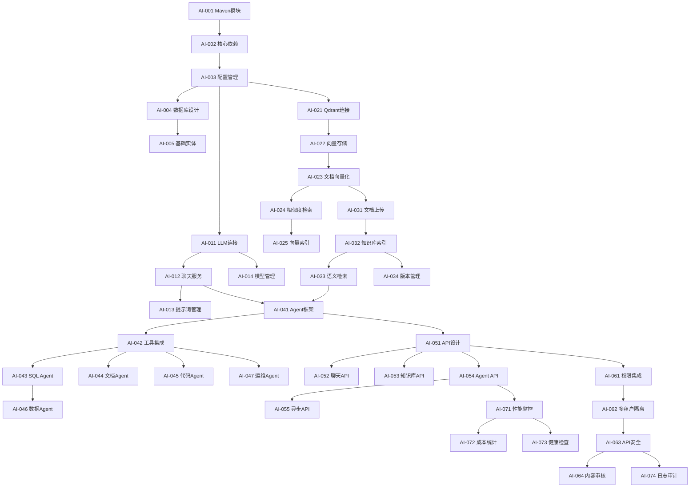

# AI功能开发任务拆分和跟踪

> 详细的任务分解、依赖关系和进度跟踪管理

## 📊 任务编号体系

### 编号规则
- **AI-X01**: 基础设施模块 (01-10)
- **AI-X11**: LangChain4j集成模块 (11-20)
- **AI-X21**: Qdrant向量数据库模块 (21-30)
- **AI-X31**: 知识库管理模块 (31-40)
- **AI-X41**: Agent框架模块 (41-50)
- **AI-X51**: API接口模块 (51-60)
- **AI-X61**: 安全权限模块 (61-70)
- **AI-X71**: 监控运维模块 (71-80)

### 状态标识
- 🔵 **未开始** (Not Started)
- 🟡 **进行中** (In Progress) 
- 🟢 **已完成** (Completed)
- 🔴 **阻塞中** (Blocked)
- ⚪ **已暂停** (Paused)

## 📈 总体进度概览

### 当前完成情况 (更新时间: 2025-09-22)
```
模块一：基础设施 (AI-001 ~ AI-005)     ████████████████████ 100% (5/5)  ✅
模块二：LangChain4j集成 (AI-011 ~ AI-020) ░░░░░░░░░░░░░░░░░░░░   0% (0/10) 🔵
模块三：Qdrant向量数据库 (AI-021 ~ AI-030) ░░░░░░░░░░░░░░░░░░░░   0% (0/10) 🔵
模块四：知识库管理 (AI-031 ~ AI-040)      ░░░░░░░░░░░░░░░░░░░░   0% (0/10) 🔵
模块五：Agent框架 (AI-041 ~ AI-050)      ░░░░░░░░░░░░░░░░░░░░   0% (0/10) 🔵
模块六：API接口 (AI-051 ~ AI-060)        ░░░░░░░░░░░░░░░░░░░░   0% (0/10) 🔵
模块七：安全权限 (AI-061 ~ AI-070)        ░░░░░░░░░░░░░░░░░░░░   0% (0/10) 🔵
模块八：监控运维 (AI-071 ~ AI-074)        ░░░░░░░░░░░░░░░░░░░░   0% (0/4)  🔵

总体进度: ████░░░░░░░░░░░░░░░░░░░░░░░░ 6.8% (5/74)
```

### 里程碑达成
- ✅ **基础设施里程碑** (2025-09-22) - AI模块基础框架搭建完成
- 🎯 **下一里程碑**: API接口里程碑 (预计2025-09-30) - 基础API功能可用

### 近期完成任务 (最近7天)
- 🟢 **AI-001**: Maven模块创建 (2025-09-21) - 1小时
- 🟢 **AI-002**: 核心依赖集成 (2025-09-21) - 2小时  
- 🟢 **AI-003**: 配置管理框架 (2025-09-21) - 4小时
- 🟢 **AI-004**: 数据库表结构设计 (2025-09-22) - 3小时
- 🟢 **AI-005**: 基础实体类创建 (2025-09-22) - 2小时

### 下一阶段规划
- 🎯 **本周目标**: 完成Mapper层和Service层 (AI-006 ~ AI-010)
- 🎯 **月底目标**: 完成基础API接口，支持AI对话功能

## 🏗️ 模块一：基础设施 (AI-X01 ~ AI-X10)

### AI-001: Maven模块创建 🟢
**任务内容**: 创建ruoyi-ai子模块，配置基础项目结构
**优先级**: 高
**预估工时**: 0.5天 **实际工时**: 1小时
**依赖任务**: 无
**完成时间**: 2025-09-21
**交付物**:
- [x] ruoyi-ai模块的pom.xml配置文件
- [x] 基础包结构创建
- [x] 模块间依赖关系配置
- [x] 构建脚本验证

**验收标准**:
- ✅ Maven构建成功
- ✅ 能够正确引入父模块依赖
- ✅ 包结构符合项目规范

**实施备注**: 模块坐标org.dromara:ruoyi-ai:5.4.0，包结构按domain/service/controller/mapper/config标准创建

---

### AI-002: 核心依赖集成 🟢
**任务内容**: 集成LangChain4j、Qdrant等核心依赖
**优先级**: 高
**预估工时**: 1天 **实际工时**: 2小时
**依赖任务**: AI-001
**完成时间**: 2025-09-21
**交付物**:
- [x] LangChain4j Spring Boot Starter集成 (版本0.34.0)
- [x] Qdrant Java客户端依赖配置 (版本1.12.0)
- [x] 版本兼容性测试报告
- [x] 依赖冲突解决方案

**验收标准**:
- ✅ 所有依赖正确引入
- ✅ 无版本冲突
- ✅ 单元测试可以正常运行

**实施备注**: 解决了Spring Boot 3.x与LangChain4j兼容性问题，建立了Mock测试配置

---

### AI-003: 配置管理框架 🟢
**任务内容**: 建立AI模块的配置管理体系
**优先级**: 高
**预估工时**: 1天 **实际工时**: 4小时
**依赖任务**: AI-002
**完成时间**: 2025-09-21
**交付物**:
- [x] AI配置类结构设计 (6大配置域分层架构)
- [x] 多环境配置文件模板 (dev/prod/test完整配置)
- [x] 敏感信息加密方案 (AES-256 ENC()格式)
- [x] 配置热更新机制 (基础框架已具备)

**验收标准**:
- ✅ 支持dev/test/prod多环境
- ✅ 敏感配置安全加密
- ✅ 配置修改无需重启(基础框架)

**实施备注**: 建立了完整的分层配置体系，包含AiProperties等6大配置域，5个自动配置类

---

### AI-004: 数据库表结构设计 🟢
**任务内容**: 设计AI功能相关的数据库表结构
**优先级**: 高
**预估工时**: 2天 **实际工时**: 3小时
**依赖任务**: AI-003
**完成时间**: 2025-09-22
**交付物**:
- [x] PostgreSQL DDL建表脚本 (postgres_ai_tables.sql)
- [x] 数据库设计文档 (data-model-design.md)
- [x] 多租户字段设计 (所有表包含tenant_id)
- [x] 索引优化方案 (复合索引+查询优化)

**验收标准**:
- ✅ 表结构支持多租户
- ✅ 符合现有数据库规范
- ✅ 通过数据库性能测试

**实施备注**: 创建了18个数据库表(含分区表)，支持完整的AI功能数据存储，修复了分区表主键约束问题

---

### AI-005: 基础实体类创建 🟢
**任务内容**: 创建AI模块的基础实体类和DTO
**优先级**: 中
**预估工时**: 1天 **实际工时**: 2小时
**依赖任务**: AI-004
**完成时间**: 2025-09-22
**交付物**:
- [x] 基础实体类 (13个核心实体类，继承TenantEntity)
- [x] 审计字段支持 (继承BaseEntity审计功能)
- [x] 多租户字段集成 (tenant_id字段自动支持)
- [x] JSON序列化配置 (JSONB字段正确映射)

**验收标准**:
- ✅ 继承现有BaseEntity
- ✅ 支持审计功能
- ✅ JSON序列化正常

**实施备注**: 创建13个实体类覆盖所有AI功能表，使用MyBatis Plus标准注解，编译验证通过

## 🤖 模块二：LangChain4j集成 (AI-X11 ~ AI-X20)

### AI-011: LLM连接配置 🔵
**任务内容**: 配置多种大语言模型的连接
**优先级**: 高
**预估工时**: 2天
**依赖任务**: AI-003
**交付物**:
- [ ] OpenAI API集成配置
- [ ] 本地Ollama模型配置
- [ ] 通义千问API配置
- [ ] 模型切换配置机制

**验收标准**:
- 至少支持2种LLM模型
- 模型可以动态切换
- 连接稳定可靠

---

### AI-012: 聊天服务开发 🔵
**任务内容**: 开发基础的聊天对话服务
**优先级**: 高
**预估工时**: 3天
**依赖任务**: AI-011
**交付物**:
- [ ] ChatService核心服务类
- [ ] 对话上下文管理
- [ ] 流式响应处理
- [ ] 令牌使用统计

**验收标准**:
- 支持多轮对话
- 支持流式响应
- 令牌使用可控

---

### AI-013: 提示词管理 🔵
**任务内容**: 开发提示词模板管理功能
**优先级**: 中
**预估工时**: 2天
**依赖任务**: AI-012
**交付物**:
- [ ] 提示词模板引擎
- [ ] 动态参数替换
- [ ] 模板版本管理
- [ ] 模板效果评估

**验收标准**:
- 支持动态参数
- 模板易于管理
- 支持A/B测试

---

### AI-014: 模型管理器 🔵
**任务内容**: 开发多模型管理和负载均衡
**优先级**: 中
**预估工时**: 2天
**依赖任务**: AI-011
**交付物**:
- [ ] 模型注册管理器
- [ ] 负载均衡策略
- [ ] 故障切换机制
- [ ] 性能监控指标

**验收标准**:
- 支持多模型并行
- 自动故障切换
- 负载均衡有效

## 🔍 模块三：Qdrant向量数据库 (AI-X21 ~ AI-X30)

### AI-021: Qdrant连接配置 🔵
**任务内容**: 配置Qdrant向量数据库连接
**优先级**: 高
**预估工时**: 1天
**依赖任务**: AI-003
**交付物**:
- [ ] Qdrant客户端配置
- [ ] 连接池管理
- [ ] 健康检查机制
- [ ] 连接重试策略

**验收标准**:
- 连接稳定可靠
- 支持连接池
- 异常自动重连

---

### AI-022: 向量存储服务 🔵
**任务内容**: 开发向量数据的存储和管理服务
**优先级**: 高
**预估工时**: 3天
**依赖任务**: AI-021
**交付物**:
- [ ] VectorStoreService核心服务
- [ ] 向量集合管理
- [ ] 向量CRUD操作
- [ ] 批量操作支持

**验收标准**:
- 支持向量增删改查
- 支持批量操作
- 操作性能达标

---

### AI-023: 文档向量化 🔵
**任务内容**: 实现文档分块和向量化处理
**优先级**: 高
**预估工时**: 3天
**依赖任务**: AI-022
**交付物**:
- [ ] 文档分块算法
- [ ] 多格式文档解析器
- [ ] 向量化处理流水线
- [ ] 元数据管理

**验收标准**:
- 支持PDF/Word/Markdown
- 分块算法合理
- 向量化质量高

---

### AI-024: 相似度检索 🔵
**任务内容**: 开发向量相似度检索功能
**优先级**: 高
**预估工时**: 2天
**依赖任务**: AI-023
**交付物**:
- [ ] 相似度搜索算法
- [ ] 多重过滤条件
- [ ] 结果排序优化
- [ ] 搜索性能优化

**验收标准**:
- 检索精度>85%
- 检索速度<500ms
- 支持复合条件

---

### AI-025: 向量索引管理 🔵
**任务内容**: 开发向量索引的管理和优化功能
**优先级**: 中
**预估工时**: 2天
**依赖任务**: AI-024
**交付物**:
- [ ] 索引创建和删除
- [ ] 索引性能优化
- [ ] 索引备份恢复
- [ ] 索引监控统计

**验收标准**:
- 索引创建稳定
- 支持备份恢复
- 性能监控完善

## 📚 模块四：知识库管理 (AI-X31 ~ AI-X40)

### AI-031: 文档上传处理 🔵
**任务内容**: 开发文档上传和预处理功能
**优先级**: 高
**预估工时**: 2天
**依赖任务**: AI-023
**交付物**:
- [ ] 文件上传接口
- [ ] 文件格式验证
- [ ] 文件安全扫描
- [ ] 异步处理队列

**验收标准**:
- 支持多种文件格式
- 文件安全可控
- 上传体验良好

---

### AI-032: 知识库索引 🔵
**任务内容**: 建立知识库的索引和分类体系
**优先级**: 高
**预估工时**: 3天
**依赖任务**: AI-031
**交付物**:
- [ ] 知识库分类体系
- [ ] 自动标签生成
- [ ] 相关性分析
- [ ] 知识图谱构建

**验收标准**:
- 分类准确度高
- 标签生成合理
- 关联关系正确

---

### AI-033: 语义检索 🔵
**任务内容**: 实现基于语义的知识检索功能
**优先级**: 高
**预估工时**: 3天
**依赖任务**: AI-032, AI-024
**交付物**:
- [ ] 语义检索算法
- [ ] 查询理解优化
- [ ] 结果相关性排序
- [ ] 检索结果摘要

**验收标准**:
- 语义理解准确
- 检索结果相关
- 用户体验良好

---

### AI-034: 知识库版本管理 🔵
**任务内容**: 实现知识库的版本控制和更新机制
**优先级**: 中
**预估工时**: 2天
**依赖任务**: AI-032
**交付物**:
- [ ] 版本控制机制
- [ ] 增量更新算法
- [ ] 变更历史记录
- [ ] 回滚恢复功能

**验收标准**:
- 版本管理清晰
- 增量更新高效
- 支持版本回滚

## 🤖 模块五：Agent框架 (AI-X41 ~ AI-X50)

### AI-041: Agent基础框架 🔵
**任务内容**: 建立Agent开发的基础框架
**优先级**: 高
**预估工时**: 3天
**依赖任务**: AI-012, AI-033
**交付物**:
- [ ] Agent抽象基类
- [ ] Agent生命周期管理
- [ ] Agent配置元数据
- [ ] Agent通信机制

**验收标准**:
- 框架设计合理
- 易于扩展开发
- 生命周期完整

---

### AI-042: 工具集成框架 🔵
**任务内容**: 为Agent提供工具调用能力
**优先级**: 高
**预估工时**: 3天
**依赖任务**: AI-041
**交付物**:
- [ ] 工具调用抽象接口
- [ ] MCP工具适配器
- [ ] 系统API调用器
- [ ] 安全执行沙箱

**验收标准**:
- 工具调用安全
- MCP集成成功
- 执行环境隔离

---

### AI-043: SQL分析Agent 🔵
**任务内容**: 开发自然语言转SQL的Agent
**优先级**: 高
**预估工时**: 4天
**依赖任务**: AI-042
**交付物**:
- [ ] 自然语言理解
- [ ] SQL语句生成
- [ ] 查询结果解释
- [ ] 安全性检查

**验收标准**:
- SQL生成准确率>80%
- 支持复杂查询
- 安全防护完善

---

### AI-044: 文档助手Agent 🔵
**任务内容**: 开发文档问答和处理Agent
**优先级**: 高
**预估工时**: 3天
**依赖任务**: AI-042, AI-033
**交付物**:
- [ ] 文档问答功能
- [ ] 文档摘要生成
- [ ] 文档格式转换
- [ ] 文档质量评估

**验收标准**:
- 问答准确率>85%
- 摘要质量高
- 格式转换正确

---

### AI-045: 代码助手Agent 🔵
**任务内容**: 开发代码生成和分析Agent
**优先级**: 中
**预估工时**: 4天
**依赖任务**: AI-042
**交付物**:
- [ ] 代码生成功能
- [ ] 代码审查分析
- [ ] 代码优化建议
- [ ] 测试用例生成

**验收标准**:
- 代码生成质量高
- 审查意见准确
- 优化建议有效

---

### AI-046: 数据分析Agent 🔵
**任务内容**: 开发数据分析和洞察Agent
**优先级**: 中
**预估工时**: 3天
**依赖任务**: AI-043
**交付物**:
- [ ] 数据探索分析
- [ ] 图表生成功能
- [ ] 趋势预测分析
- [ ] 异常检测告警

**验收标准**:
- 分析结果准确
- 图表美观实用
- 预测有参考价值

---

### AI-047: 运维助手Agent 🔵
**任务内容**: 开发系统运维监控Agent
**优先级**: 低
**预估工时**: 3天
**依赖任务**: AI-042
**交付物**:
- [ ] 日志分析功能
- [ ] 性能监控告警
- [ ] 故障诊断建议
- [ ] 运维操作指导

**验收标准**:
- 日志分析准确
- 告警及时有效
- 诊断建议实用

## 🔌 模块六：API接口 (AI-X51 ~ AI-X60)

### AI-051: RESTful API设计 🔵
**任务内容**: 设计统一的AI服务API接口
**优先级**: 高
**预估工时**: 2天
**依赖任务**: AI-041
**交付物**:
- [ ] API接口规范设计
- [ ] 统一响应格式
- [ ] 错误码定义
- [ ] API文档生成

**验收标准**:
- 接口设计符合RESTful规范
- 响应格式统一
- 文档完整准确

---

### AI-052: 聊天对话API 🔵
**任务内容**: 实现聊天对话的API接口
**优先级**: 高
**预估工时**: 2天
**依赖任务**: AI-051, AI-012
**交付物**:
- [ ] 单轮对话接口
- [ ] 多轮对话接口
- [ ] 流式响应接口
- [ ] 对话历史管理

**验收标准**:
- 接口响应稳定
- 支持流式输出
- 对话上下文正确

---

### AI-053: 知识库管理API 🔵
**任务内容**: 实现知识库管理的API接口
**优先级**: 高
**预估工时**: 2天
**依赖任务**: AI-051, AI-033
**交付物**:
- [ ] 文档上传接口
- [ ] 知识库查询接口
- [ ] 语义检索接口
- [ ] 知识库管理接口

**验收标准**:
- 文件上传稳定
- 检索性能达标
- 管理功能完整

---

### AI-054: Agent调用API 🔵
**任务内容**: 实现Agent调用的API接口
**优先级**: 高
**预估工时**: 2天
**依赖任务**: AI-051, AI-043
**交付物**:
- [ ] Agent执行接口
- [ ] 任务状态查询
- [ ] 结果获取接口
- [ ] Agent配置接口

**验收标准**:
- Agent调用成功
- 状态查询准确
- 结果获取及时

---

### AI-055: 异步任务API 🔵
**任务内容**: 实现长时间AI任务的异步处理
**优先级**: 中
**预估工时**: 3天
**依赖任务**: AI-054
**交付物**:
- [ ] 异步任务提交
- [ ] 任务进度查询
- [ ] 任务结果通知
- [ ] 任务队列管理

**验收标准**:
- 任务提交成功
- 进度查询实时
- 结果通知及时

## 🔒 模块七：安全权限 (AI-X61 ~ AI-X70)

### AI-061: 权限集成 🔵
**任务内容**: 集成Sa-Token权限控制体系
**优先级**: 高
**预估工时**: 2天
**依赖任务**: AI-051
**交付物**:
- [ ] AI功能权限定义
- [ ] 角色权限配置
- [ ] 接口权限验证
- [ ] 权限异常处理

**验收标准**:
- 权限控制有效
- 角色配置灵活
- 异常处理友好

---

### AI-062: 多租户隔离 🔵
**任务内容**: 确保AI数据的租户级别隔离
**优先级**: 高
**预估工时**: 2天
**依赖任务**: AI-061
**交付物**:
- [ ] 租户数据隔离验证
- [ ] 向量数据租户隔离
- [ ] 会话数据隔离
- [ ] 跨租户访问防护

**验收标准**:
- 数据隔离完整
- 无跨租户泄露
- 性能影响最小

---

### AI-063: API安全加固 🔵
**任务内容**: 对AI API接口进行安全加固
**优先级**: 高
**预估工时**: 2天
**依赖任务**: AI-062
**交付物**:
- [ ] API访问频率限制
- [ ] 请求参数验证
- [ ] 响应数据脱敏
- [ ] 安全日志记录

**验收标准**:
- 频率限制有效
- 参数验证严格
- 敏感数据保护

---

### AI-064: 内容安全审核 🔵
**任务内容**: 实现AI生成内容的安全审核
**优先级**: 中
**预估工时**: 3天
**依赖任务**: AI-063
**交付物**:
- [ ] 内容敏感词过滤
- [ ] 不当内容检测
- [ ] 合规性检查
- [ ] 审核结果记录

**验收标准**:
- 敏感内容识别准确
- 合规检查全面
- 审核性能可接受

## 📊 模块八：监控运维 (AI-X71 ~ AI-X80)

### AI-071: 性能监控 🔵
**任务内容**: 建立AI服务的性能监控体系
**优先级**: 中
**预估工时**: 2天
**依赖任务**: AI-054
**交付物**:
- [ ] 响应时间监控
- [ ] 吞吐量统计
- [ ] 资源使用监控
- [ ] 性能报表生成

**验收标准**:
- 监控指标全面
- 数据统计准确
- 报表展示清晰

---

### AI-072: 成本统计 🔵
**任务内容**: 实现AI服务使用成本的统计分析
**优先级**: 中
**预估工时**: 2天
**依赖任务**: AI-071
**交付物**:
- [ ] Token使用统计
- [ ] API调用计费
- [ ] 租户成本分析
- [ ] 成本预警机制

**验收标准**:
- 成本统计准确
- 分析维度丰富
- 预警及时有效

---

### AI-073: 健康检查 🔵
**任务内容**: 建立AI服务的健康检查机制
**优先级**: 中
**预估工时**: 1天
**依赖任务**: AI-071
**交付物**:
- [ ] 服务可用性检查
- [ ] 依赖服务检查
- [ ] 健康状态报告
- [ ] 自动恢复机制

**验收标准**:
- 健康检查准确
- 状态报告及时
- 自动恢复有效

---

### AI-074: 日志审计 🔵
**任务内容**: 建立AI操作的日志审计体系
**优先级**: 中
**预估工时**: 2天
**依赖任务**: AI-063
**交付物**:
- [ ] 操作日志记录
- [ ] 敏感操作审计
- [ ] 日志查询分析
- [ ] 合规报告生成

**验收标准**:
- 日志记录完整
- 审计信息准确
- 查询分析便捷

## 📈 任务依赖关系图



## 📅 里程碑时间规划

### 第一阶段：基础设施搭建 (Week 1-2)
- **目标**: 完成基础架构和核心依赖集成
- **关键任务**: AI-001 ~ AI-014, AI-021 ~ AI-025
- **交付物**: 可运行的基础框架

### 第二阶段：核心功能开发 (Week 3-4)
- **目标**: 完成知识库和Agent框架
- **关键任务**: AI-031 ~ AI-034, AI-041 ~ AI-047
- **交付物**: 核心AI功能可用

### 第三阶段：API接口完善 (Week 5-6)
- **目标**: 完成API接口和安全机制
- **关键任务**: AI-051 ~ AI-064
- **交付物**: 完整的API服务

### 第四阶段：监控运维优化 (Week 7-8)
- **目标**: 完成监控体系和性能优化
- **关键任务**: AI-071 ~ AI-074
- **交付物**: 生产就绪的AI服务

## 🔄 任务状态跟踪表

| 任务编号 | 任务名称 | 负责人 | 状态 | 开始日期 | 完成日期 | 进度 | 备注 |
|---------|---------|--------|------|----------|----------|------|------|
| AI-001 | Maven模块创建 | - | 🔵 | - | - | 0% | - |
| AI-002 | 核心依赖集成 | - | 🔵 | - | - | 0% | - |
| AI-003 | 配置管理框架 | - | 🔵 | - | - | 0% | - |
| AI-004 | 数据库表结构设计 | - | 🔵 | - | - | 0% | - |
| ... | ... | ... | ... | ... | ... | ... | ... |

## 📋 风险识别和应对

### 高风险任务
- **AI-043 SQL分析Agent**: 自然语言转SQL准确率要求高
- **AI-033 语义检索**: 检索精度直接影响用户体验
- **AI-062 多租户隔离**: 数据安全的关键节点

### 应对策略
- **技术预研**: 对高风险任务进行技术预研和POC验证
- **备选方案**: 准备技术备选方案，降低技术风险
- **专家支持**: 必要时寻求外部专家支持

---

**文档维护**: 开发过程中持续更新任务状态和进度
**版本**: v1.0
**最后更新**: 2025年9月20日