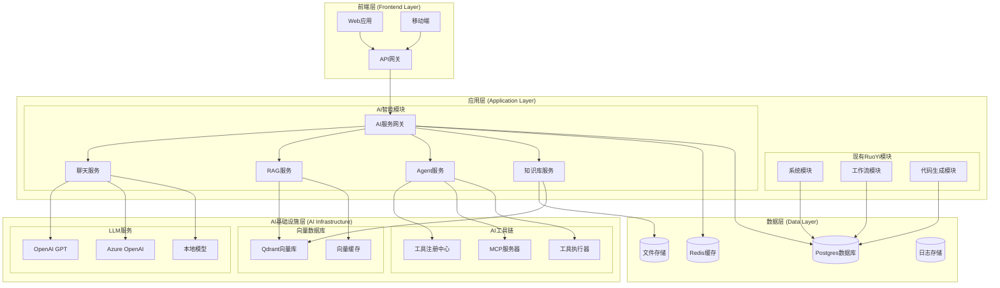
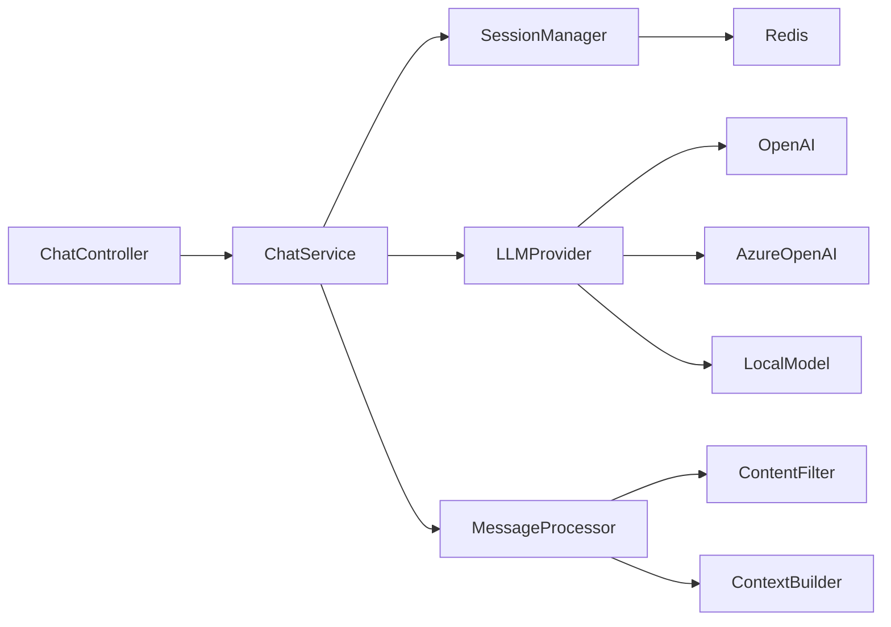
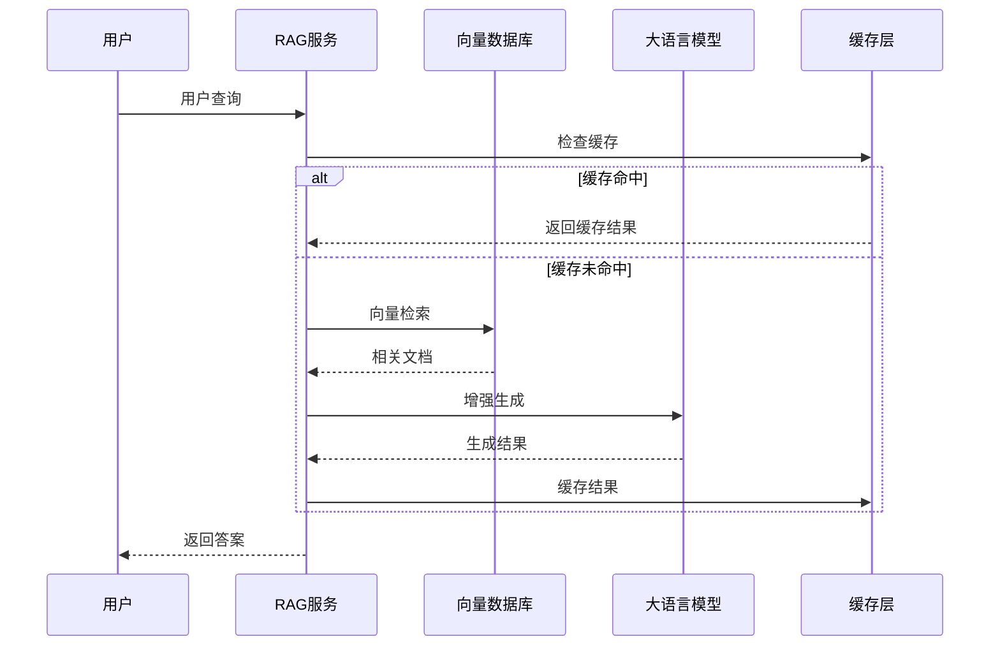
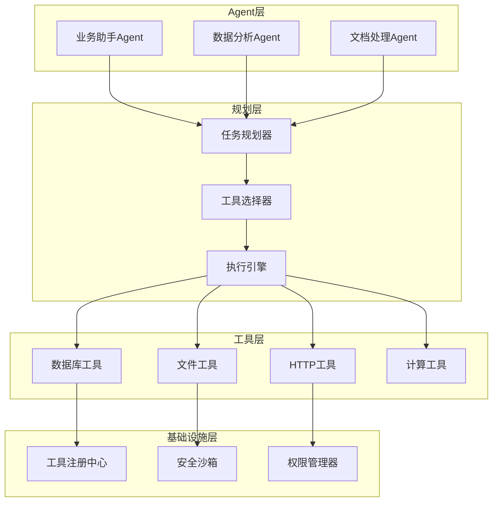
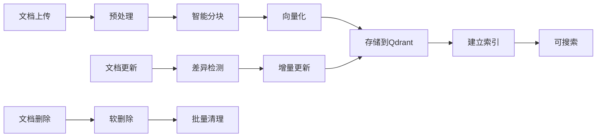
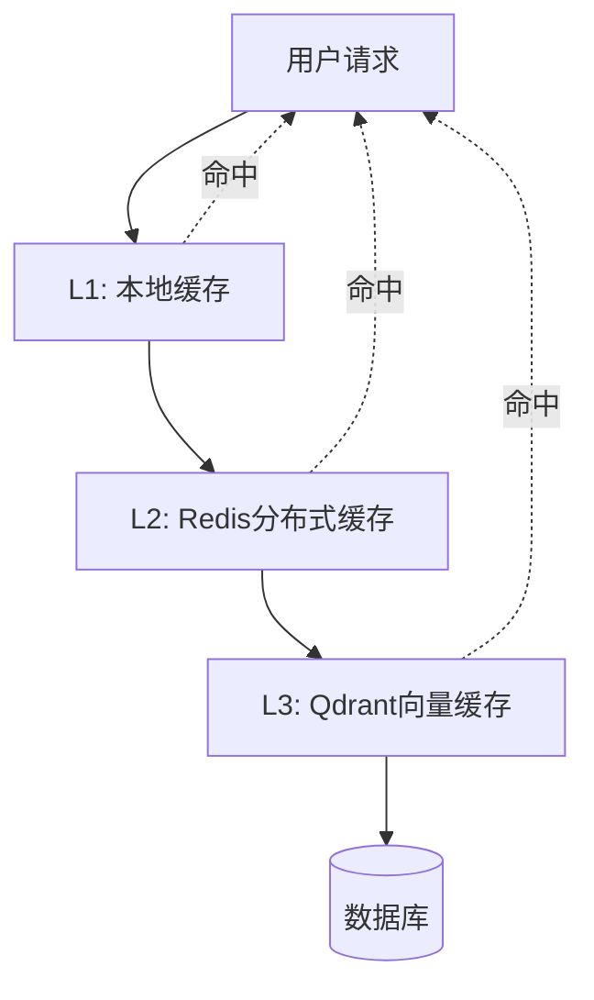
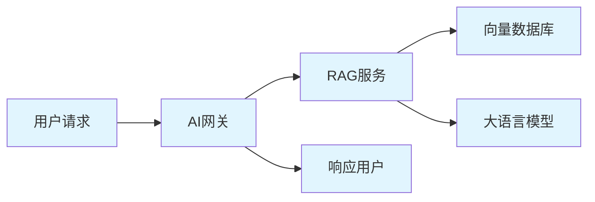

# 🏗 RuoYi-Vue-Plus AI智能化技术架构

## 🎯 架构设计原则

### 核心理念
- **无侵入性**: 在不破坏现有架构的基础上扩展AI能力
- **模块化**: 各AI功能模块独立开发、独立部署
- **可扩展性**: 支持水平扩展和垂直扩展
- **安全性**: 多租户数据隔离和权限控制
- **可观测性**: 完整的监控、日志和追踪体系

### 设计约束
- 兼容现有RuoYi-Vue-Plus架构
- 支持多租户和多数据源
- 保持现有权限体系
- 确保数据安全和隐私保护

---

## 🏛 整体架构图



---

## 🧩 核心模块设计

### 1. AI服务网关 (AI Gateway)

#### 职责
- 统一AI服务入口和路由
- 请求认证和权限控制
- 负载均衡和服务降级
- 监控和日志记录

#### 核心组件
```java
@Component
public class AIGateway {
    
    @Autowired
    private TenantContextHolder tenantContext;
    
    @Autowired
    private AIServiceRouter serviceRouter;
    
    @Autowired
    private RateLimiter rateLimiter;
    
    public AIResponse route(AIRequest request) {
        // 1. 租户上下文设置
        String tenantId = tenantContext.getCurrentTenantId();
        
        // 2. 权限验证
        validatePermissions(request, tenantId);
        
        // 3. 限流控制
        rateLimiter.acquire(tenantId, request.getServiceType());
        
        // 4. 路由到具体服务
        return serviceRouter.route(request);
    }
}
```

### 2. 聊天服务 (Chat Service)

#### 架构设计


#### 核心功能
- **会话管理**: 多轮对话上下文维护
- **模型切换**: 智能选择最适合的LLM模型
- **流式输出**: 实时响应流处理
- **内容过滤**: 敏感内容检测和过滤

### 3. RAG检索增强服务

#### 核心流程


#### 关键技术
- **混合检索**: 关键词检索 + 语义向量检索
- **重排序算法**: 基于相关性和质量的结果排序
- **上下文窗口管理**: 智能选择最相关的文档片段
- **增量更新**: 文档变更的实时向量更新

### 4. Agent智能体系统

#### 架构层次


---

## 💾 数据架构设计

### 1. 多租户数据隔离

#### 传统数据隔离 (继承现有)
```sql
-- 继承RuoYi的租户隔离策略
SELECT * FROM sys_user WHERE tenant_id = ? AND dept_id = ?
```

#### AI数据隔离策略
```sql
-- AI聊天会话隔离
CREATE TABLE ai_chat_session (
    id BIGINT PRIMARY KEY,
    tenant_id VARCHAR(64) NOT NULL,
    user_id BIGINT NOT NULL,
    session_name VARCHAR(255),
    created_time DATETIME,
    INDEX idx_tenant_user (tenant_id, user_id)
);

-- 知识库文档隔离
CREATE TABLE ai_knowledge_document (
    id BIGINT PRIMARY KEY,
    tenant_id VARCHAR(64) NOT NULL,
    collection_name VARCHAR(128) NOT NULL,
    document_name VARCHAR(255),
    file_path VARCHAR(512),
    vector_ids JSON,
    INDEX idx_tenant_collection (tenant_id, collection_name)
);

-- Agent配置隔离
CREATE TABLE ai_agent_config (
    id BIGINT PRIMARY KEY,
    tenant_id VARCHAR(64) NOT NULL,
    agent_name VARCHAR(128) NOT NULL,
    agent_config JSON,
    tools_config JSON,
    INDEX idx_tenant_agent (tenant_id, agent_name)
);
```

### 2. 向量数据库设计

#### Qdrant Collection结构
```json
{
  "collection_name": "tenant_{tenant_id}_knowledge",
  "vectors": {
    "size": 1536,
    "distance": "Cosine"
  },
  "payload_schema": {
    "tenant_id": "keyword",
    "document_id": "integer",
    "chunk_id": "integer",
    "content": "text",
    "metadata": "object",
    "created_at": "datetime"
  },
  "optimizers_config": {
    "default_segment_number": 2,
    "memmap_threshold": 20000
  }
}
```

#### 向量数据生命周期


---

## 🔧 技术选型与对比

### 1. LLM集成框架对比

| 框架 | 优势 | 劣势 | 选择理由 |
|------|------|------|----------|
| LangChain4j | Java原生、Spring Boot集成好 | 文档相对较少 | ✅ 与现有技术栈匹配 |
| LangChain (Python) | 生态丰富、文档完善 | 需要额外的Python服务 | ❌ 技术栈不统一 |
| Semantic Kernel | 微软官方、.NET原生 | Java支持有限 | ❌ 生态不够成熟 |

### 2. 向量数据库对比

| 数据库 | 性能 | 易用性 | 扩展性 | 成本 | 选择 |
|--------|------|--------|--------|------|------|
| Qdrant | 高 | 高 | 高 | 低 | ✅ |
| Pinecone | 高 | 高 | 高 | 高 | ❌ |
| Weaviate | 中 | 中 | 高 | 中 | ❌ |
| Chroma | 中 | 高 | 中 | 低 | ❌ |

### 3. Embedding模型选择

| 模型 | 维度 | 语言支持 | 性能 | 成本 | 推荐度 |
|------|------|----------|------|------|--------|
| OpenAI text-embedding-ada-002 | 1536 | 多语言 | 高 | 中 | ⭐⭐⭐⭐⭐ |
| BGE-large-zh | 1024 | 中文优化 | 高 | 免费 | ⭐⭐⭐⭐ |
| m3e-base | 768 | 中文 | 中 | 免费 | ⭐⭐⭐ |

---

## 🔐 安全架构设计

### 1. 多层安全防护

#### 网络层安全
```yaml
security:
  network:
    # API网关限流
    rate-limit:
      global: 1000/min
      per-tenant: 100/min
      per-user: 10/min
    
    # IP白名单
    ip-whitelist:
      - 192.168.1.0/24
      - 10.0.0.0/8
    
    # HTTPS强制
    ssl:
      enabled: true
      protocols: [TLSv1.2, TLSv1.3]
```

#### 应用层安全
- **权限控制**: 基于RBAC的细粒度权限
- **数据脱敏**: 敏感信息自动脱敏
- **审计日志**: 完整的操作审计链路
- **输入验证**: 防止Prompt注入攻击

#### 数据层安全
- **传输加密**: 所有数据传输采用TLS加密
- **存储加密**: 敏感数据落盘加密
- **备份加密**: 备份数据加密存储
- **访问控制**: 数据库级别的访问控制

### 2. AI特定安全措施

#### Prompt安全
```java
@Component
public class PromptSecurityFilter {
    
    // 检测Prompt注入攻击
    public boolean detectInjection(String prompt) {
        return promptInjectionPatterns.stream()
            .anyMatch(pattern -> pattern.matcher(prompt).find());
    }
    
    // 内容安全过滤
    public String sanitizeContent(String content) {
        return contentFilter.filter(content);
    }
    
    // 敏感信息脱敏
    public String maskSensitiveInfo(String text) {
        return sensitiveDataMasker.mask(text);
    }
}
```

#### 模型调用安全
- **Token预算控制**: 防止恶意大量消耗
- **内容审核**: 输出内容的合规性检查
- **调用审计**: 所有模型调用的完整记录
- **异常检测**: 异常调用模式的实时检测

---

## 📊 性能架构设计

### 1. 缓存策略

#### 多级缓存架构


#### 缓存配置
```yaml
cache:
  # L1本地缓存
  local:
    chat-context:
      size: 1000
      expire: 30m
    user-preferences:
      size: 5000
      expire: 1h
  
  # L2分布式缓存
  redis:
    query-results:
      expire: 1h
      max-size: 100MB
    vector-cache:
      expire: 24h
      max-size: 1GB
  
  # L3向量缓存
  qdrant:
    hot-vectors:
      size: 10000
      refresh: 2h
```

### 2. 性能优化策略

#### 异步处理
```java
@Service
public class AsyncRAGService {
    
    @Async("aiTaskExecutor")
    public CompletableFuture<List<Document>> retrieveDocuments(String query) {
        return CompletableFuture.supplyAsync(() -> {
            return vectorDatabase.search(query);
        });
    }
    
    @Async("aiTaskExecutor")  
    public CompletableFuture<String> generateResponse(String query, List<Document> context) {
        return CompletableFuture.supplyAsync(() -> {
            return llmService.generate(query, context);
        });
    }
}
```

#### 批处理优化
- **向量化批处理**: 批量处理文档向量化
- **查询合并**: 相似查询的智能合并
- **预计算**: 热点查询的预计算和缓存

### 3. 扩展性设计

#### 水平扩展
```yaml
scaling:
  # 微服务扩展
  services:
    ai-gateway:
      replicas: 3
      resources:
        cpu: 2
        memory: 4Gi
    
    rag-service:
      replicas: 2
      resources:
        cpu: 4
        memory: 8Gi
    
    agent-service:
      replicas: 2
      resources:
        cpu: 2
        memory: 4Gi
  
  # 数据库扩展
  databases:
    qdrant:
      shards: 3
      replicas: 2
    
    redis:
      cluster-size: 6
      memory: 16Gi
```

---

## 🔍 可观测性架构

### 1. 监控体系

#### 指标监控
```yaml
metrics:
  # 业务指标
  business:
    - ai_requests_total
    - ai_response_time
    - ai_error_rate
    - token_usage_total
    - vector_search_latency
  
  # 系统指标
  system:
    - cpu_usage_percent
    - memory_usage_percent
    - disk_usage_percent
    - network_io_bytes
  
  # 自定义指标
  custom:
    - tenant_active_users
    - knowledge_base_size
    - agent_execution_success_rate
```

#### 告警规则
```yaml
alerts:
  - name: AI服务响应时间过长
    condition: ai_response_time > 5s
    severity: warning
    
  - name: Token使用量超限
    condition: token_usage_rate > 80%
    severity: critical
    
  - name: 向量数据库连接异常
    condition: qdrant_connection_failed > 0
    severity: critical
```

### 2. 日志系统

#### 结构化日志
```json
{
  "timestamp": "2024-01-15T10:30:00Z",
  "level": "INFO",
  "service": "ai-gateway",
  "tenant_id": "tenant_001",
  "user_id": "user_123",
  "trace_id": "trace_abc123",
  "span_id": "span_def456",
  "event": "ai_request",
  "data": {
    "model": "gpt-4",
    "tokens_used": 150,
    "response_time_ms": 1200,
    "success": true
  }
}
```

### 3. 链路追踪

#### 分布式追踪


---

## 🚀 部署架构

### 1. 容器化部署

#### Docker Compose配置
```yaml
version: '3.8'
services:
  ai-gateway:
    image: ruoyi/ai-gateway:latest
    ports:
      - "8080:8080"
    environment:
      - SPRING_PROFILES_ACTIVE=prod
      - QDRANT_HOST=qdrant
      - REDIS_HOST=redis
    depends_on:
      - qdrant
      - redis
  
  qdrant:
    image: qdrant/qdrant:v1.7.0
    ports:
      - "6333:6333"
      - "6334:6334"
    volumes:
      - qdrant_data:/qdrant/storage
  
  redis:
    image: redis:7-alpine
    ports:
      - "6379:6379"
    volumes:
      - redis_data:/data

volumes:
  qdrant_data:
  redis_data:
```

### 2. Kubernetes部署

#### 生产环境配置
```yaml
apiVersion: apps/v1
kind: Deployment
metadata:
  name: ai-gateway
spec:
  replicas: 3
  selector:
    matchLabels:
      app: ai-gateway
  template:
    metadata:
      labels:
        app: ai-gateway
    spec:
      containers:
      - name: ai-gateway
        image: ruoyi/ai-gateway:latest
        ports:
        - containerPort: 8080
        resources:
          requests:
            cpu: 500m
            memory: 1Gi
          limits:
            cpu: 2
            memory: 4Gi
        env:
        - name: SPRING_PROFILES_ACTIVE
          value: "k8s"
        - name: QDRANT_HOST
          value: "qdrant-service"
```

---

## 📈 架构演进规划

### 当前阶段 (v1.0)
- 单体应用扩展
- 基础AI能力集成
- 简单的多租户支持

### 中期目标 (v2.0)
- 微服务化改造
- 高可用架构
- 高级AI功能

### 长期愿景 (v3.0)
- 云原生架构
- 智能运维
- 生态开放平台

**技术架构将持续演进，始终以业务价值为导向，以用户体验为中心！** 🎯