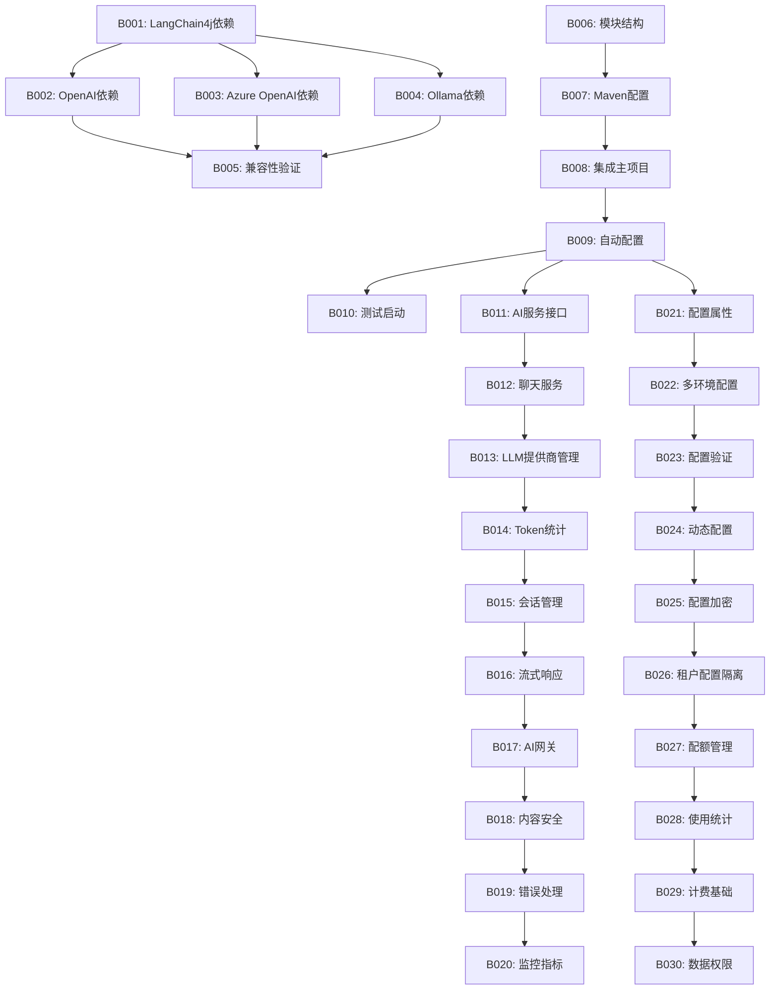

# 🚀 Phase 1 后端任务 - LangChain4j基础集成

## 📋 任务概览

**阶段名称**: Phase 1 - LangChain4j基础集成  
**任务范围**: B001-B030  
**预计时间**: 1.5-2周  
**核心目标**: 构建AI能力的基础设施，实现基本的智能对话和文档问答功能  

---

## 📊 任务分类统计

| 类别 | 任务数量 | 预计时间 |
|------|----------|----------|
| 依赖管理 | 5个 | 1天 |
| 模块架构 | 5个 | 2天 |
| 核心服务 | 10个 | 6天 |
| 配置管理 | 5个 | 2天 |
| 多租户支持 | 5个 | 3天 |
| **总计** | **30个** | **14天** |

---

## 🔧 依赖管理任务 (B001-B005)

### B001: 添加LangChain4j依赖
- **任务描述**: 在ruoyi-ai模块中添加langchain4j-spring-boot-starter依赖
- **技术要点**: 
  ```xml
  <dependency>
      <groupId>dev.langchain4j</groupId>
      <artifactId>langchain4j-spring-boot-starter</artifactId>
      <version>1.1.0</version>
  </dependency>
  ```
- **验收标准**: 
  - 依赖成功引入，无版本冲突
  - Spring Boot应用正常启动
- **预计工时**: 0.5天
- **依赖任务**: 无
- **输出文件**: `server/ruoyi-modules/ruoyi-ai/pom.xml`

### B002: 配置OpenAI集成依赖
- **任务描述**: 添加OpenAI模型支持依赖
- **技术要点**:
  ```xml
  <dependency>
      <groupId>dev.langchain4j</groupId>
      <artifactId>langchain4j-open-ai-spring-boot-starter</artifactId>
      <version>1.1.0</version>
  </dependency>
  ```
- **验收标准**: 
  - OpenAI相关配置类正常注入
  - 可通过application.yml配置API Key
- **预计工时**: 0.5天
- **依赖任务**: B001
- **输出文件**: `server/ruoyi-modules/ruoyi-ai/pom.xml`

### B003: 配置Azure OpenAI集成依赖
- **任务描述**: 添加Azure OpenAI模型支持依赖
- **技术要点**:
  ```xml
  <dependency>
      <groupId>dev.langchain4j</groupId>
      <artifactId>langchain4j-azure-open-ai-spring-boot-starter</artifactId>
      <version>1.1.0</version>
  </dependency>
  ```
- **验收标准**: 
  - Azure OpenAI配置类正常加载
  - 支持endpoint和deployment-name配置
- **预计工时**: 0.5天
- **依赖任务**: B001
- **输出文件**: `server/ruoyi-modules/ruoyi-ai/pom.xml`

### B004: 配置本地模型集成依赖  
- **任务描述**: 添加Ollama本地模型支持依赖
- **技术要点**:
  ```xml
  <dependency>
      <groupId>dev.langchain4j</groupId>
      <artifactId>langchain4j-ollama-spring-boot-starter</artifactId>
      <version>1.1.0</version>
  </dependency>
  ```
- **验收标准**: 
  - Ollama模型配置类正常注入
  - 支持本地模型的base-url配置
- **预计工时**: 0.5天
- **依赖任务**: B001
- **输出文件**: `server/ruoyi-modules/ruoyi-ai/pom.xml`

### B005: 依赖版本兼容性验证
- **任务描述**: 验证所有AI依赖与现有RuoYi框架的兼容性
- **技术要点**:
  - 检查Spring Boot版本兼容性
  - 验证Jackson序列化库兼容性
  - 检查Security框架兼容性
- **验收标准**: 
  - 所有测试用例通过
  - 应用启动无异常
  - 依赖树无冲突
- **预计工时**: 0.5天
- **依赖任务**: B001-B004
- **输出文件**: `dependency-compatibility-report.md`

---

## 🏗 模块架构任务 (B006-B010)

### B006: 创建ruoyi-ai模块基础结构
- **任务描述**: 在ruoyi-modules下创建ruoyi-ai模块基础目录结构
- **技术要点**:
  ```
  ruoyi-ai/
  ├── src/main/java/org/dromara/ai/
  │   ├── config/          # AI配置类
  │   ├── service/         # AI服务层
  │   ├── controller/      # AI控制器  
  │   ├── domain/          # AI数据模型
  │   ├── mapper/          # 数据访问层
  │   └── util/            # AI工具类
  └── pom.xml
  ```
- **验收标准**: 
  - 目录结构符合RuoYi规范
  - Maven模块正确配置
- **预计工时**: 0.5天
- **依赖任务**: 无
- **输出文件**: `server/ruoyi-modules/ruoyi-ai/` 目录结构

### B007: 配置AI模块Maven构建
- **任务描述**: 配置ruoyi-ai模块的pom.xml文件
- **技术要点**:
  ```xml
  <artifactId>ruoyi-ai</artifactId>
  <description>AI智能模块</description>
  <dependencies>
      <dependency>
          <groupId>org.dromara</groupId>
          <artifactId>ruoyi-common-core</artifactId>
      </dependency>
      <dependency>
          <groupId>org.dromara</groupId>
          <artifactId>ruoyi-common-security</artifactId>
      </dependency>
  </dependencies>
  ```
- **验收标准**: 
  - 模块可独立编译
  - 依赖RuoYi核心模块
- **预计工时**: 0.5天
- **依赖任务**: B006
- **输出文件**: `server/ruoyi-modules/ruoyi-ai/pom.xml`

### B008: 集成到主项目构建
- **任务描述**: 将ruoyi-ai模块集成到主项目的pom.xml中
- **技术要点**:
  ```xml
  <modules>
      <module>ruoyi-common</module>
      <module>ruoyi-modules</module>
      <module>ruoyi-ai</module>
  </modules>
  ```
- **验收标准**: 
  - 主项目可正常编译
  - AI模块被包含在构建过程中
- **预计工时**: 0.5天
- **依赖任务**: B007
- **输出文件**: `server/pom.xml`, `server/ruoyi-modules/pom.xml`

### B009: 配置模块自动配置类
- **任务描述**: 创建AI模块的自动配置类
- **技术要点**:
  ```java
  @Configuration
  @EnableConfigurationProperties(AiProperties.class)
  @ConditionalOnProperty(prefix = "ai", name = "enabled", havingValue = "true")
  public class AiAutoConfiguration {
      // 自动配置逻辑
  }
  ```
- **验收标准**: 
  - 自动配置类正常加载
  - 支持条件化配置
- **预计工时**: 1天
- **依赖任务**: B008
- **输出文件**: `org/dromara/ai/config/AiAutoConfiguration.java`

### B010: 创建模块启动类和测试
- **任务描述**: 创建AI模块的测试启动类和基础测试
- **技术要点**:
  ```java
  @SpringBootApplication
  @EnableAiServices
  public class AiModuleTestApplication {
      public static void main(String[] args) {
          SpringApplication.run(AiModuleTestApplication.class, args);
      }
  }
  ```
- **验收标准**: 
  - 测试应用可正常启动
  - 基础健康检查通过
- **预计工时**: 0.5天
- **依赖任务**: B009
- **输出文件**: `src/test/java/AiModuleTestApplication.java`

---

## ⚙️ 核心服务任务 (B011-B020)

### B011: 实现AI服务统一接口
- **任务描述**: 设计并实现统一的AI服务接口
- **技术要点**:
  ```java
  public interface AIService {
      AiResponse chat(String sessionId, String message);
      AiResponse streamChat(String sessionId, String message);
      List<String> getSupportedModels();
      TokenUsage getTokenUsage(String sessionId);
  }
  ```
- **验收标准**: 
  - 接口设计符合业务需求
  - 支持同步和异步调用
- **预计工时**: 1天
- **依赖任务**: B009
- **输出文件**: `org/dromara/ai/service/AIService.java`

### B012: 实现聊天服务核心逻辑
- **任务描述**: 实现ChatService聊天会话管理
- **技术要点**:
  ```java
  @Service
  public class ChatServiceImpl implements ChatService {
      
      @Autowired
      private ChatModel chatModel;
      
      @Override
      public ChatResponse chat(ChatRequest request) {
          // 基于langchain4j的聊天实现
          return chatModel.chat(request.getMessage());
      }
  }
  ```
- **验收标准**: 
  - 支持多轮对话
  - 会话状态正确管理
- **预计工时**: 2天
- **依赖任务**: B011
- **输出文件**: `org/dromara/ai/service/impl/ChatServiceImpl.java`

### B013: 实现LLM提供商管理服务
- **任务描述**: 实现多LLM提供商的统一管理
- **技术要点**:
  ```java
  @Service
  public class LLMProviderService {
      
      @Qualifier("openAiChatModel")
      private ChatModel openAiModel;
      
      @Qualifier("azureOpenAiChatModel") 
      private ChatModel azureModel;
      
      @Qualifier("ollamaChatModel")
      private ChatModel ollamaModel;
      
      public ChatModel getModel(String provider) {
          // 根据提供商返回对应模型
      }
  }
  ```
- **验收标准**: 
  - 支持动态切换模型
  - 模型选择逻辑正确
- **预计工时**: 1.5天
- **依赖任务**: B012
- **输出文件**: `org/dromara/ai/service/LLMProviderService.java`

### B014: 实现Token使用统计服务
- **任务描述**: 实现Token使用量的统计和管理
- **技术要点**:
  ```java
  @Service
  public class TokenUsageService {
      
      public void recordTokenUsage(String sessionId, TokenUsage usage);
      public TokenUsageStats getUsageStats(String tenantId);
      public boolean checkQuota(String tenantId);
  }
  ```
- **验收标准**: 
  - Token使用统计准确
  - 支持配额管理
- **预计工时**: 1天
- **依赖任务**: B013
- **输出文件**: `org/dromara/ai/service/TokenUsageService.java`

### B015: 实现会话管理服务
- **任务描述**: 实现AI聊天会话的生命周期管理
- **技术要点**:
  ```java
  @Service
  public class SessionManagerService {
      
      public String createSession(String userId);
      public void addMessage(String sessionId, Message message);
      public List<Message> getSessionHistory(String sessionId);
      public void clearSession(String sessionId);
  }
  ```
- **验收标准**: 
  - 会话创建和销毁正常
  - 历史消息存储正确
- **预计工时**: 1.5天
- **依赖任务**: B014
- **输出文件**: `org/dromara/ai/service/SessionManagerService.java`

### B016: 实现流式响应处理
- **任务描述**: 实现基于Reactor的流式响应处理
- **技术要点**:
  ```java
  @Service
  public class StreamingService {
      
      @Autowired
      private StreamingChatModel streamingChatModel;
      
      public Flux<String> streamChat(String message) {
          return Flux.create(sink -> {
              streamingChatModel.chat(message, new StreamingResponseHandler<AiMessage>() {
                  @Override
                  public void onNext(String token) {
                      sink.next(token);
                  }
              });
          });
      }
  }
  ```
- **验收标准**: 
  - 流式输出正常工作
  - 支持实时响应
- **预计工时**: 2天
- **依赖任务**: B015
- **输出文件**: `org/dromara/ai/service/StreamingService.java`

### B017: 实现AI服务网关
- **任务描述**: 实现统一的AI服务入口和路由
- **技术要点**:
  ```java
  @Component
  public class AIGateway {
      
      public AiResponse route(AiRequest request) {
          // 1. 权限验证
          // 2. 限流控制  
          // 3. 路由到具体服务
          // 4. 结果封装
      }
  }
  ```
- **验收标准**: 
  - 请求路由正确
  - 统一异常处理
- **预计工时**: 1.5天
- **依赖任务**: B016
- **输出文件**: `org/dromara/ai/gateway/AIGateway.java`

### B018: 实现内容安全过滤
- **任务描述**: 实现AI输入输出的内容安全过滤
- **技术要点**:
  ```java
  @Service
  public class ContentSecurityService {
      
      public boolean isInputSafe(String input);
      public String sanitizeOutput(String output);
      public boolean detectPromptInjection(String prompt);
  }
  ```
- **验收标准**: 
  - 敏感内容正确过滤
  - Prompt注入检测有效
- **预计工时**: 1天
- **依赖任务**: B017
- **输出文件**: `org/dromara/ai/service/ContentSecurityService.java`

### B019: 实现错误处理和重试机制
- **任务描述**: 实现AI服务的统一错误处理和重试机制
- **技术要点**:
  ```java
  @Component
  public class AiServiceErrorHandler {
      
      @Retryable(value = {ApiException.class}, maxAttempts = 3)
      public AiResponse handleWithRetry(Supplier<AiResponse> operation);
      
      @Recover
      public AiResponse recover(ApiException ex);
  }
  ```
- **验收标准**: 
  - 异常正确分类处理
  - 重试机制正常工作
- **预计工时**: 1天
- **依赖任务**: B018
- **输出文件**: `org/dromara/ai/handler/AiServiceErrorHandler.java`

### B020: 实现AI服务监控和指标收集
- **任务描述**: 实现AI服务的监控指标收集
- **技术要点**:
  ```java
  @Component
  public class AiServiceMetrics {
      
      private final MeterRegistry meterRegistry;
      
      public void recordRequest(String model, Duration responseTime);
      public void recordError(String model, String errorType);
      public void recordTokenUsage(String model, int tokens);
  }
  ```
- **验收标准**: 
  - 监控指标正确收集
  - 支持Prometheus格式
- **预计工时**: 1天
- **依赖任务**: B019
- **输出文件**: `org/dromara/ai/metrics/AiServiceMetrics.java`

---

## 📝 配置管理任务 (B021-B025)

### B021: 设计AI配置属性类
- **任务描述**: 设计AI模块的配置属性类
- **技术要点**:
  ```java
  @ConfigurationProperties(prefix = "ai")
  @Data
  public class AiProperties {
      private boolean enabled = true;
      private LlmProperties llm = new LlmProperties();
      private SecurityProperties security = new SecurityProperties();
      private QuotaProperties quota = new QuotaProperties();
  }
  ```
- **验收标准**: 
  - 配置项分类清晰
  - 支持IDE自动补全
- **预计工时**: 0.5天
- **依赖任务**: B009
- **输出文件**: `org/dromara/ai/config/AiProperties.java`

### B022: 实现多环境配置支持
- **任务描述**: 实现开发、测试、生产环境的AI配置
- **技术要点**:
  ```yaml
  # application-dev.yml
  ai:
    llm:
      default-provider: openai
      providers:
        openai:
          api-key: ${OPENAI_API_KEY}
          model: gpt-4o-mini
  ```
- **验收标准**: 
  - 各环境配置正确
  - 敏感信息使用环境变量
- **预计工时**: 0.5天
- **依赖任务**: B021
- **输出文件**: `application-dev.yml`, `application-test.yml`, `application-prod.yml`

### B023: 实现配置验证机制
- **任务描述**: 实现启动时的AI配置验证
- **技术要点**:
  ```java
  @Component
  public class AiConfigValidator {
      
      @EventListener(ApplicationReadyEvent.class)
      public void validateConfig() {
          // 验证API Key配置
          // 验证模型配置
          // 验证连接可用性
      }
  }
  ```
- **验收标准**: 
  - 配置错误及时发现
  - 提供清晰的错误信息
- **预计工时**: 1天
- **依赖任务**: B022
- **输出文件**: `org/dromara/ai/config/AiConfigValidator.java`

### B024: 实现动态配置更新
- **任务描述**: 实现运行时的AI配置动态更新
- **技术要点**:
  ```java
  @RefreshScope
  @Service
  public class DynamicConfigService {
      
      @Value("${ai.llm.default-provider}")
      private String defaultProvider;
      
      public void updateConfig(String key, String value);
  }
  ```
- **验收标准**: 
  - 支持配置热更新
  - 更新后服务正常工作
- **预计工时**: 1.5天
- **依赖任务**: B023
- **输出文件**: `org/dromara/ai/config/DynamicConfigService.java`

### B025: 实现配置加密存储
- **任务描述**: 实现敏感配置信息的加密存储
- **技术要点**:
  ```java
  @Service
  public class ConfigEncryptionService {
      
      public String encryptApiKey(String apiKey);
      public String decryptApiKey(String encryptedKey);
  }
  ```
- **验收标准**: 
  - API Key等敏感信息加密存储
  - 加密算法安全可靠
- **预计工时**: 0.5天
- **依赖任务**: B024
- **输出文件**: `org/dromara/ai/security/ConfigEncryptionService.java`

---

## 🏢 多租户支持任务 (B026-B030)

### B026: 设计租户级AI配置隔离
- **任务描述**: 设计基于RuoYi租户系统的AI配置隔离
- **技术要点**:
  ```java
  @Service
  public class TenantAiConfigService {
      
      public AiConfig getTenantConfig(String tenantId);
      public void updateTenantConfig(String tenantId, AiConfig config);
      public boolean checkTenantQuota(String tenantId);
  }
  ```
- **验收标准**: 
  - 租户配置完全隔离
  - 支持租户级别定制
- **预计工时**: 1天
- **依赖任务**: B025
- **输出文件**: `org/dromara/ai/tenant/TenantAiConfigService.java`

### B027: 实现租户AI使用配额管理
- **任务描述**: 实现租户级别的AI使用配额管理
- **技术要点**:
  ```java
  @Service
  public class TenantQuotaService {
      
      public QuotaStatus checkQuota(String tenantId, QuotaType type);
      public void consumeQuota(String tenantId, int tokens);
      public void resetQuota(String tenantId, QuotaType type);
  }
  ```
- **验收标准**: 
  - 配额控制精确
  - 支持多种配额类型
- **预计工时**: 1.5天
- **依赖任务**: B026
- **输出文件**: `org/dromara/ai/tenant/TenantQuotaService.java`

### B028: 实现租户AI使用统计
- **任务描述**: 实现租户级别的AI使用数据统计
- **技术要点**:
  ```java
  @Service
  public class TenantUsageStatsService {
      
      public UsageStats getDailyStats(String tenantId, LocalDate date);
      public UsageStats getMonthlyStats(String tenantId, YearMonth month);
      public List<UsageRecord> getUsageHistory(String tenantId);
  }
  ```
- **验收标准**: 
  - 统计数据准确
  - 支持多维度统计
- **预计工时**: 1天
- **依赖任务**: B027
- **输出文件**: `org/dromara/ai/tenant/TenantUsageStatsService.java`

### B029: 实现租户AI计费基础
- **任务描述**: 实现租户AI使用的计费基础功能
- **技术要点**:
  ```java
  @Service
  public class TenantBillingService {
      
      public BigDecimal calculateCost(String tenantId, UsageRecord record);
      public BillingStatement generateStatement(String tenantId, YearMonth month);
      public void recordBillableEvent(String tenantId, BillableEvent event);
  }
  ```
- **验收标准**: 
  - 计费逻辑准确
  - 支持不同计费模式
- **预计工时**: 1.5天
- **依赖任务**: B028
- **输出文件**: `org/dromara/ai/tenant/TenantBillingService.java`

### B030: 实现租户数据权限控制
- **任务描述**: 实现租户级别的AI数据权限控制
- **技术要点**:
  ```java
  @Aspect
  @Component
  public class TenantDataPermissionAspect {
      
      @Around("@annotation(TenantDataPermission)")
      public Object checkTenantPermission(ProceedingJoinPoint joinPoint) {
          // 检查租户数据权限
          // 过滤跨租户数据访问
      }
  }
  ```
- **验收标准**: 
  - 租户数据完全隔离
  - 无跨租户数据泄露
- **预计工时**: 1天
- **依赖任务**: B029
- **输出文件**: `org/dromara/ai/security/TenantDataPermissionAspect.java`

---

## 📋 验收标准

### 功能验收
- [ ] 支持至少2种LLM提供商 (OpenAI, Azure OpenAI)
- [ ] 实现基础聊天对话功能
- [ ] 多租户配置隔离正常
- [ ] Token使用统计准确
- [ ] 错误处理机制完善

### 性能验收  
- [ ] 聊天响应时间 < 5秒
- [ ] 支持并发请求 > 100
- [ ] 内存使用合理

### 安全验收
- [ ] 敏感配置加密存储
- [ ] 租户数据完全隔离
- [ ] 输入输出内容过滤

### 代码质量验收
- [ ] 单元测试覆盖率 > 80%
- [ ] 代码规范检查通过
- [ ] 文档完整

---

## 🔗 任务依赖关系



---

## 💡 技术重点说明

### LangChain4j集成要点
1. **Spring Boot自动配置**: 利用langchain4j-spring-boot-starter的自动配置特性
2. **多模型支持**: 通过@Qualifier注解区分不同的ChatModel Bean
3. **流式响应**: 使用StreamingChatModel和Reactor实现实时响应
4. **配置外部化**: 通过ConfigurationProperties实现配置管理

### 架构设计原则
1. **无侵入性**: 在不破坏现有RuoYi架构基础上扩展
2. **模块化**: 各功能模块独立，支持按需加载
3. **可扩展性**: 预留扩展点，支持后续功能增强
4. **多租户**: 完全兼容RuoYi的多租户体系

---

**🎯 Phase 1完成标志**: 成功实现基础AI聊天功能，支持多租户环境下的安全稳定运行