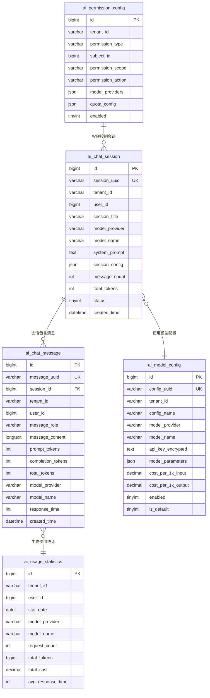

# 💾 Phase 1 数据库任务 - AI基础表结构设计

## 📋 任务概览

**阶段名称**: Phase 1 - AI基础表结构设计  
**任务范围**: D001-D005  
**预计时间**: 2天  
**核心目标**: 设计支持AI功能的基础数据表结构，确保多租户隔离和数据安全  
**数据库**: MySQL 8.0+ (主库) + Redis (缓存)

---

## 📊 任务分类统计

| 类别 | 任务数量 | 预计时间 |
|------|----------|----------|
| 会话管理表 | 1个 | 0.5天 |
| 消息记录表 | 1个 | 0.5天 |
| 配置管理表 | 1个 | 0.5天 |
| 统计分析表 | 1个 | 0.5天 |
| 权限配置表 | 1个 | 0.5天 |
| **总计** | **5个** | **2.5天** |

---

## 💬 会话管理表任务 (D001)

### D001: 设计AI聊天会话表 (ai_chat_session)
- **任务描述**: 设计AI聊天会话的主表，管理用户与AI的对话会话
- **表结构设计**:
  ```sql
  CREATE TABLE `ai_chat_session` (
    `id` BIGINT NOT NULL AUTO_INCREMENT COMMENT '会话ID',
    `session_uuid` VARCHAR(64) NOT NULL COMMENT '会话UUID，用于前端标识',
    `tenant_id` VARCHAR(64) NOT NULL DEFAULT '000000' COMMENT '租户ID',
    `user_id` BIGINT NOT NULL COMMENT '用户ID',
    `session_title` VARCHAR(255) DEFAULT NULL COMMENT '会话标题',
    `model_provider` VARCHAR(32) NOT NULL COMMENT '模型提供商 (openai/azure/ollama)',
    `model_name` VARCHAR(64) NOT NULL COMMENT '模型名称',
    `system_prompt` TEXT COMMENT '系统提示词',
    `session_config` JSON COMMENT '会话配置 (temperature, max_tokens等)',
    `message_count` INT DEFAULT 0 COMMENT '消息数量',
    `total_tokens` INT DEFAULT 0 COMMENT '总Token消耗',
    `status` TINYINT DEFAULT 1 COMMENT '状态 (1:活跃 2:暂停 3:结束)',
    `created_by` BIGINT NOT NULL COMMENT '创建者',
    `created_time` DATETIME NOT NULL DEFAULT CURRENT_TIMESTAMP COMMENT '创建时间',
    `updated_by` BIGINT DEFAULT NULL COMMENT '更新者',
    `updated_time` DATETIME NOT NULL DEFAULT CURRENT_TIMESTAMP ON UPDATE CURRENT_TIMESTAMP COMMENT '更新时间',
    `deleted` TINYINT DEFAULT 0 COMMENT '删除标志 (0:正常 1:删除)',
    PRIMARY KEY (`id`),
    UNIQUE KEY `uk_session_uuid` (`session_uuid`),
    KEY `idx_tenant_user` (`tenant_id`, `user_id`),
    KEY `idx_created_time` (`created_time`),
    KEY `idx_status` (`status`, `deleted`)
  ) ENGINE=InnoDB DEFAULT CHARSET=utf8mb4 COLLATE=utf8mb4_unicode_ci COMMENT='AI聊天会话表';
  ```

- **核心字段说明**:
  - `session_uuid`: 前端使用的会话标识，避免暴露内部ID
  - `tenant_id`: 多租户隔离字段，继承RuoYi的租户体系
  - `model_provider`: 支持多种AI模型提供商
  - `session_config`: JSON字段存储灵活的会话配置
  - `total_tokens`: 用于成本统计和配额控制

- **索引设计**:
  - 主键索引：快速定位会话
  - 租户用户索引：支持多租户查询
  - 时间索引：支持时间范围查询
  - 状态索引：支持状态过滤

- **验收标准**:
  - 支持高并发插入和查询
  - 多租户数据完全隔离
  - 软删除机制正常工作
  - 索引覆盖常用查询场景

- **预计工时**: 0.5天
- **依赖任务**: 无
- **输出文件**: `server/script/sql/ai_chat_session.sql`

---

## 📝 消息记录表任务 (D002)

### D002: 设计AI消息记录表 (ai_chat_message)
- **任务描述**: 设计AI对话消息的详细记录表，存储每条消息的完整信息
- **表结构设计**:
  ```sql
  CREATE TABLE `ai_chat_message` (
    `id` BIGINT NOT NULL AUTO_INCREMENT COMMENT '消息ID',
    `message_uuid` VARCHAR(64) NOT NULL COMMENT '消息UUID',
    `session_id` BIGINT NOT NULL COMMENT '会话ID',
    `tenant_id` VARCHAR(64) NOT NULL DEFAULT '000000' COMMENT '租户ID',
    `user_id` BIGINT NOT NULL COMMENT '用户ID',
    `message_role` VARCHAR(16) NOT NULL COMMENT '消息角色 (user/assistant/system)',
    `message_type` VARCHAR(16) DEFAULT 'text' COMMENT '消息类型 (text/image/file/code)',
    `message_content` LONGTEXT NOT NULL COMMENT '消息内容',
    `content_format` VARCHAR(16) DEFAULT 'plain' COMMENT '内容格式 (plain/markdown/json)',
    `prompt_tokens` INT DEFAULT 0 COMMENT '输入Token数',
    `completion_tokens` INT DEFAULT 0 COMMENT '输出Token数',
    `total_tokens` INT DEFAULT 0 COMMENT '总Token数',
    `model_provider` VARCHAR(32) NOT NULL COMMENT '模型提供商',
    `model_name` VARCHAR(64) NOT NULL COMMENT '模型名称',
    `model_version` VARCHAR(32) DEFAULT NULL COMMENT '模型版本',
    `response_time` INT DEFAULT NULL COMMENT '响应时间(毫秒)',
    `finish_reason` VARCHAR(32) DEFAULT NULL COMMENT '完成原因 (stop/length/function_call)',
    `error_code` VARCHAR(32) DEFAULT NULL COMMENT '错误码',
    `error_message` TEXT DEFAULT NULL COMMENT '错误信息',
    `metadata` JSON DEFAULT NULL COMMENT '扩展元数据',
    `parent_message_id` BIGINT DEFAULT NULL COMMENT '父消息ID(用于追踪对话链)',
    `created_time` DATETIME NOT NULL DEFAULT CURRENT_TIMESTAMP COMMENT '创建时间',
    `deleted` TINYINT DEFAULT 0 COMMENT '删除标志 (0:正常 1:删除)',
    PRIMARY KEY (`id`),
    UNIQUE KEY `uk_message_uuid` (`message_uuid`),
    KEY `idx_session_id` (`session_id`),
    KEY `idx_tenant_user` (`tenant_id`, `user_id`),
    KEY `idx_created_time` (`created_time`),
    KEY `idx_message_role` (`message_role`),
    KEY `idx_parent_message` (`parent_message_id`),
    CONSTRAINT `fk_message_session` FOREIGN KEY (`session_id`) REFERENCES `ai_chat_session` (`id`) ON DELETE CASCADE
  ) ENGINE=InnoDB DEFAULT CHARSET=utf8mb4 COLLATE=utf8mb4_unicode_ci COMMENT='AI聊天消息表';
  ```

- **核心字段说明**:
  - `message_role`: 区分用户消息、AI响应、系统消息
  - `message_type`: 支持多种消息类型，为未来扩展做准备
  - `*_tokens`: 详细的Token使用统计，支持精确计费
  - `response_time`: 性能监控指标
  - `parent_message_id`: 构建消息对话树，支持分支对话

- **分区策略**:
  ```sql
  -- 按月分区，提高查询性能
  ALTER TABLE ai_chat_message 
  PARTITION BY RANGE (TO_DAYS(created_time)) (
    PARTITION p202501 VALUES LESS THAN (TO_DAYS('2025-02-01')),
    PARTITION p202502 VALUES LESS THAN (TO_DAYS('2025-03-01')),
    PARTITION p202503 VALUES LESS THAN (TO_DAYS('2025-04-01')),
    -- 继续添加分区...
    PARTITION pmax VALUES LESS THAN MAXVALUE
  );
  ```

- **验收标准**:
  - 支持大量消息存储(单表千万级)
  - 查询性能满足业务需求
  - 分区机制正常工作
  - 外键约束保证数据完整性

- **预计工时**: 0.5天
- **依赖任务**: D001
- **输出文件**: `server/script/sql/ai_chat_message.sql`

---

## ⚙️ 配置管理表任务 (D003)

### D003: 设计AI模型配置表 (ai_model_config)
- **任务描述**: 设计AI模型的配置管理表，支持租户级别的模型配置
- **表结构设计**:
  ```sql
  CREATE TABLE `ai_model_config` (
    `id` BIGINT NOT NULL AUTO_INCREMENT COMMENT '配置ID',
    `config_uuid` VARCHAR(64) NOT NULL COMMENT '配置UUID',
    `tenant_id` VARCHAR(64) NOT NULL DEFAULT '000000' COMMENT '租户ID',
    `config_name` VARCHAR(128) NOT NULL COMMENT '配置名称',
    `config_type` VARCHAR(16) NOT NULL DEFAULT 'tenant' COMMENT '配置类型 (system/tenant/user)',
    `user_id` BIGINT DEFAULT NULL COMMENT '用户ID(用户级配置)',
    `model_provider` VARCHAR(32) NOT NULL COMMENT '模型提供商',
    `model_name` VARCHAR(64) NOT NULL COMMENT '模型名称',
    `api_endpoint` VARCHAR(512) DEFAULT NULL COMMENT 'API端点',
    `api_key_encrypted` TEXT DEFAULT NULL COMMENT '加密后的API密钥',
    `model_parameters` JSON NOT NULL COMMENT '模型参数配置',
    `system_prompt` TEXT DEFAULT NULL COMMENT '默认系统提示词',
    `max_tokens_limit` INT DEFAULT 4000 COMMENT '最大Token限制',
    `rate_limit_rpm` INT DEFAULT 60 COMMENT '每分钟请求限制',
    `rate_limit_tpm` INT DEFAULT 150000 COMMENT '每分钟Token限制',
    `cost_per_1k_input` DECIMAL(10,6) DEFAULT 0.000000 COMMENT '每1K输入Token成本',
    `cost_per_1k_output` DECIMAL(10,6) DEFAULT 0.000000 COMMENT '每1K输出Token成本',
    `enabled` TINYINT DEFAULT 1 COMMENT '是否启用 (0:禁用 1:启用)',
    `is_default` TINYINT DEFAULT 0 COMMENT '是否默认配置 (0:否 1:是)',
    `priority` INT DEFAULT 0 COMMENT '优先级(数字越大优先级越高)',
    `description` VARCHAR(512) DEFAULT NULL COMMENT '配置描述',
    `created_by` BIGINT NOT NULL COMMENT '创建者',
    `created_time` DATETIME NOT NULL DEFAULT CURRENT_TIMESTAMP COMMENT '创建时间',
    `updated_by` BIGINT DEFAULT NULL COMMENT '更新者',
    `updated_time` DATETIME NOT NULL DEFAULT CURRENT_TIMESTAMP ON UPDATE CURRENT_TIMESTAMP COMMENT '更新时间',
    `deleted` TINYINT DEFAULT 0 COMMENT '删除标志 (0:正常 1:删除)',
    PRIMARY KEY (`id`),
    UNIQUE KEY `uk_config_uuid` (`config_uuid`),
    UNIQUE KEY `uk_tenant_default` (`tenant_id`, `is_default`, `deleted`),
    KEY `idx_tenant_type` (`tenant_id`, `config_type`),
    KEY `idx_provider_model` (`model_provider`, `model_name`),
    KEY `idx_enabled` (`enabled`, `deleted`)
  ) ENGINE=InnoDB DEFAULT CHARSET=utf8mb4 COLLATE=utf8mb4_unicode_ci COMMENT='AI模型配置表';
  ```

- **示例配置数据**:
  ```sql
  -- OpenAI GPT-4配置示例
  INSERT INTO ai_model_config (
    config_uuid, tenant_id, config_name, model_provider, model_name,
    model_parameters, system_prompt, cost_per_1k_input, cost_per_1k_output,
    enabled, is_default, created_by
  ) VALUES (
    UUID(), '000000', 'OpenAI GPT-4o', 'openai', 'gpt-4o',
    '{"temperature": 0.7, "max_tokens": 4000, "top_p": 1.0, "frequency_penalty": 0.0, "presence_penalty": 0.0}',
    '你是一个有用的AI助手，请用中文回答问题。',
    0.015000, 0.030000, 1, 1, 1
  );
  ```

- **核心字段说明**:
  - `config_type`: 支持系统级、租户级、用户级配置
  - `api_key_encrypted`: 加密存储敏感的API密钥
  - `model_parameters`: JSON存储灵活的模型参数
  - `cost_*`: 支持成本计算和计费

- **验收标准**:
  - 支持多级配置覆盖(系统<租户<用户)
  - API密钥安全加密存储
  - 配置参数验证正确
  - 默认配置唯一性约束

- **预计工时**: 0.5天
- **依赖任务**: 无
- **输出文件**: `server/script/sql/ai_model_config.sql`

---

## 📊 统计分析表任务 (D004)

### D004: 设计AI使用统计表 (ai_usage_statistics)
- **任务描述**: 设计AI使用的统计分析表，支持多维度的使用数据分析
- **表结构设计**:
  ```sql
  CREATE TABLE `ai_usage_statistics` (
    `id` BIGINT NOT NULL AUTO_INCREMENT COMMENT '统计ID',
    `stat_uuid` VARCHAR(64) NOT NULL COMMENT '统计UUID',
    `tenant_id` VARCHAR(64) NOT NULL DEFAULT '000000' COMMENT '租户ID',
    `user_id` BIGINT DEFAULT NULL COMMENT '用户ID',
    `stat_date` DATE NOT NULL COMMENT '统计日期',
    `stat_hour` TINYINT DEFAULT NULL COMMENT '统计小时(0-23，用于小时级统计)',
    `model_provider` VARCHAR(32) NOT NULL COMMENT '模型提供商',
    `model_name` VARCHAR(64) NOT NULL COMMENT '模型名称',
    `request_count` INT DEFAULT 0 COMMENT '请求次数',
    `success_count` INT DEFAULT 0 COMMENT '成功次数',
    `error_count` INT DEFAULT 0 COMMENT '错误次数',
    `total_prompt_tokens` BIGINT DEFAULT 0 COMMENT '总输入Token数',
    `total_completion_tokens` BIGINT DEFAULT 0 COMMENT '总输出Token数',
    `total_tokens` BIGINT DEFAULT 0 COMMENT '总Token数',
    `total_cost` DECIMAL(12,6) DEFAULT 0.000000 COMMENT '总成本',
    `avg_response_time` INT DEFAULT 0 COMMENT '平均响应时间(毫秒)',
    `max_response_time` INT DEFAULT 0 COMMENT '最大响应时间(毫秒)',
    `min_response_time` INT DEFAULT 0 COMMENT '最小响应时间(毫秒)',
    `created_time` DATETIME NOT NULL DEFAULT CURRENT_TIMESTAMP COMMENT '创建时间',
    `updated_time` DATETIME NOT NULL DEFAULT CURRENT_TIMESTAMP ON UPDATE CURRENT_TIMESTAMP COMMENT '更新时间',
    PRIMARY KEY (`id`),
    UNIQUE KEY `uk_stat_uuid` (`stat_uuid`),
    UNIQUE KEY `uk_tenant_user_date_hour_model` (`tenant_id`, `user_id`, `stat_date`, `stat_hour`, `model_provider`, `model_name`),
    KEY `idx_tenant_date` (`tenant_id`, `stat_date`),
    KEY `idx_stat_date` (`stat_date`),
    KEY `idx_model_provider` (`model_provider`, `model_name`)
  ) ENGINE=InnoDB DEFAULT CHARSET=utf8mb4 COLLATE=utf8mb4_unicode_ci COMMENT='AI使用统计表';
  
  -- 创建按月分区
  ALTER TABLE ai_usage_statistics 
  PARTITION BY RANGE (TO_DAYS(stat_date)) (
    PARTITION p202501 VALUES LESS THAN (TO_DAYS('2025-02-01')),
    PARTITION p202502 VALUES LESS THAN (TO_DAYS('2025-03-01')),
    PARTITION p202503 VALUES LESS THAN (TO_DAYS('2025-04-01')),
    PARTITION pmax VALUES LESS THAN MAXVALUE
  );
  ```

- **统计维度视图**:
  ```sql
  -- 租户日统计视图
  CREATE VIEW v_ai_tenant_daily_stats AS
  SELECT 
    tenant_id,
    stat_date,
    SUM(request_count) as daily_requests,
    SUM(total_tokens) as daily_tokens,
    SUM(total_cost) as daily_cost,
    AVG(avg_response_time) as avg_response_time
  FROM ai_usage_statistics 
  WHERE stat_hour IS NULL
  GROUP BY tenant_id, stat_date;
  
  -- 模型使用排行视图  
  CREATE VIEW v_ai_model_usage_ranking AS
  SELECT 
    tenant_id,
    model_provider,
    model_name,
    SUM(request_count) as total_requests,
    SUM(total_tokens) as total_tokens,
    SUM(total_cost) as total_cost,
    AVG(avg_response_time) as avg_response_time
  FROM ai_usage_statistics 
  WHERE stat_date >= DATE_SUB(CURDATE(), INTERVAL 30 DAY)
  GROUP BY tenant_id, model_provider, model_name
  ORDER BY total_requests DESC;
  ```

- **核心功能**:
  - 支持小时级和日级统计
  - 多租户使用统计隔离
  - 模型使用情况分析
  - 成本统计和预算控制

- **验收标准**:
  - 统计数据准确无误
  - 查询性能满足报表需求
  - 分区策略有效减少查询时间
  - 视图提供便利的数据分析

- **预计工时**: 0.5天
- **依赖任务**: D003
- **输出文件**: `server/script/sql/ai_usage_statistics.sql`

---

## 🔐 权限配置表任务 (D005)

### D005: 设计AI权限配置表 (ai_permission_config)
- **任务描述**: 设计AI功能的权限配置表，集成RuoYi权限体系
- **表结构设计**:
  ```sql
  CREATE TABLE `ai_permission_config` (
    `id` BIGINT NOT NULL AUTO_INCREMENT COMMENT '权限配置ID',
    `config_uuid` VARCHAR(64) NOT NULL COMMENT '配置UUID',
    `tenant_id` VARCHAR(64) NOT NULL DEFAULT '000000' COMMENT '租户ID',
    `permission_type` VARCHAR(16) NOT NULL COMMENT '权限类型 (role/user/dept)',
    `subject_id` BIGINT NOT NULL COMMENT '主体ID(角色/用户/部门ID)',
    `permission_scope` VARCHAR(32) NOT NULL COMMENT '权限范围 (chat/config/quota/history)',
    `permission_action` VARCHAR(32) NOT NULL COMMENT '权限动作 (view/create/update/delete)',
    `model_providers` JSON DEFAULT NULL COMMENT '允许的模型提供商 ["openai","azure"]',
    `model_names` JSON DEFAULT NULL COMMENT '允许的模型名称 ["gpt-4","gpt-3.5-turbo"]',
    `quota_config` JSON DEFAULT NULL COMMENT '配额配置',
    `rate_limit_config` JSON DEFAULT NULL COMMENT '限流配置',
    `feature_flags` JSON DEFAULT NULL COMMENT '功能开关配置',
    `restrictions` JSON DEFAULT NULL COMMENT '使用限制配置',
    `enabled` TINYINT DEFAULT 1 COMMENT '是否启用 (0:禁用 1:启用)',
    `effective_start` DATETIME DEFAULT NULL COMMENT '生效开始时间',
    `effective_end` DATETIME DEFAULT NULL COMMENT '生效结束时间',
    `created_by` BIGINT NOT NULL COMMENT '创建者',
    `created_time` DATETIME NOT NULL DEFAULT CURRENT_TIMESTAMP COMMENT '创建时间',
    `updated_by` BIGINT DEFAULT NULL COMMENT '更新者',
    `updated_time` DATETIME NOT NULL DEFAULT CURRENT_TIMESTAMP ON UPDATE CURRENT_TIMESTAMP COMMENT '更新时间',
    `deleted` TINYINT DEFAULT 0 COMMENT '删除标志 (0:正常 1:删除)',
    PRIMARY KEY (`id`),
    UNIQUE KEY `uk_config_uuid` (`config_uuid`),
    UNIQUE KEY `uk_tenant_subject_scope_action` (`tenant_id`, `permission_type`, `subject_id`, `permission_scope`, `permission_action`, `deleted`),
    KEY `idx_tenant_type` (`tenant_id`, `permission_type`),
    KEY `idx_subject_id` (`subject_id`),
    KEY `idx_permission_scope` (`permission_scope`, `permission_action`),
    KEY `idx_enabled_effective` (`enabled`, `effective_start`, `effective_end`)
  ) ENGINE=InnoDB DEFAULT CHARSET=utf8mb4 COLLATE=utf8mb4_unicode_ci COMMENT='AI权限配置表';
  ```

- **权限配置示例**:
  ```sql
  -- 管理员角色完整权限
  INSERT INTO ai_permission_config (
    config_uuid, tenant_id, permission_type, subject_id,
    permission_scope, permission_action, model_providers, quota_config,
    created_by
  ) VALUES (
    UUID(), '000000', 'role', 1,
    'chat', 'create', '["openai","azure","ollama"]',
    '{"daily_requests": 1000, "monthly_tokens": 1000000, "monthly_cost": 100.00}',
    1
  );
  
  -- 普通用户限制权限
  INSERT INTO ai_permission_config (
    config_uuid, tenant_id, permission_type, subject_id,
    permission_scope, permission_action, model_providers, quota_config,
    rate_limit_config, created_by
  ) VALUES (
    UUID(), '000000', 'role', 2,
    'chat', 'create', '["openai"]',
    '{"daily_requests": 50, "monthly_tokens": 50000, "monthly_cost": 10.00}',
    '{"requests_per_minute": 10, "tokens_per_minute": 5000}',
    1
  );
  ```

- **权限检查视图**:
  ```sql
  CREATE VIEW v_ai_user_permissions AS
  SELECT DISTINCT
    u.user_id,
    u.tenant_id,
    apc.permission_scope,
    apc.permission_action,
    apc.model_providers,
    apc.quota_config,
    apc.rate_limit_config,
    apc.feature_flags
  FROM sys_user u
  LEFT JOIN sys_user_role sur ON u.user_id = sur.user_id
  LEFT JOIN ai_permission_config apc ON (
    (apc.permission_type = 'user' AND apc.subject_id = u.user_id) OR
    (apc.permission_type = 'role' AND apc.subject_id = sur.role_id) OR
    (apc.permission_type = 'dept' AND apc.subject_id = u.dept_id)
  )
  WHERE apc.enabled = 1 
    AND apc.deleted = 0
    AND (apc.effective_start IS NULL OR apc.effective_start <= NOW())
    AND (apc.effective_end IS NULL OR apc.effective_end >= NOW());
  ```

- **核心功能**:
  - 多主体权限控制(角色/用户/部门)
  - 多维度权限管理(功能/模型/配额)
  - 时效性权限控制
  - 与RuoYi权限体系集成

- **验收标准**:
  - 权限检查逻辑正确
  - 支持复杂的权限组合
  - 权限变更实时生效
  - 性能满足权限检查需求

- **预计工时**: 0.5天
- **依赴任务**: D004
- **输出文件**: `server/script/sql/ai_permission_config.sql`

---

## 📋 验收标准

### 数据完整性验收
- [ ] 所有表结构设计合理
- [ ] 外键约束正确建立
- [ ] 索引覆盖主要查询场景
- [ ] 数据类型选择恰当

### 多租户隔离验收
- [ ] 所有表包含tenant_id字段
- [ ] 租户数据完全隔离
- [ ] 跨租户查询被阻止

### 性能验收
- [ ] 单表查询响应时间 < 100ms
- [ ] 复杂关联查询响应时间 < 500ms
- [ ] 分区表分区策略有效
- [ ] 索引命中率 > 90%

### 安全性验收
- [ ] 敏感数据加密存储
- [ ] 软删除机制正常
- [ ] 权限检查逻辑正确
- [ ] 数据访问审计完整

---

## 🔗 表关系图



---

## 💡 设计重点说明

### 多租户设计原则
1. **数据隔离**: 每个表都包含tenant_id字段
2. **权限隔离**: 通过权限配置表控制租户内权限
3. **配置隔离**: 支持租户级别的模型配置
4. **统计隔离**: 租户使用数据完全分离

### 性能优化策略
1. **分区表**: 消息表和统计表按时间分区
2. **索引优化**: 针对查询模式设计复合索引
3. **视图简化**: 提供常用查询的视图
4. **缓存友好**: 设计支持Redis缓存的数据结构

### 扩展性考虑
1. **JSON字段**: 使用JSON存储灵活配置
2. **UUID标识**: 前端使用UUID避免ID暴露
3. **软删除**: 支持数据恢复和审计
4. **版本预留**: 为未来功能扩展预留字段

---

**🎯 Phase 1数据库完成标志**: AI基础表结构完整，支持多租户安全隔离，满足基本的聊天、配置、统计、权限管理需求