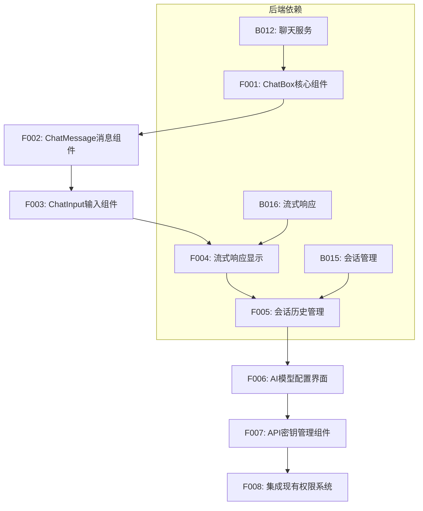

# 💻 Phase 1 前端任务 - AI聊天界面开发

## 📋 任务概览

**阶段名称**: Phase 1 - AI聊天界面开发  
**任务范围**: F001-F008  
**预计时间**: 1-1.5周  
**核心目标**: 构建基于Vue 3的AI聊天界面，实现用户友好的AI交互体验  
**技术栈**: Vue 3 + TypeScript + Ant Design Vue + Pinia + Vite

---

## 📊 任务分类统计

| 类别 | 任务数量 | 预计时间 |
|------|----------|----------|
| 聊天组件开发 | 5个 | 6天 |
| 配置管理界面 | 2个 | 2天 |
| 权限集成 | 1个 | 1天 |
| **总计** | **8个** | **9天** |

---

## 💬 聊天组件开发任务 (F001-F005)

### F001: 创建ChatBox核心组件
- **任务描述**: 开发核心的AI聊天界面组件
- **技术要点**:
  ```vue
  <template>
    <div class="ai-chatbox">
      <div class="chat-header">
        <a-space>
          <a-avatar :src="currentModel.icon" />
          <span>{{ currentModel.name }}</span>
          <a-tag :color="connectionStatus.color">{{ connectionStatus.text }}</a-tag>
        </a-space>
      </div>
      
      <div class="chat-messages" ref="messagesContainer">
        <ChatMessage 
          v-for="message in messages" 
          :key="message.id"
          :message="message"
          :typing="message.typing"
        />
      </div>
      
      <div class="chat-input">
        <ChatInput 
          @send="handleSendMessage"
          @clear="handleClearChat"
          :disabled="isTyping"
        />
      </div>
    </div>
  </template>
  ```
- **核心功能**:
  - 消息展示区域
  - 输入框和发送按钮
  - 模型状态显示
  - 清空对话功能
- **验收标准**: 
  - 界面布局美观合理
  - 支持响应式设计
  - 消息滚动正常
- **预计工时**: 2天
- **依赖任务**: 无 
- **输出文件**: `client/apps/web-antd/src/components/ai/ChatBox.vue`

### F002: 实现ChatMessage消息组件
- **任务描述**: 开发单条消息的展示组件
- **技术要点**:
  ```vue
  <template>
    <div class="chat-message" :class="messageClass">
      <div class="message-avatar">
        <a-avatar v-if="message.role === 'assistant'" :src="aiAvatar" />
        <a-avatar v-else :src="userAvatar" />
      </div>
      
      <div class="message-content">
        <div class="message-header">
          <span class="sender">{{ message.sender }}</span>
          <span class="timestamp">{{ formatTime(message.timestamp) }}</span>
        </div>
        
        <div class="message-body">
          <div v-if="message.type === 'text'" class="text-content">
            <MarkdownRenderer 
              :content="message.content"
              :typing="typing"
            />
          </div>
          
          <div v-if="message.type === 'code'" class="code-content">
            <CodeBlock 
              :code="message.content"
              :language="message.language"
            />
          </div>
        </div>
        
        <div class="message-actions">
          <a-space>
            <a-button type="text" size="small" @click="copyMessage">
              <template #icon><CopyOutlined /></template>
              复制
            </a-button>
            <a-button type="text" size="small" @click="regenerateResponse" v-if="message.role === 'assistant'">
              <template #icon><ReloadOutlined /></template>
              重新生成
            </a-button>
          </a-space>
        </div>
      </div>
    </div>
  </template>
  ```
- **核心功能**:
  - 用户/AI消息区分显示
  - Markdown内容渲染
  - 代码块语法高亮
  - 消息操作按钮
- **验收标准**:
  - 消息显示样式正确
  - Markdown渲染正常
  - 操作按钮功能完整
- **预计工时**: 1.5天
- **依赖任务**: F001
- **输出文件**: `client/apps/web-antd/src/components/ai/ChatMessage.vue`

### F003: 实现ChatInput输入组件
- **任务描述**: 开发消息输入和发送组件
- **技术要点**:
  ```vue
  <template>
    <div class="chat-input-container">
      <div class="input-toolbar">
        <a-space>
          <a-tooltip title="上传文件">
            <a-button type="text" size="small" @click="handleFileUpload">
              <template #icon><PaperClipOutlined /></template>
            </a-button>
          </a-tooltip>
          
          <a-tooltip title="插入表情">
            <a-popover placement="topLeft" trigger="click">
              <template #content>
                <EmojiPicker @select="insertEmoji" />
              </template>
              <a-button type="text" size="small">
                <template #icon><SmileOutlined /></template>
              </a-button>
            </a-popover>
          </a-tooltip>
          
          <a-tooltip title="语音输入">
            <a-button 
              type="text" 
              size="small" 
              :class="{ 'recording': isRecording }"
              @click="toggleVoiceInput"
            >
              <template #icon><AudioOutlined /></template>
            </a-button>
          </a-tooltip>
        </a-space>
      </div>
      
      <div class="input-area">
        <a-textarea
          v-model:value="inputText"
          :placeholder="inputPlaceholder"
          :auto-size="{ minRows: 1, maxRows: 6 }"
          :disabled="disabled"
          @keydown="handleKeydown"
          @paste="handlePaste"
          class="message-input"
        />
        
        <div class="input-actions">
          <a-space>
            <a-button 
              size="small" 
              @click="handleClear"
              :disabled="!inputText && messages.length === 0"
            >
              清空
            </a-button>
            
            <a-button 
              type="primary" 
              size="small"
              @click="handleSend"
              :loading="sending"
              :disabled="!canSend"
            >
              <template #icon><SendOutlined /></template>
              发送
            </a-button>
          </a-space>
        </div>
      </div>
      
      <div class="input-hints" v-if="showHints">
        <a-space wrap>
          <a-tag 
            v-for="hint in quickHints" 
            :key="hint"
            @click="insertHint(hint)"
            class="hint-tag"
          >
            {{ hint }}
          </a-tag>
        </a-space>
      </div>
    </div>
  </template>
  ```
- **核心功能**:
  - 多行文本输入
  - 快捷键发送(Ctrl+Enter)
  - 文件上传支持
  - 语音输入(可选)
  - 快捷提示词
- **验收标准**:
  - 输入体验流畅
  - 支持常用快捷键
  - 文件上传正常
- **预计工时**: 1.5天
- **依赖任务**: F002
- **输出文件**: `client/apps/web-antd/src/components/ai/ChatInput.vue`

### F004: 实现流式响应显示
- **任务描述**: 实现AI响应的流式显示效果
- **技术要点**:
  ```typescript
  // 流式响应处理
  export class StreamingRenderer {
    private container: HTMLElement
    private currentText: string = ''
    private typewriterSpeed: number = 30
    
    async renderStream(stream: ReadableStream<string>) {
      const reader = stream.getReader()
      
      try {
        while (true) {
          const { done, value } = await reader.read()
          
          if (done) break
          
          this.currentText += value
          await this.typewriterEffect(value)
        }
      } finally {
        reader.releaseLock()
      }
    }
    
    private async typewriterEffect(text: string) {
      const chars = text.split('')
      
      for (const char of chars) {
        this.appendChar(char)
        await this.delay(this.typewriterSpeed)
      }
    }
    
    private appendChar(char: string) {
      // 渐进式添加字符
    }
    
    private delay(ms: number) {
      return new Promise(resolve => setTimeout(resolve, ms))
    }
  }
  ```
- **核心功能**:
  - 打字机效果
  - 流式数据处理
  - Markdown实时渲染
  - 停止生成功能
- **验收标准**:
  - 流式效果自然
  - 响应及时显示
  - 支持中断生成
- **预计工时**: 2天
- **依赖任务**: F003
- **输出文件**: `client/apps/web-antd/src/components/ai/StreamingRenderer.ts`

### F005: 实现会话历史管理
- **任务描述**: 开发聊天会话的历史记录管理
- **技术要点**:
  ```vue
  <template>
    <div class="chat-history-panel">
      <div class="history-header">
        <a-space align="center">
          <a-typography-title :level="5">会话历史</a-typography-title>
          <a-button type="text" size="small" @click="createNewSession">
            <template #icon><PlusOutlined /></template>
            新建会话
          </a-button>
        </a-space>
      </div>
      
      <div class="history-search">
        <a-input-search
          v-model:value="searchKeyword"
          placeholder="搜索会话..."
          @search="handleSearch"
        />
      </div>
      
      <div class="history-list">
        <a-list 
          :data-source="filteredSessions"
          size="small"
        >
          <template #renderItem="{ item }">
            <a-list-item 
              :class="{ 'active': item.id === currentSessionId }"
              @click="switchSession(item.id)"
            >
              <a-list-item-meta>
                <template #title>
                  <div class="session-title">
                    <a-tooltip :title="item.title">
                      <span class="title-text">{{ item.title || '新会话' }}</span>
                    </a-tooltip>
                    <span class="message-count">{{ item.messageCount }}</span>
                  </div>
                </template>
                
                <template #description>
                  <div class="session-meta">
                    <span class="last-time">{{ formatRelativeTime(item.updatedAt) }}</span>
                    <span class="model-name">{{ item.modelName }}</span>
                  </div>
                </template>
              </a-list-item-meta>
              
              <template #actions>
                <a-dropdown :trigger="['click']">
                  <a-button type="text" size="small">
                    <template #icon><MoreOutlined /></template>
                  </a-button>
                  
                  <template #overlay>
                    <a-menu>
                      <a-menu-item @click="renameSession(item.id)">
                        <template #icon><EditOutlined /></template>
                        重命名
                      </a-menu-item>
                      <a-menu-item @click="exportSession(item.id)">
                        <template #icon><ExportOutlined /></template>
                        导出
                      </a-menu-item>
                      <a-menu-divider />
                      <a-menu-item @click="deleteSession(item.id)" danger>
                        <template #icon><DeleteOutlined /></template>
                        删除
                      </a-menu-item>
                    </a-menu>
                  </template>
                </a-dropdown>
              </template>
            </a-list-item>
          </template>
        </a-list>
      </div>
    </div>
  </template>
  ```
- **核心功能**:
  - 会话列表展示
  - 会话搜索功能
  - 会话切换
  - 会话操作(重命名、删除、导出)
- **验收标准**:
  - 会话管理功能完整
  - 搜索功能正常
  - 操作响应及时
- **预计工时**: 1天
- **依赖任务**: F004
- **输出文件**: `client/apps/web-antd/src/components/ai/ChatHistory.vue`

---

## ⚙️ 配置管理界面任务 (F006-F007)

### F006: 实现AI模型配置界面
- **任务描述**: 开发AI模型选择和参数配置界面
- **技术要点**:
  ```vue
  <template>
    <div class="ai-model-config">
      <a-card title="模型配置" size="small">
        <a-form :model="modelConfig" layout="vertical">
          <a-row :gutter="16">
            <a-col :span="12">
              <a-form-item label="模型提供商">
                <a-select 
                  v-model:value="modelConfig.provider"
                  @change="handleProviderChange"
                >
                  <a-select-option value="openai">OpenAI</a-select-option>
                  <a-select-option value="azure">Azure OpenAI</a-select-option>
                  <a-select-option value="ollama">Ollama (本地)</a-select-option>
                </a-select>
              </a-form-item>
            </a-col>
            
            <a-col :span="12">
              <a-form-item label="模型名称">
                <a-select 
                  v-model:value="modelConfig.modelName"
                  :options="availableModels"
                  @change="handleModelChange"
                >
                </a-select>
              </a-form-item>
            </a-col>
          </a-row>
          
          <a-row :gutter="16">
            <a-col :span="8">
              <a-form-item label="温度">
                <a-slider 
                  v-model:value="modelConfig.temperature"
                  :min="0"
                  :max="2"
                  :step="0.1"
                  :tooltip-formatter="v => `${v}`"
                />
              </a-form-item>
            </a-col>
            
            <a-col :span="8">
              <a-form-item label="最大Token">
                <a-input-number 
                  v-model:value="modelConfig.maxTokens"
                  :min="1"
                  :max="4000"
                  style="width: 100%"
                />
              </a-form-item>
            </a-col>
            
            <a-col :span="8">
              <a-form-item label="Top P">
                <a-slider 
                  v-model:value="modelConfig.topP"
                  :min="0"
                  :max="1"
                  :step="0.1"
                  :tooltip-formatter="v => `${v}`"
                />
              </a-form-item>
            </a-col>
          </a-row>
          
          <a-form-item label="系统提示词">
            <a-textarea 
              v-model:value="modelConfig.systemPrompt"
              :rows="4"
              placeholder="设置AI助手的角色和行为..."
            />
          </a-form-item>
          
          <a-form-item>
            <a-space>
              <a-button type="primary" @click="saveConfig">保存配置</a-button>
              <a-button @click="resetConfig">重置</a-button>
              <a-button @click="testConnection">测试连接</a-button>
            </a-space>
          </a-form-item>
        </a-form>
      </a-card>
      
      <a-card title="API密钥管理" size="small" class="mt-4">
        <ApiKeyManager 
          :provider="modelConfig.provider"
          @update="handleApiKeyUpdate"
        />
      </a-card>
    </div>
  </template>
  ```
- **核心功能**:
  - 模型提供商选择
  - 模型参数配置
  - 系统提示词设置
  - 连接测试功能
- **验收标准**:
  - 配置保存正常
  - 参数验证正确
  - 测试连接有效
- **预计工时**: 1.5天
- **依赖任务**: F005
- **输出文件**: `client/apps/web-antd/src/views/ai/ModelConfig.vue`

### F007: 实现API密钥管理组件
- **任务描述**: 开发API密钥的安全管理界面
- **技术要点**:
  ```vue
  <template>
    <div class="api-key-manager">
      <a-form layout="vertical">
        <a-form-item 
          v-for="provider in supportedProviders" 
          :key="provider.key"
          :label="provider.name"
        >
          <a-input-password 
            v-model:value="apiKeys[provider.key]"
            :placeholder="`输入${provider.name} API Key...`"
            @change="handleKeyChange(provider.key)"
          >
            <template #addonAfter>
              <a-space>
                <a-tooltip title="测试连接">
                  <a-button 
                    type="text" 
                    size="small"
                    :loading="testing[provider.key]"
                    @click="testApiKey(provider.key)"
                  >
                    <template #icon><ApiOutlined /></template>
                  </a-button>
                </a-tooltip>
                
                <a-tooltip title="查看文档">
                  <a-button 
                    type="text" 
                    size="small"
                    @click="openDocumentation(provider.key)"
                  >
                    <template #icon><QuestionCircleOutlined /></template>
                  </a-button>
                </a-tooltip>
              </a-space>
            </template>
          </a-input-password>
          
          <div class="key-status" v-if="keyStatus[provider.key]">
            <a-space>
              <a-tag 
                :color="keyStatus[provider.key].valid ? 'success' : 'error'"
              >
                {{ keyStatus[provider.key].valid ? '有效' : '无效' }}
              </a-tag>
              
              <span class="status-text">
                {{ keyStatus[provider.key].message }}
              </span>
            </a-space>
          </div>
        </a-form-item>
        
        <a-form-item>
          <a-alert
            message="安全提示"
            description="API密钥将加密存储在本地，不会上传到服务器。建议定期更换密钥以确保安全。"
            type="info"
            show-icon
          />
        </a-form-item>
      </a-form>
    </div>
  </template>
  ```
- **核心功能**:
  - 多提供商密钥管理
  - 密钥有效性验证
  - 本地加密存储
  - 操作指导说明
- **验收标准**:
  - 密钥加密存储
  - 验证功能正常
  - 界面用户友好
- **预计工时**: 0.5天
- **依赖任务**: F006
- **输出文件**: `client/apps/web-antd/src/components/ai/ApiKeyManager.vue`

---

## 🔐 权限集成任务 (F008)

### F008: 集成现有权限系统
- **任务描述**: 将AI功能集成到RuoYi的权限管理体系中
- **技术要点**:
  ```typescript
  // 权限常量定义
  export const AI_PERMISSIONS = {
    CHAT_ACCESS: 'ai:chat:access',
    MODEL_CONFIG: 'ai:model:config', 
    API_KEY_MANAGE: 'ai:apikey:manage',
    HISTORY_VIEW: 'ai:history:view',
    HISTORY_DELETE: 'ai:history:delete',
    QUOTA_VIEW: 'ai:quota:view'
  } as const
  
  // 权限检查 Hook
  export function useAiPermissions() {
    const { hasPermi } = usePermission()
    
    return {
      canChat: computed(() => hasPermi(AI_PERMISSIONS.CHAT_ACCESS)),
      canConfigModel: computed(() => hasPermi(AI_PERMISSIONS.MODEL_CONFIG)),
      canManageApiKey: computed(() => hasPermi(AI_PERMISSIONS.API_KEY_MANAGE)),
      canViewHistory: computed(() => hasPermi(AI_PERMISSIONS.HISTORY_VIEW)),
      canDeleteHistory: computed(() => hasPermi(AI_PERMISSIONS.HISTORY_DELETE)),
      canViewQuota: computed(() => hasPermi(AI_PERMISSIONS.QUOTA_VIEW))
    }
  }
  ```
  
  ```vue
  <!-- 在组件中使用权限控制 -->
  <template>
    <div class="ai-chat-page">
      <!-- 聊天界面 -->
      <div v-if="permissions.canChat" class="chat-container">
        <ChatBox />
      </div>
      
      <!-- 权限不足提示 -->
      <a-result
        v-else
        status="403"
        title="权限不足"
        sub-title="您没有使用AI助手的权限，请联系管理员开通。"
      >
        <template #extra>
          <a-button type="primary" @click="$router.push('/dashboard')">
            返回首页
          </a-button>
        </template>
      </a-result>
      
      <!-- 模型配置 (需要相应权限) -->
      <a-drawer 
        v-if="permissions.canConfigModel"
        v-model:visible="configVisible"
        title="模型配置"
      >
        <ModelConfig />
      </a-drawer>
    </div>
  </template>
  ```
  
  ```typescript
  // 路由守卫配置
  const aiRoutes = [
    {
      path: '/ai',
      name: 'AiModule',
      component: () => import('@/layouts/basic.vue'),
      meta: {
        title: 'AI助手',
        requiresAuth: true,
        permissions: [AI_PERMISSIONS.CHAT_ACCESS]
      },
      children: [
        {
          path: 'chat',
          name: 'AiChat',
          component: () => import('@/views/ai/Chat.vue'),
          meta: {
            title: '智能对话',
            permissions: [AI_PERMISSIONS.CHAT_ACCESS]
          }
        },
        {
          path: 'config',
          name: 'AiConfig', 
          component: () => import('@/views/ai/Config.vue'),
          meta: {
            title: '模型配置',
            permissions: [AI_PERMISSIONS.MODEL_CONFIG]
          }
        }
      ]
    }
  ]
  ```
- **核心功能**:
  - 权限常量定义
  - 权限检查Hook
  - 路由权限守卫
  - 组件级权限控制
- **验收标准**:
  - 权限检查正确
  - 无权限时有友好提示
  - 路由跳转受权限控制
- **预计工时**: 1天
- **依赖任务**: F007
- **输出文件**: 
  - `client/apps/web-antd/src/hooks/useAiPermissions.ts`
  - `client/apps/web-antd/src/router/modules/ai.ts`

---

## 📋 验收标准

### 功能验收
- [ ] AI聊天界面完整可用
- [ ] 流式响应效果自然
- [ ] 会话历史管理正常
- [ ] 模型配置功能完整
- [ ] 权限控制正确有效

### 用户体验验收
- [ ] 界面美观，符合设计规范
- [ ] 响应式布局适配良好
- [ ] 操作流程顺畅自然
- [ ] 错误提示友好明确

### 性能验收
- [ ] 组件加载速度 < 3秒
- [ ] 消息渲染流畅不卡顿
- [ ] 大量历史记录加载正常

### 兼容性验收
- [ ] 支持主流浏览器
- [ ] 移动端适配良好
- [ ] 无控制台错误

---

## 🔗 任务依赖关系



---

## 💡 技术重点说明

### Vue 3 Composition API使用
```typescript
// 示例：聊天组件的状态管理
export default defineComponent({
  setup() {
    const { permissions } = useAiPermissions()
    const chatStore = useChatStore()
    
    const messages = ref<ChatMessage[]>([])
    const isTyping = ref(false)
    const currentSession = ref<string>('')
    
    const sendMessage = async (content: string) => {
      const message: ChatMessage = {
        id: nanoid(),
        content,
        role: 'user',
        timestamp: Date.now()
      }
      
      messages.value.push(message)
      
      try {
        isTyping.value = true
        await chatStore.sendMessage(currentSession.value, content)
      } finally {
        isTyping.value = false
      }
    }
    
    return {
      permissions,
      messages,
      isTyping,
      sendMessage
    }
  }
})
```

### 响应式设计要点
- 使用Ant Design Vue的栅格系统
- 适配移动端触摸操作
- 支持深色/浅色主题切换
- 字体大小可配置

### 性能优化策略
- 长列表虚拟滚动
- 图片懒加载
- 组件按需加载
- 防抖节流优化

---

**🎯 Phase 1前端完成标志**: 用户可以通过美观易用的界面与AI进行流畅对话，配置管理功能完善，权限控制正确