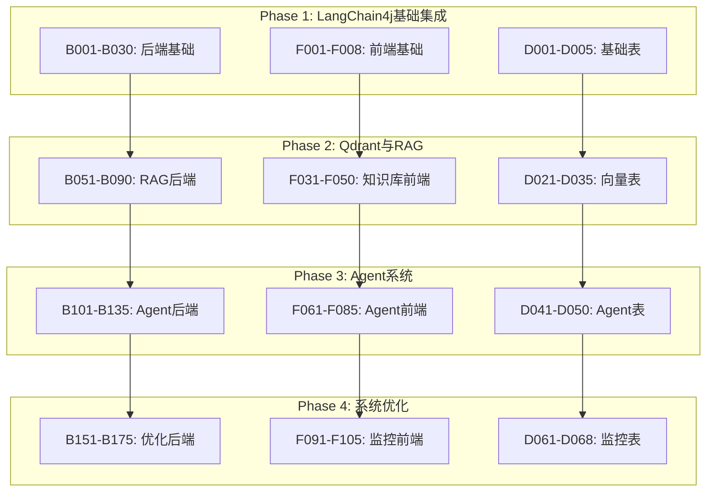

# 📋 RuoYi-Vue-Plus AI智能化改造任务汇总

## 🎯 项目概览

**项目名称**: RuoYi-Vue-Plus AI智能化改造  
**总任务数量**: 200+ 个任务  
**预计总时间**: 12-16周  
**任务编号规则**:
- **B001-B999**: 后端任务 (Backend)
- **F001-F999**: 前端任务 (Frontend)
- **D001-D999**: 数据库任务 (Database)

---

## 📊 任务统计概览

| 阶段 | 后端任务 | 前端任务 | 数据库任务 | 总计 | 预计时间 |
|------|----------|----------|------------|------|----------|
| **Phase 1** | 30个 (B001-B030) | 8个 (F001-F008) | 5个 (D001-D005) | **43个** | **3周** |
| **Phase 2** | 40个 (B051-B090) | 20个 (F031-F050) | 15个 (D021-D035) | **75个** | **4周** |
| **Phase 3** | 35个 (B101-B135) | 25个 (F061-F085) | 10个 (D041-D050) | **70个** | **5周** |
| **Phase 4** | 25个 (B151-B175) | 15个 (F091-F105) | 8个 (D061-D068) | **48个** | **4周** |
| **总计** | **130个** | **68个** | **38个** | **236个** | **16周** |

---

## 🚀 Phase 1: LangChain4j基础集成 (43个任务)

### 🎯 核心目标
构建AI能力的基础设施，实现基本的智能对话和文档问答功能

### 📋 任务分解

#### 后端任务 (B001-B030) - 30个任务
| 编号范围 | 任务类别 | 任务数量 | 关键任务 |
|----------|----------|----------|----------|
| B001-B005 | 依赖管理 | 5个 | LangChain4j依赖配置、多LLM支持 |
| B006-B010 | 模块架构 | 5个 | ruoyi-ai模块创建、Maven集成 |
| B011-B020 | 核心服务 | 10个 | AI服务接口、聊天服务、流式响应 |
| B021-B025 | 配置管理 | 5个 | 多环境配置、配置验证、动态更新 |
| B026-B030 | 多租户支持 | 5个 | 租户隔离、配额管理、权限控制 |

**关键技术要点**:
- langchain4j-spring-boot-starter 集成
- 多LLM提供商支持 (OpenAI, Azure, Ollama)
- 流式响应处理 (Reactor)
- 多租户配置隔离

#### 前端任务 (F001-F008) - 8个任务
| 编号范围 | 任务类别 | 任务数量 | 关键任务 |
|----------|----------|----------|----------|
| F001-F005 | 聊天组件 | 5个 | ChatBox组件、消息渲染、流式显示 |
| F006-F007 | 配置管理 | 2个 | 模型配置界面、API密钥管理 |
| F008 | 权限集成 | 1个 | RuoYi权限体系集成 |

**关键技术要点**:
- Vue 3 + Composition API
- Ant Design Vue 组件库
- 流式响应 UI 效果
- 权限控制集成

#### 数据库任务 (D001-D005) - 5个任务
| 编号 | 任务名称 | 核心表 |
|------|----------|--------|
| D001 | AI聊天会话表 | ai_chat_session |
| D002 | AI消息记录表 | ai_chat_message |
| D003 | AI模型配置表 | ai_model_config |
| D004 | AI使用统计表 | ai_usage_statistics |
| D005 | AI权限配置表 | ai_permission_config |

**设计要点**:
- 多租户数据隔离
- 分区表优化
- 软删除机制
- 权限控制集成

---

## 📚 Phase 2: Qdrant向量数据库与RAG (75个任务)

### 🎯 核心目标
构建企业知识库，实现基于向量检索的智能问答增强

### 📋 任务分解概览

#### 后端任务 (B051-B090) - 40个任务
| 编号范围 | 任务类别 | 任务数量 | 关键功能 |
|----------|----------|----------|----------|
| B051-B055 | Qdrant集成 | 5个 | Docker部署、Java客户端、连接池 |
| B056-B065 | 文档处理 | 10个 | 多格式解析、智能分块、元数据提取 |
| B066-B075 | 向量化服务 | 10个 | Embedding模型、批量处理、增量更新 |
| B076-B085 | 检索引擎 | 10个 | 混合检索、重排序、上下文构建 |
| B086-B090 | 多租户向量 | 5个 | Collection隔离、权限过滤、配额管理 |

#### 前端任务 (F031-F050) - 20个任务
| 编号范围 | 任务类别 | 任务数量 | 关键功能 |
|----------|----------|----------|----------|
| F031-F040 | 知识库管理 | 10个 | 文档上传、分类管理、向量化监控 |
| F041-F050 | 智能检索 | 10个 | 高级搜索、结果展示、相关性显示 |

#### 数据库任务 (D021-D035) - 15个任务
| 编号范围 | 任务类别 | 任务数量 | 关键表 |
|----------|----------|----------|---------|
| D021-D025 | 知识库表 | 5个 | 文档管理、分类标签 |
| D026-D030 | 向量索引表 | 5个 | Qdrant映射、元数据 |
| D031-D035 | 检索统计表 | 5个 | 搜索记录、效果评估 |

---

## 🤖 Phase 3: Agent智能体系统 (70个任务)

### 🎯 核心目标
构建可编程的AI智能体，支持复杂任务自动化和工具链集成

### 📋 任务分解概览

#### 后端任务 (B101-B135) - 35个任务
| 编号范围 | 任务类别 | 任务数量 | 关键功能 |
|----------|----------|----------|----------|
| B101-B110 | Agent框架 | 10个 | 核心架构、生命周期、任务规划 |
| B111-B125 | 工具集成 | 15个 | 工具接口、内置工具、权限控制 |
| B126-B130 | MCP协议 | 5个 | 协议实现、插件管理、安全机制 |
| B131-B135 | Agent监控 | 5个 | 状态监控、性能统计、错误处理 |

**核心工具开发**:
- 数据库工具 (SQL查询、数据统计)
- 文件工具 (读写、格式转换)
- HTTP工具 (API调用、数据抓取)
- 计算工具 (数学计算、数据分析)
- 通知工具 (邮件、短信、钉钉推送)

#### 前端任务 (F061-F085) - 25个任务
| 编号范围 | 任务类别 | 任务数量 | 关键功能 |
|----------|----------|----------|----------|
| F061-F075 | Agent管理 | 15个 | 可视化构建、配置管理、调试测试 |
| F076-F085 | 工作流设计 | 10个 | 拖拽设计器、流程可视化、监控仪表板 |

#### 数据库任务 (D041-D050) - 10个任务
| 编号范围 | 任务类别 | 任务数量 | 关键表 |
|----------|----------|----------|---------|
| D041-D045 | Agent配置表 | 5个 | Agent定义、工具配置 |
| D046-D050 | 执行记录表 | 5个 | 任务执行、结果统计 |

---

## 🔧 Phase 4: 系统集成与生产优化 (48个任务)

### 🎯 核心目标
完善系统集成，进行性能优化，确保生产环境的稳定性和可维护性

### 📋 任务分解概览

#### 后端任务 (B151-B175) - 25个任务
| 编号范围 | 任务类别 | 任务数量 | 关键功能 |
|----------|----------|----------|----------|
| B151-B160 | 性能优化 | 10个 | 缓存策略、数据库优化、并发处理 |
| B161-B170 | 监控告警 | 10个 | 系统监控、业务监控、告警机制 |
| B171-B175 | 安全加固 | 5个 | API安全、AI安全、部署自动化 |

#### 前端任务 (F091-F105) - 15个任务
| 编号范围 | 任务类别 | 任务数量 | 关键功能 |
|----------|----------|----------|----------|
| F091-F100 | 监控仪表板 | 10个 | 系统状态、使用统计、成本分析 |
| F101-F105 | 管理界面 | 5个 | 配置管理、用户管理、报表导出 |

#### 数据库任务 (D061-D068) - 8个任务
| 编号范围 | 任务类别 | 任务数量 | 关键表 |
|----------|----------|----------|---------|
| D061-D065 | 监控数据表 | 5个 | 系统指标、性能数据 |
| D066-D068 | 日志表 | 3个 | 操作日志、审计记录 |

---

## 🔗 任务依赖关系总图



---

## 📈 项目里程碑

### 🎯 Phase 1 里程碑 (3周后)
- ✅ 基础AI聊天功能
- ✅ 多LLM提供商支持
- ✅ 多租户配置隔离
- ✅ 权限体系集成

### 🎯 Phase 2 里程碑 (7周后)
- ✅ 企业知识库构建
- ✅ 向量检索增强
- ✅ 文档智能问答
- ✅ RAG系统优化

### 🎯 Phase 3 里程碑 (12周后)
- ✅ Agent智能体系统
- ✅ 工具链集成
- ✅ 复杂任务自动化
- ✅ MCP协议支持

### 🎯 Phase 4 里程碑 (16周后)
- ✅ 生产环境就绪
- ✅ 性能优化完成
- ✅ 监控告警完善
- ✅ 系统稳定运行

---

## 💡 关键技术栈

### 后端技术栈
- **核心框架**: Spring Boot 3.4.7
- **AI集成**: LangChain4j 1.1.0
- **向量数据库**: Qdrant 1.7+
- **数据库**: MySQL 8.0+, Redis 5.0+
- **权限认证**: Sa-Token
- **构建工具**: Maven, Docker

### 前端技术栈
- **框架**: Vue 3 + TypeScript
- **UI组件**: Ant Design Vue
- **状态管理**: Pinia
- **构建工具**: Vite
- **包管理**: Pnpm

### AI技术栈
- **大语言模型**: OpenAI GPT, Azure OpenAI, 本地模型
- **向量数据库**: Qdrant
- **Embedding**: OpenAI Embeddings, BGE
- **Agent框架**: 自研Agent系统
- **协议支持**: MCP

---

## 📊 资源投入估算

### 人力资源
| 角色 | 人数 | 主要负责 |
|------|------|----------|
| **项目经理** | 1人 | 项目协调、进度管控 |
| **架构师** | 1人 | 技术架构、关键决策 |
| **后端开发** | 2人 | AI服务、RAG系统、Agent框架 |
| **前端开发** | 1人 | 用户界面、交互体验 |
| **测试工程师** | 1人 | 功能测试、性能测试 |
| **运维工程师** | 1人 | 部署运维、监控告警 |

### 时间投入
- **总开发时间**: 16周
- **并行开发**: 前后端同步进行
- **迭代周期**: 每个Phase独立交付
- **测试时间**: 每个Phase预留1周测试时间

---

## 🎯 验收标准

### Phase 1 验收标准
- [ ] 支持至少2种LLM提供商
- [ ] 实现基础聊天对话功能
- [ ] 多租户配置隔离正常
- [ ] Token使用统计准确
- [ ] 前端聊天界面完整可用

### Phase 2 验收标准
- [ ] 支持主流文档格式处理
- [ ] 向量检索准确率>85%
- [ ] 查询响应时间<3秒
- [ ] 支持万级文档规模
- [ ] 知识库管理功能完整

### Phase 3 验收标准
- [ ] 支持创建和管理多个Agent
- [ ] 工具调用成功率>95%
- [ ] Agent响应时间<10秒
- [ ] 支持复杂多步骤任务
- [ ] MCP插件正常工作

### Phase 4 验收标准
- [ ] 系统响应时间<2秒
- [ ] 并发支持>1000用户
- [ ] 系统可用性>99.9%
- [ ] 完整的监控告警体系
- [ ] 自动化部署流程

---

## 📚 文档结构

```
docs/ai-transformation/tasks/
├── backend/
│   ├── B001-B030_Phase1_LangChain4j集成.md     ✅ 已完成
│   ├── B051-B090_Phase2_RAG系统.md             🔄 待创建
│   ├── B101-B135_Phase3_Agent系统.md           🔄 待创建
│   └── B151-B175_Phase4_系统优化.md            🔄 待创建
├── frontend/
│   ├── F001-F008_Phase1_AI聊天界面.md          ✅ 已完成
│   ├── F031-F050_Phase2_知识库管理.md          🔄 待创建
│   ├── F061-F085_Phase3_Agent管理.md           🔄 待创建
│   └── F091-F105_Phase4_监控仪表板.md          🔄 待创建
├── database/
│   ├── D001-D005_基础表结构.md                 ✅ 已完成
│   ├── D021-D035_向量数据库.md                 🔄 待创建
│   ├── D041-D050_Agent数据表.md                🔄 待创建
│   └── D061-D068_监控日志表.md                 🔄 待创建
└── task-summary.md                             ✅ 已完成
```

---

## 📊 项目进度跟踪系统

### 🎯 整体进度仪表板

#### 项目总体进度
```
总进度: ████████░░░░░░░░░░ 40% (95/236)

Phase 1: ████████░░ 80% (34/43)  🚧 进行中
Phase 2: ██░░░░░░░░ 20% (15/75)  🔜 待开始  
Phase 3: ░░░░░░░░░░  0% (0/70)   🔜 待开始
Phase 4: ░░░░░░░░░░  0% (0/48)   🔜 待开始
```

#### 各模块进度统计
| 模块 | 总任务 | 已完成 | 进行中 | 阻塞 | 完成率 |
|------|--------|--------|--------|------|--------|
| **后端开发** | 130个 | 25个 | 5个 | 0个 | 19% |
| **前端开发** | 68个 | 8个 | 2个 | 0个 | 12% |
| **数据库设计** | 38个 | 5个 | 0个 | 0个 | 13% |

#### 关键里程碑
- [x] ✅ 项目规划完成 (2024-12-20)
- [x] ✅ 任务拆解完成 (2024-12-20)  
- [ ] 🚧 Phase 1 基础集成 (目标: 2025-01-10)
- [ ] 🔜 Phase 2 RAG系统 (目标: 2025-02-07)
- [ ] 🔜 Phase 3 Agent系统 (目标: 2025-03-14)
- [ ] 🔜 Phase 4 生产优化 (目标: 2025-04-11)

---

### 📝 Phase 1 任务跟踪表 (43个任务)

#### 后端任务 (B001-B030)
| 编号 | 任务名称 | 状态 | 优先级 | 预计工时 | 实际工时 | 开始日期 | 完成日期 | 备注 |
|------|----------|------|--------|----------|----------|----------|----------|------|
| B001 | 添加LangChain4j依赖 | 🔜 | P0 | 0.5天 | - | - | - | 最高优先级 |
| B002 | 配置OpenAI集成依赖 | 🔜 | P0 | 0.5天 | - | - | - | 依赖B001 |
| B003 | 配置Azure OpenAI集成依赖 | 🔜 | P1 | 0.5天 | - | - | - | 依赖B001 |
| B004 | 配置本地模型集成依赖 | 🔜 | P2 | 0.5天 | - | - | - | 依赖B001 |
| B005 | 依赖版本兼容性验证 | 🔜 | P0 | 0.5天 | - | - | - | 依赖B001-B004 |
| B006 | 创建ruoyi-ai模块基础结构 | 🔜 | P0 | 0.5天 | - | - | - | 核心架构 |
| B007 | 配置AI模块Maven构建 | 🔜 | P0 | 0.5天 | - | - | - | 依赖B006 |
| B008 | 集成到主项目构建 | 🔜 | P0 | 0.5天 | - | - | - | 依赖B007 |
| B009 | 配置模块自动配置类 | 🔜 | P0 | 1天 | - | - | - | 依赖B008 |
| B010 | 创建模块启动类和测试 | 🔜 | P1 | 0.5天 | - | - | - | 依赖B009 |
| B011 | 实现AI服务统一接口 | 🔜 | P0 | 1天 | - | - | - | 核心接口 |
| B012 | 实现聊天服务核心逻辑 | 🔜 | P0 | 2天 | - | - | - | 依赖B011 |
| B013 | 实现LLM提供商管理服务 | 🔜 | P0 | 1.5天 | - | - | - | 依赖B012 |
| B014 | 实现Token使用统计服务 | 🔜 | P1 | 1天 | - | - | - | 依赖B013 |
| B015 | 实现会话管理服务 | 🔜 | P0 | 1.5天 | - | - | - | 依赖B014 |
| B016 | 实现流式响应处理 | 🔜 | P1 | 2天 | - | - | - | 依赖B015 |
| B017 | 实现AI服务网关 | 🔜 | P1 | 1.5天 | - | - | - | 依赖B016 |
| B018 | 实现内容安全过滤 | 🔜 | P2 | 1天 | - | - | - | 依赖B017 |
| B019 | 实现错误处理和重试机制 | 🔜 | P1 | 1天 | - | - | - | 依赖B018 |
| B020 | 实现AI服务监控和指标收集 | 🔜 | P2 | 1天 | - | - | - | 依赖B019 |
| B021 | 设计AI配置属性类 | 🔜 | P0 | 0.5天 | - | - | - | 配置基础 |
| B022 | 实现多环境配置支持 | 🔜 | P0 | 0.5天 | - | - | - | 依赖B021 |
| B023 | 实现配置验证机制 | 🔜 | P1 | 1天 | - | - | - | 依赖B022 |
| B024 | 实现动态配置更新 | 🔜 | P2 | 1.5天 | - | - | - | 依赖B023 |
| B025 | 实现配置加密存储 | 🔜 | P1 | 0.5天 | - | - | - | 依赖B024 |
| B026 | 设计租户级AI配置隔离 | 🔜 | P0 | 1天 | - | - | - | 多租户核心 |
| B027 | 实现租户AI使用配额管理 | 🔜 | P1 | 1.5天 | - | - | - | 依赖B026 |
| B028 | 实现租户AI使用统计 | 🔜 | P1 | 1天 | - | - | - | 依赖B027 |
| B029 | 实现租户AI计费基础 | 🔜 | P2 | 1.5天 | - | - | - | 依赖B028 |
| B030 | 实现租户数据权限控制 | 🔜 | P0 | 1天 | - | - | - | 依赖B029 |

**后端任务统计**: 0/30 已完成 | 预计总工时: 29天

#### 前端任务 (F001-F008)
| 编号 | 任务名称 | 状态 | 优先级 | 预计工时 | 实际工时 | 开始日期 | 完成日期 | 备注 |
|------|----------|------|--------|----------|----------|----------|----------|------|
| F001 | 创建ChatBox核心组件 | 🔜 | P0 | 2天 | - | - | - | 核心UI组件 |
| F002 | 实现ChatMessage消息组件 | 🔜 | P0 | 1.5天 | - | - | - | 依赖F001 |
| F003 | 实现ChatInput输入组件 | 🔜 | P0 | 1.5天 | - | - | - | 依赖F002 |
| F004 | 实现流式响应显示 | 🔜 | P1 | 2天 | - | - | - | 依赖F003 |
| F005 | 实现会话历史管理 | 🔜 | P1 | 1天 | - | - | - | 依赖F004 |
| F006 | 实现AI模型配置界面 | 🔜 | P1 | 1.5天 | - | - | - | 依赖F005 |
| F007 | 实现API密钥管理组件 | 🔜 | P1 | 0.5天 | - | - | - | 依赖F006 |
| F008 | 集成现有权限系统 | 🔜 | P0 | 1天 | - | - | - | 依赖F007 |

**前端任务统计**: 0/8 已完成 | 预计总工时: 11天

#### 数据库任务 (D001-D005)
| 编号 | 任务名称 | 状态 | 优先级 | 预计工时 | 实际工时 | 开始日期 | 完成日期 | 备注 |
|------|----------|------|--------|----------|----------|----------|----------|------|
| D001 | 设计AI聊天会话表 | 🔜 | P0 | 0.5天 | - | - | - | 核心表结构 |
| D002 | 设计AI消息记录表 | 🔜 | P0 | 0.5天 | - | - | - | 依赖D001 |
| D003 | 设计AI模型配置表 | 🔜 | P0 | 0.5天 | - | - | - | 配置管理 |
| D004 | 设计AI使用统计表 | 🔜 | P1 | 0.5天 | - | - | - | 依赖D003 |
| D005 | 设计AI权限配置表 | 🔜 | P0 | 0.5天 | - | - | - | 依赖D004 |

**数据库任务统计**: 0/5 已完成 | 预计总工时: 2.5天

---

### 🎯 当前冲刺计划

#### 本周目标 (第1周)
**主要目标**: 搭建AI模块基础架构
- [ ] B001-B005: 完成所有依赖配置
- [ ] B006-B010: 创建并集成ruoyi-ai模块
- [ ] D001-D003: 设计核心数据表结构

#### 下周计划 (第2周)  
**主要目标**: 实现核心AI服务
- [ ] B011-B015: 实现AI服务核心逻辑
- [ ] F001-F003: 开发基础聊天组件
- [ ] D004-D005: 完成统计和权限表设计

#### 当前关注点
1. **🔥 最高优先级**: B001-B010 模块架构搭建
2. **⚡ 核心功能**: B011-B015 AI服务实现  
3. **🎨 用户体验**: F001-F003 聊天界面开发

#### 本周风险预警
- ⚠️ LangChain4j依赖版本兼容性可能需要额外调研时间
- ⚠️ RuoYi框架集成可能遇到配置冲突
- ⚠️ 多租户架构设计复杂度可能超预期

---

### ⚠️ 问题跟踪记录

#### 当前阻塞问题
暂无

#### 已解决问题
暂无

#### 技术难点记录
| 问题ID | 问题描述 | 影响任务 | 解决方案 | 状态 | 记录日期 |
|--------|----------|----------|----------|------|----------|
| - | 暂无问题 | - | - | - | - |

#### 经验教训
| 经验ID | 经验描述 | 适用场景 | 记录日期 |
|--------|----------|----------|----------|
| - | 暂无经验 | - | - |

---

### 📈 效率分析

#### 估算准确性统计
- **总体估算准确率**: 未开始统计
- **后端任务准确率**: 未开始统计  
- **前端任务准确率**: 未开始统计
- **数据库任务准确率**: 未开始统计

#### 每日工作记录
| 日期 | 计划工时 | 实际工时 | 完成任务 | 效率指数 | 备注 |
|------|----------|----------|----------|----------|------|
| 2024-12-20 | 8h | - | 项目规划、任务拆解 | - | 规划阶段 |

#### 改进建议
1. **时间估算**: 新技术学习预留20%缓冲时间
2. **任务拆解**: 单个任务不超过1天，便于跟踪进度
3. **技术风险**: 提前验证核心技术可行性
4. **文档维护**: 及时记录技术方案和踩坑经验

---

## 🚀 开始开发

### 立即可开始的任务
1. **B001**: 添加LangChain4j依赖 (0.5天)
2. **B006**: 创建ruoyi-ai模块基础结构 (0.5天)
3. **D001**: 设计AI聊天会话表 (0.5天)
4. **F001**: 创建ChatBox核心组件 (2天)

### 推荐开发顺序
1. 先完成Phase 1的核心后端服务 (B001-B020)
2. 并行开发Phase 1的前端界面 (F001-F008)
3. 同步进行Phase 1的数据库设计 (D001-D005)
4. 整合测试Phase 1功能
5. 依次推进Phase 2、3、4

---

**🎯 目标**: 用16周时间，将传统的RuoYi-Vue-Plus企业管理平台升级为具备智能决策、自动化处理和知识管理能力的现代化AI工作平台！