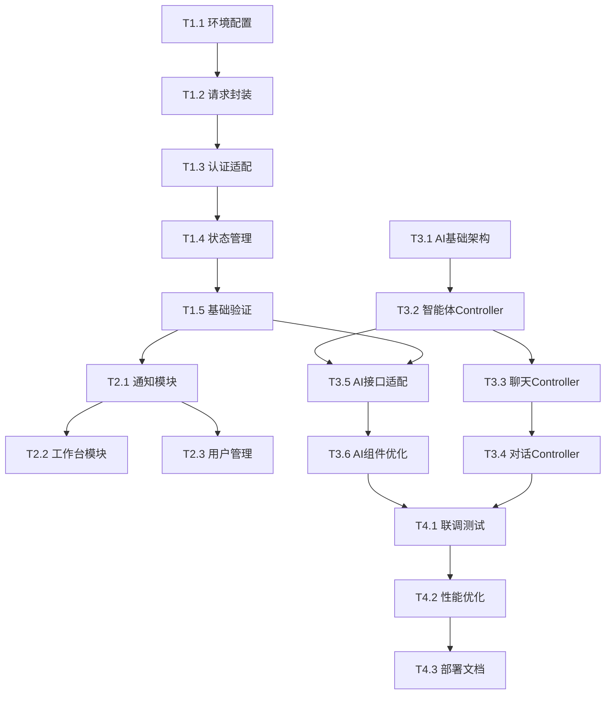

# PC Client 改造项目任务跟踪文档

## 📋 项目概览

### 改造目标
将 PC Client 从外部依赖迁移到主项目后端，实现统一的技术架构，并新增完整的AI功能模块。

### 技术栈变更汇总
| 组件 | 当前状态 | 目标状态 | 变更类型 |
|------|----------|----------|----------|
| API代理 | http://8.163.17.82:8080 | localhost:8080 | 🔄 迁移 |
| 认证机制 | 自定义Token | Sa-Token JWT | 🔄 重构 |
| 响应格式 | 混合格式 | 统一R<T>包装 | 🔄 重构 |
| AI功能 | 基础实现 | 完整AI生态 | ➕ 新增 |
| 状态管理 | 基础Pinia | 模块化Store | 🔄 优化 |

### 关键里程碑
- **M1**: 基础架构改造完成 (Day 5)
- **M2**: 系统模块适配完成 (Day 8)  
- **M3**: AI核心功能就绪 (Day 12)
- **M4**: 完整系统测试通过 (Day 17)

---

## 🎯 任务分解矩阵

### 阶段一：基础架构改造 (Day 1-5)

#### T1.1 开发环境配置 ⚡ 优先级：P0
**负责人**: 前端开发  
**预估工时**: 0.5天  
**依赖**: 无

**任务详情**:
- [ ] 修改 `vite.config.js` 代理配置
  ```javascript
  // 从: target: 'http://8.163.17.82:8080'
  // 到: target: 'http://localhost:8080'
  ```
- [ ] 创建环境变量文件 `.env.development`, `.env.production`
- [ ] 验证代理配置是否生效

**验收标准**:
- ✅ 开发环境能正常代理到本地后端
- ✅ 生产环境配置正确
- ✅ 代理路径 `/api/*` 正确转发

---

#### T1.2 请求封装重构 ⚡ 优先级：P0
**负责人**: 前端开发  
**预估工时**: 1.5天  
**依赖**: T1.1

**任务详情**:
- [ ] 重构 `src/utils/request.js`
  - [ ] 统一R<T>响应格式处理
  - [ ] 集成Sa-Token认证机制
  - [ ] 完善错误处理逻辑
- [ ] 重构 `src/utils/auth.js`
  - [ ] 支持Sa-Token格式
  - [ ] 添加Token自动刷新
  - [ ] 完善权限验证

**验收标准**:
- ✅ 所有API请求使用统一格式
- ✅ Token存储和获取机制正确
- ✅ 错误处理统一且用户友好
- ✅ 自动刷新Token机制生效

**关键文件**:
```
src/utils/request.js     [重构]
src/utils/auth.js        [重构]
src/utils/errorHandler.js [新增]
```

---

#### T1.3 认证模块API适配 ⚡ 优先级：P0
**负责人**: 前端开发  
**预估工时**: 1天  
**依赖**: T1.2

**任务详情**:
- [ ] 修改 `src/api/auth.js` 登录接口
  - [ ] 路径：`/login` → `/auth/login`
  - [ ] 请求格式适配主项目AuthController
  - [ ] 响应数据处理适配Sa-Token
- [ ] 适配获取用户信息接口 `/getInfo`
- [ ] 适配注销接口 `/logout` → `/auth/logout`
- [ ] 适配注册接口

**验收标准**:
- ✅ 登录流程完全正常
- ✅ 用户信息获取正确
- ✅ 注销功能正常
- ✅ Token失效自动跳转登录

**接口映射表**:
| 功能 | 当前路径 | 目标路径 | 状态 |
|------|----------|----------|------|
| 登录 | `/login` | `/auth/login` | 🔄 |
| 用户信息 | `/getInfo` | `/getInfo` | ✅ |
| 注销 | `/logout` | `/auth/logout` | 🔄 |

---

#### T1.4 状态管理重构 ⚡ 优先级：P1
**负责人**: 前端开发  
**预估工时**: 1.5天  
**依赖**: T1.3

**任务详情**:
- [ ] 重构 `src/stores/auth.js`
  - [ ] 适配Sa-Token认证流程
  - [ ] 完善权限和角色管理
  - [ ] 添加数据持久化
- [ ] 重构路由守卫 `src/router/permission.js`
- [ ] 更新相关组件的状态调用

**验收标准**:
- ✅ 认证状态管理正确
- ✅ 权限控制生效
- ✅ 页面刷新状态保持
- ✅ 路由跳转正常

---

#### T1.5 基础功能验证 ⚡ 优先级：P0
**负责人**: 前端开发 + 测试  
**预估工时**: 0.5天  
**依赖**: T1.4

**任务详情**:
- [ ] 登录/注销完整流程测试
- [ ] 权限控制测试
- [ ] 页面跳转测试
- [ ] 错误处理测试

**验收标准**:
- ✅ 核心认证流程零Bug
- ✅ 所有页面可正常访问
- ✅ 错误提示用户友好

---

### 阶段二：系统模块适配 (Day 6-8)

#### T2.1 通知模块适配 ⚡ 优先级：P1
**负责人**: 前端开发  
**预估工时**: 1天  
**依赖**: T1.5

**任务详情**:
- [ ] 适配 `src/api/notification.js`
  - [ ] 确认与SysNoticeController接口兼容性
  - [ ] 调整参数格式
  - [ ] 适配分页结构
- [ ] 更新通知相关组件
- [ ] 添加实时通知功能

**验收标准**:
- ✅ 通知列表正常显示
- ✅ 通知详情查看正常
- ✅ 标记已读功能正常

---

#### T2.2 工作台模块适配 ⚡ 优先级：P2
**负责人**: 前端开发  
**预估工时**: 1天  
**依赖**: T2.1

**任务详情**:
- [ ] 适配 `src/api/workbench.js`
- [ ] 更新工作台组件
- [ ] 集成系统统计数据

**验收标准**:
- ✅ 工作台数据显示正确
- ✅ 各功能模块入口正常

---

#### T2.3 用户管理模块适配 ⚡ 优先级：P2
**负责人**: 前端开发  
**预估工时**: 1天  
**依赖**: T2.1

**任务详情**:
- [ ] 适配个人中心相关接口
- [ ] 更新用户信息组件
- [ ] 完善头像上传功能

**验收标准**:
- ✅ 个人信息修改正常
- ✅ 密码修改功能正常
- ✅ 头像上传功能正常

---

### 阶段三：AI功能开发 (Day 9-14)

#### T3.1 后端AI基础架构 ⚡ 优先级：P0
**负责人**: 后端开发  
**预估工时**: 2天  
**依赖**: 无 (可并行进行)

**任务详情**:
- [ ] 创建AI模块基础包结构
  ```
  ruoyi-modules/ruoyi-ai/
  ├── src/main/java/org/dromara/ai/
  │   ├── controller/
  │   ├── service/
  │   ├── domain/
  │   └── mapper/
  ```
- [ ] 设计AI相关数据表
  - [ ] ai_agent (智能体表)
  - [ ] ai_conversation (对话表)  
  - [ ] ai_message (消息表)
  - [ ] ai_file (文件表)
- [ ] 创建基础实体类和VO类

**验收标准**:
- ✅ AI模块Maven配置正确
- ✅ 数据表创建成功
- ✅ 基础实体类完整

---

#### T3.2 智能体管理Controller ⚡ 优先级：P0
**负责人**: 后端开发  
**预估工时**: 1.5天  
**依赖**: T3.1

**任务详情**:
- [ ] 开发 `AiAgentController`
  ```java
  @RestController
  @RequestMapping("/ai/agent")
  public class AiAgentController {
      @GetMapping("/list")           // 智能体列表
      @GetMapping("/{agentId}")      // 智能体详情
      @GetMapping("/code/{code}")    // 根据编码查询
      @GetMapping("/permission/{id}") // 权限检查
  }
  ```
- [ ] 实现对应的Service层
- [ ] 添加权限控制注解
- [ ] 编写单元测试

**验收标准**:
- ✅ 所有接口返回正确的R<T>格式
- ✅ 权限控制生效
- ✅ 单元测试覆盖率>80%

---

#### T3.3 聊天功能Controller ⚡ 优先级：P0
**负责人**: 后端开发  
**预估工时**: 2天  
**依赖**: T3.2

**任务详情**:
- [ ] 开发 `AiChatController`
  ```java
  @RestController
  @RequestMapping("/ai/chat")
  public class AiChatController {
      @PostMapping("/send")          // 普通消息
      @PostMapping("/stream")        // 流式消息  
      @PostMapping("/upload")        // 文件上传
      @GetMapping("/history")        // 历史消息
  }
  ```
- [ ] 集成主项目SSE框架实现流式响应
- [ ] 实现文件上传和处理
- [ ] 添加消息存储和检索

**验收标准**:
- ✅ 普通聊天功能正常
- ✅ 流式响应稳定
- ✅ 文件上传安全可靠
- ✅ 消息历史正确存储

**技术重点**:
```java
// 流式响应示例
@PostMapping("/stream")
public SseEmitter streamChat(@RequestBody AiMessageBo message) {
    SseEmitter emitter = new SseEmitter(30000L);
    // 集成主项目SSE框架
    return aiChatService.streamResponse(message, emitter);
}
```

---

#### T3.4 对话管理Controller ⚡ 优先级：P1
**负责人**: 后端开发  
**预估工时**: 1天  
**依赖**: T3.3

**任务详情**:
- [ ] 开发 `AiConversationController`
  ```java
  @RestController
  @RequestMapping("/ai/conversation")
  public class AiConversationController {
      @GetMapping("/list")           // 对话列表
      @PostMapping("/create")        // 创建对话
      @PutMapping("/rename")         // 重命名对话
      @DeleteMapping("/{id}")        // 删除对话
  }
  ```
- [ ] 实现对话管理逻辑
- [ ] 添加对话权限控制

**验收标准**:
- ✅ 对话CRUD功能完整
- ✅ 权限控制正确
- ✅ 数据一致性保证

---

#### T3.5 前端AI接口适配 ⚡ 优先级：P0
**负责人**: 前端开发  
**预估工时**: 2天  
**依赖**: T3.2, T1.5

**任务详情**:
- [ ] 适配 `src/api/agent.js`
  - [ ] 连接真实的AiAgentController接口
  - [ ] 移除mock数据
  - [ ] 完善错误处理
- [ ] 适配 `src/api/chat.js`
  - [ ] 实现与后端流式响应的对接
  - [ ] 优化文件上传逻辑
  - [ ] 完善消息状态管理
- [ ] 适配 `src/api/conversation.js`

**验收标准**:
- ✅ 智能体列表正常显示
- ✅ 聊天功能完全正常
- ✅ 文件上传稳定可靠
- ✅ 对话管理功能正常

**关键技术点**:
```javascript
// 流式响应处理优化
export function sendMessage(data, onMessage, onError, onComplete) {
  return streamRequest('/ai/chat/stream', data, {
    onMessage: (chunk) => {
      // 处理不同类型的流式数据
      switch(chunk.type) {
        case 'message_delta':
          onMessage(chunk.data)
          break
        case 'conversation_created':
          // 更新会话信息
          break
      }
    },
    onError,
    onComplete
  })
}
```

---

#### T3.6 AI功能前端组件优化 ⚡ 优先级：P1
**负责人**: 前端开发  
**预估工时**: 1.5天  
**依赖**: T3.5

**任务详情**:
- [ ] 优化聊天界面组件
  - [ ] 流式响应的视觉效果
  - [ ] 消息状态指示
  - [ ] 错误重试机制
- [ ] 优化智能体选择组件
- [ ] 添加文件上传进度显示
- [ ] 完善加载状态和错误提示

**验收标准**:
- ✅ 用户体验流畅
- ✅ 错误处理友好
- ✅ 加载状态清晰

---

### 阶段四：系统集成与优化 (Day 15-17)

#### T4.1 前后端联调测试 ⚡ 优先级：P0
**负责人**: 前端+后端+测试  
**预估工时**: 1天  
**依赖**: T3.6, T3.4

**任务详情**:
- [ ] 完整业务流程测试
  - [ ] 登录→选择智能体→创建对话→发送消息→查看历史
- [ ] 异常场景测试
  - [ ] 网络中断恢复
  - [ ] Token过期处理
  - [ ] 文件上传失败重试
- [ ] 性能测试
  - [ ] 大文件上传测试
  - [ ] 长时间对话测试
  - [ ] 并发用户测试

**验收标准**:
- ✅ 端到端业务流程零Bug
- ✅ 异常处理机制完善
- ✅ 性能指标达标

---

#### T4.2 性能优化 ⚡ 优先级：P1
**负责人**: 前端开发  
**预估工时**: 1天  
**依赖**: T4.1

**任务详情**:
- [ ] 实施代码分割和懒加载
- [ ] 添加API请求缓存
- [ ] 优化虚拟滚动
- [ ] 压缩构建产物

**验收标准**:
- ✅ 首屏加载时间<3秒
- ✅ 路由切换流畅
- ✅ 内存使用稳定

---

#### T4.3 部署配置和文档 ⚡ 优先级：P1
**负责人**: DevOps + 前端开发  
**预估工时**: 1天  
**依赖**: T4.2

**任务详情**:
- [ ] 配置生产环境构建
- [ ] 编写部署文档
- [ ] 配置CI/CD流水线
- [ ] 编写用户手册

**验收标准**:
- ✅ 生产环境部署成功
- ✅ 文档完整准确
- ✅ CI/CD流水线正常

---

## 📊 进度跟踪表

### 总体进度
| 阶段 | 计划天数 | 完成任务 | 总任务 | 进度 | 状态 |
|------|----------|----------|--------|------|------|
| 阶段一：基础架构 | 5天 | 0 | 5 | 0% | ⏳ 待开始 |
| 阶段二：系统适配 | 3天 | 0 | 3 | 0% | ⏳ 待开始 |
| 阶段三：AI功能 | 6天 | 0 | 6 | 0% | ⏳ 待开始 |
| 阶段四：集成优化 | 3天 | 0 | 3 | 0% | ⏳ 待开始 |
| **总计** | **17天** | **0** | **17** | **0%** | ⏳ 待开始 |

### 详细任务状态
| 任务ID | 任务名称 | 负责人 | 预估工时 | 实际工时 | 状态 | 备注 |
|--------|----------|--------|----------|----------|------|------|
| T1.1 | 开发环境配置 | 前端 | 0.5天 | - | ⏳ | - |
| T1.2 | 请求封装重构 | 前端 | 1.5天 | - | ⏳ | - |
| T1.3 | 认证模块适配 | 前端 | 1天 | - | ⏳ | - |
| T1.4 | 状态管理重构 | 前端 | 1.5天 | - | ⏳ | - |
| T1.5 | 基础功能验证 | 前端+测试 | 0.5天 | - | ⏳ | - |
| T2.1 | 通知模块适配 | 前端 | 1天 | - | ⏳ | - |
| T2.2 | 工作台模块适配 | 前端 | 1天 | - | ⏳ | - |
| T2.3 | 用户管理适配 | 前端 | 1天 | - | ⏳ | - |
| T3.1 | AI基础架构 | 后端 | 2天 | - | ⏳ | 可并行 |
| T3.2 | 智能体Controller | 后端 | 1.5天 | - | ⏳ | - |
| T3.3 | 聊天Controller | 后端 | 2天 | - | ⏳ | 重点任务 |
| T3.4 | 对话Controller | 后端 | 1天 | - | ⏳ | - |
| T3.5 | AI接口适配 | 前端 | 2天 | - | ⏳ | 重点任务 |
| T3.6 | AI组件优化 | 前端 | 1.5天 | - | ⏳ | - |
| T4.1 | 联调测试 | 全员 | 1天 | - | ⏳ | 关键节点 |
| T4.2 | 性能优化 | 前端 | 1天 | - | ⏳ | - |
| T4.3 | 部署文档 | DevOps | 1天 | - | ⏳ | - |

**图例**:
- ⏳ 待开始
- 🔄 进行中  
- ✅ 已完成
- ❌ 已取消
- ⚠️ 有风险

---

## 🔗 依赖关系图



### 关键路径 (Critical Path)
`T1.1 → T1.2 → T1.3 → T1.4 → T1.5 → T3.5 → T3.6 → T4.1 → T4.2 → T4.3`

**总关键路径时长**: 12.5天

### 并行开发机会
- **T3.1-T3.4** (后端AI开发) 可与 **T1.1-T2.3** (前端基础改造) 并行进行
- **T2.2-T2.3** (系统模块) 可以并行开发

---

## ⚠️ 风险管控

### 高风险项 (🔴)

#### R1: 认证机制变更影响现有功能
**影响**: 可能导致用户无法正常登录  
**概率**: 中等  
**应对措施**:
- ✅ 准备回滚方案：保留原认证代码备份
- ✅ 分阶段验证：每个认证相关修改立即测试
- ✅ 金丝雀部署：先在测试环境完整验证

#### R2: 流式响应与主项目SSE框架兼容性
**影响**: AI聊天功能可能不稳定  
**概率**: 中等  
**应对措施**:
- ✅ 提前技术预研：深入了解主项目SSE实现
- ✅ 备选方案：准备WebSocket备选实现
- ✅ 充分测试：多浏览器、长时间、大数据量测试

#### R3: AI功能开发进度延期
**影响**: 整体项目延期  
**概率**: 高  
**应对措施**:
- ✅ 并行开发：前后端同步进行
- ✅ MVP优先：先实现核心功能再优化
- ✅ 资源调配：必要时增加开发人员

### 中风险项 (🟡)

#### R4: 文件上传性能和安全问题
**影响**: 用户体验差，安全风险  
**概率**: 低  
**应对措施**:
- ✅ 技术选型：复用主项目OSS服务
- ✅ 安全检查：文件类型、大小、恶意代码检测
- ✅ 性能优化：分片上传、进度显示

#### R5: 跨域和代理配置问题
**影响**: 开发和部署困难  
**概率**: 低  
**应对措施**:
- ✅ 统一配置：使用环境变量管理
- ✅ 详细文档：记录所有配置细节
- ✅ 自动化脚本：减少手动配置错误

---

## 🎯 验收标准

### 功能性验收

#### 基础功能 (Must Have)
- ✅ 用户登录/注销流程完整
- ✅ 智能体列表正常显示和选择
- ✅ 基础文本对话功能正常
- ✅ 对话历史存储和显示
- ✅ 文件上传基本功能
- ✅ 通知系统正常工作

#### 高级功能 (Should Have)
- ✅ 流式响应稳定流畅
- ✅ 多格式文件支持
- ✅ 对话管理（重命名、删除）
- ✅ 用户权限控制完善
- ✅ 响应式界面适配

#### 体验功能 (Nice to Have)
- ✅ 流式输出动画效果
- ✅ 消息状态实时显示
- ✅ 快捷键支持
- ✅ 主题切换功能

### 性能验收

| 指标 | 目标值 | 验收标准 |
|------|--------|----------|
| 首屏加载时间 | <3秒 | 90%用户达标 |
| API响应时间 | <500ms | 95%请求达标 |
| 文件上传速度 | >1MB/s | 大文件稳定传输 |
| 内存使用 | <100MB | 长时间使用稳定 |
| 流式响应延迟 | <200ms | 实时对话体验 |

### 兼容性验收

| 环境 | 支持版本 | 验收要求 |
|------|----------|----------|
| Chrome | 90+ | 完全支持 |
| Firefox | 88+ | 完全支持 |
| Safari | 14+ | 基本支持 |
| Edge | 90+ | 完全支持 |
| 分辨率 | 1366x768+ | 响应式适配 |

---

## 📈 质量保障体系

### 代码质量
- **ESLint检查**: 强制代码规范，0 Error容忍度
- **TypeScript**: 类型覆盖率>90%
- **Code Review**: 所有代码必须经过Review
- **单元测试**: 核心逻辑覆盖率>80%

### 测试策略

#### 单元测试 (工具函数、组件)
```javascript
// 示例：auth.js 测试
describe('Auth Utils', () => {
  test('should store and retrieve token correctly', () => {
    const token = 'test-token'
    setToken(token)
    expect(getToken()).toBe(token)
  })
  
  test('should clear auth data correctly', () => {
    clearAuth()
    expect(getToken()).toBeNull()
  })
})
```

#### 集成测试 (API接口)
```javascript
// 示例：API集成测试
describe('AI Chat API', () => {
  test('should send message successfully', async () => {
    const response = await sendMessage({
      agentId: 1,
      message: 'Hello'
    })
    expect(response.code).toBe(200)
  })
})
```

#### E2E测试 (业务流程)
```javascript
// 示例：登录流程E2E测试
describe('Login Flow', () => {
  test('user can login and access AI chat', async () => {
    await page.goto('/login')
    await page.fill('[data-testid=username]', 'test@example.com')
    await page.fill('[data-testid=password]', 'password')
    await page.click('[data-testid=login-btn]')
    
    await expect(page).toHaveURL('/ai/chat')
    await expect(page.locator('[data-testid=agent-list]')).toBeVisible()
  })
})
```

### 回滚预案

#### 快速回滚触发条件
- 🚨 登录功能完全失效
- 🚨 主要功能页面无法访问
- 🚨 严重的数据丢失或错误
- 🚨 性能严重下降(响应时间>5秒)

#### 回滚步骤
1. **立即停止部署** - 通知所有相关人员
2. **恢复前一版本** - 使用Git回滚到稳定commit
3. **数据库回滚** - 如有必要，恢复数据库备份
4. **功能验证** - 确认基础功能正常
5. **问题分析** - 分析失败原因，制定修复方案

---

## 📊 资源分配

### 人力资源
| 角色 | 人数 | 主要职责 | 关键时期 |
|------|------|----------|----------|
| 前端开发 | 1人 | 前端改造、组件开发 | 全程 |
| 后端开发 | 1人 | AI Controller开发 | Day 6-14 |
| 测试工程师 | 1人 | 功能测试、自动化测试 | Day 12-17 |
| DevOps | 0.5人 | 部署配置、CI/CD | Day 16-17 |
| 产品经理 | 0.2人 | 需求确认、验收 | Day 1, 8, 17 |

### 技术资源
- **开发环境**: 本地开发 + 测试服务器
- **CI/CD**: Jenkins/GitHub Actions
- **监控工具**: Sentry错误监控 + 性能监控
- **文档平台**: 项目wiki + API文档

---

## 📝 沟通机制

### 日常沟通
- **Daily Standup**: 每日上午9:30，15分钟
- **进度同步**: 每周三下午，30分钟
- **技术讨论**: 遇到技术难点随时讨论

### 关键节点
- **M1完成**: 基础架构改造验收会议
- **M2完成**: 系统模块适配验收会议  
- **M3完成**: AI功能开发验收会议
- **M4完成**: 整体项目验收会议

### 问题上报
- **一般问题**: 24小时内解决
- **阻塞问题**: 4小时内上报，优先解决
- **紧急问题**: 立即上报，紧急处理

---

## 🎯 项目成功指标

### 技术指标
- ✅ 代码质量：0个Critical Issue
- ✅ 测试覆盖：单元测试>80%，E2E测试覆盖主流程
- ✅ 性能达标：首屏<3秒，API<500ms
- ✅ 兼容性：主流浏览器完全支持

### 业务指标
- ✅ 功能完整：所有规划功能100%实现
- ✅ 用户体验：SUS评分>80分
- ✅ 稳定性：99%可用性
- ✅ 安全性：0个安全漏洞

### 项目管理指标
- ✅ 进度控制：延期<1天
- ✅ 质量控制：返工<5%
- ✅ 资源控制：人力投入<预算110%
- ✅ 风险控制：重大风险0个

---

## 📋 使用说明

### 如何使用本文档
1. **项目启动**: 所有相关人员熟读本文档
2. **日常跟踪**: 每日更新任务状态表
3. **风险管控**: 定期评估风险项状态
4. **进度汇报**: 基于本文档生成进度报告

### 文档维护
- **更新频率**: 每日更新任务状态
- **版本控制**: 重大变更需要版本记录
- **责任人**: 项目经理负责维护
- **备份策略**: 定期备份到项目仓库

---

*最后更新时间: 2025-01-21*  
*文档版本: v1.0*  
*维护人员: 项目组*

---

> 💡 **提示**: 这是一个活文档，随着项目进展会持续更新。所有团队成员都应该关注文档变化，确保信息同步。